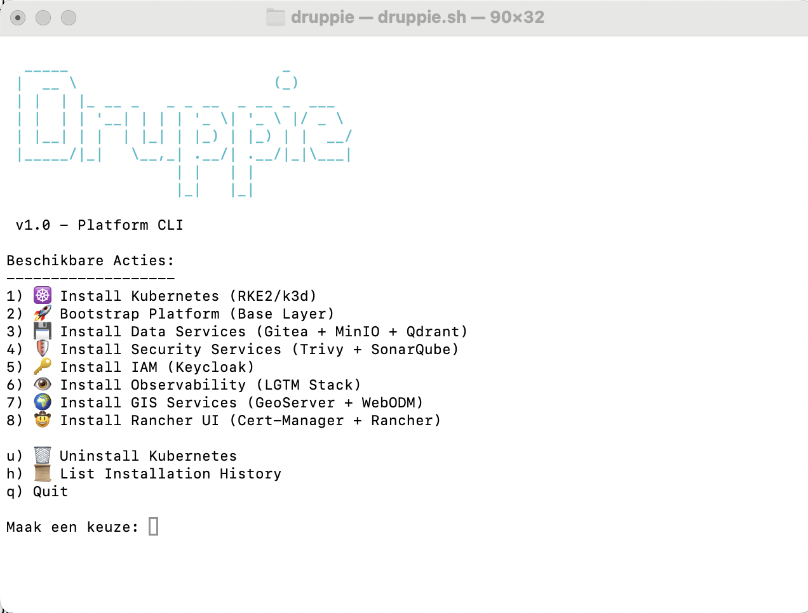

# Druppie – Spec-Driven AI Architectuur

Druppie is een geavanceerd enterprise platform voor **Spec-Driven AI** en **Human-in-the-Loop** automatisering. Dit project beschrijft hoe AI-agents, compliance-regels en menselijke interactie samenkomen om software veilig, schaalbaar en consistent te bouwen en te beheren.

De focus ligt op het automatiseren van de volledige lifecycle binnen een **overheidscontext** (Waterschap/Gemeente), met zware nadruk op **Security**, **Privacy (GDPR)** en **Compliance (BIO/NIS2/AI Act)**.

**One-Stop-Shop**: Deze repository bevat zowel de architectuurdocumentatie als de **Infrastructure-as-Code** (IaC) scripts om een platform te implementeren, waarmee de bouwblokken en skills kunnen worden geïmplementeerd. De focus ligt op het experimenteren en gebruiken van AI-agents en compliance-regels in een overheidsomgeving.

---

## 🚀 Aan de slag met de Architectuur

De volledige architectuur is interactief te verkennen.

1. Open **`index.html`** in je browser.
2. Gebruik het dashboard om door de verschillende lagen (Bouwblokken, Skills, Runtime) te navigeren.
3. Draai simulaties (Scenarios) om de interactie tussen componenten te visualiseren.

## 🚀 Snel Starten met het Platform

De makkelijkste manier om te beginnen is via de **Druppie CLI** ```./druppie.sh```

 


Dit interactieve menu geeft toegang tot:
1.  **☸️ Installatie**: Kubernetes (RKE2 voor Prod, k3d voor Dev).
2.  **🏗️ Bootstrap**: Platform base layer (Flux, Kyverno, Tekton, Kong).
3.  **📦 Services**: One-click setup voor Gitea, Keycloak, Prometheus, GeoServer, etc.
4.  **📚 Documentatie**: Genereer de "Living Documentation".

---

## 📂 Projectstructuur

De repository is opgebouwd uit verschillende lagen:

### 1. 🧱 [Bouwblokken](./bouwblokken/)
De lego-stenen van het platform. Definities van tools en componenten:
*   **Security**: Trivy, SonarQube.
*   **Data**: MinIO, Gitea, Qdrant (Vector DB).
*   **GIS**: GeoServer, PostGIS, WebODM, GeoNode.
*   **Observability**: LGTM Stack (Loki, Grafana, Tempo, Prometheus).

### 2. 🏗️ [Build Plane](./build_plane/)
De "Agent Factory". Hier wordt code omgezet in veilige artifacts:
*   **Builder Agent**: AI die code, tests en docs genereert.
*   **Automated Testing**: Unit, Integration, E2E in Tekton pipelines.
*   **Secure Supply Chain**: SBOMs en signatures bij elke build.

### 3. ⚙️ [Runtime](./runtime/)
De landingsplaats (Kubernetes):
*   **Hybride Cluster**: Draait deels in Azure, deels On-Premise.
*   **Policy Engine (Kyverno)**: Dwingt regels af (bv. "Geen root containers").
*   **Agentic RAG**: Netwerk van AI agenten die veilig data ontsluiten.

### 4. 📝 [Ontwerpen (Designs)](./design/)
Gedetailleerde technische ontwerpen en functionele beschrijvingen:
*   **[Exoten Detectie](./design/exoten_detectie.md)**: Satelliet + Drone flow.
*   **[Vergunning zoeker](./design/vergunning_zoeker.md)**: AI zoekt oude aktes.
*   **[Automated Rebuild](./design/automated_rebuild.md)**: Self-healing bij security patches.

### 5. 🛡️ [Compliance](./compliance/)
De regels en wetten vertaald naar techniek:
*   **AI Act & Register**: Verplichte registratie van algoritmes.
*   **BIO & NIS2**: Baseline Informatiebeveiliging.
*   **Goed Bestuur**: Principes van transparantie en controleerbaarheid.

---

## 💡 Kernprincipes

1.  **Alles is een Spec**: Van infrastructuur tot agent-gedrag, alles wordt vastgelegd in leesbare files.
2.  **Human-in-the-Loop**: Kritieke beslissingen (vliegroute drone, verwijderen data) vereisen *altijd* menselijke goedkeuring.
3.  **Secure by Design**: Security tools (Trivy, Kyverno) staan "aan" by default.
4.  **Traceerbaarheid**: Elke actie, van prompt tot deployment, wordt gelogd in de Traceability DB.

---

## 🛠️ Scripts & Tools

Bekijk de [Script Overview](./script/overview.md) voor een lijst van alle beschikbare beheerscripts.

## Search index

De search index is gemaakt met de [node generate_search_index.js](./generate_search_index.js) script en wordt opgeslagen in [search_index.json](./search_index.json).
