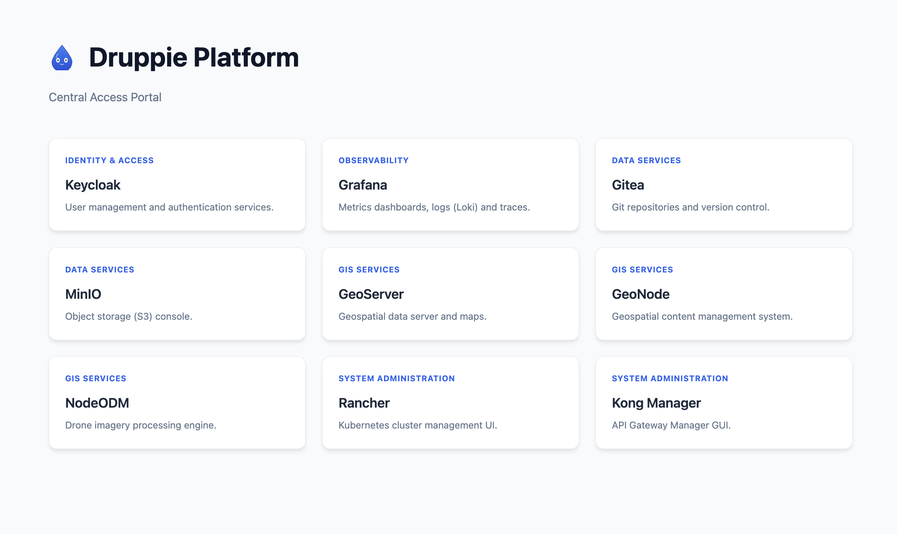

# Druppie – Spec-Driven AI Architectuur

Druppie is een geavanceerd enterprise platform voor **Spec-Driven AI** en **Human-in-the-Loop** automatisering. Dit project beschrijft hoe AI-agents, compliance-regels en menselijke interactie samenkomen om software veilig, schaalbaar en consistent te bouwen en te beheren.

De focus ligt op het automatiseren van de volledige lifecycle binnen een **overheidscontext** (Waterschap/Gemeente), met zware nadruk op **Security**, **Privacy (GDPR)** en **Compliance (BIO/NIS2/AI Act)**.

**One-Stop-Shop**: Deze repository bevat zowel de architectuurdocumentatie als de **Infrastructure-as-Code** (IaC) scripts om een platform te implementeren, waarmee de bouwblokken en skills kunnen worden geïmplementeerd. De focus ligt op het experimenteren en gebruiken van AI-agents en compliance-regels in een overheidsomgeving.

---

## 🚀 Aan de slag met de Architectuur

De volledige architectuur is interactief te verkennen.

1. Open **`index.html`** in je browser (Architecture Portal).
2. Open **`ui/index.html`** voor de Chat Interface.
3. Gebruik het dashboard om door de verschillende lagen (Bouwblokken, Skills, Runtime) te navigeren.
4. **PWA Support**: Voeg de app toe aan je startscherm op mobiel voor een native ervaring.

## 💧 Locale installatie

De locale installatie is gemaakt met GOLang je can een locale build gebruiken met ```go run ./cmd``` zorg wel dat je in de core directory bent ```cd core```. Mocht je een locale build willen gebruiken dan gebruik je ```go build -o druppie ./cmd```. Gebruik de ```help``` parameter om te zien welke commando's er beschikbaar zijn.

## 🚀 Snel Starten met het Platform

De makkelijkste manier om te beginnen is via de **Druppie CLI** ```./script/druppie.sh``` of mocht je reeds een locale build gemaakt hebben dan gebruik je ```./core/druppie cli```

 

Dit interactieve menu geeft toegang tot:
1.  **☸️ Installatie**: Kubernetes (RKE2 voor Prod, k3d voor Dev 'local docker')).
2.  **🏗️ Bootstrap**: Platform base layer (Flux, Kyverno, Tekton, Kong).
3.  **📦 Services**: One-click setup voor Gitea, Keycloak, Prometheus, GeoServer, etc.
4.  **🚀 UI**: Toegang scherm tot de verschillende UI's van de verschillende services.

De password voor de verschillende services is 'druppie' worden opgeslagen in de .secrets file. De installatie logs zijn terug te vinden in de directory .logs. En de applicatie installatie overiew is terug te vinden in de .druppie_history file.

 
Deze installatie is een lokaal installatie en draait in een docker container en is toegankelijk via de k3d cluster op [https://localhost](https://localhost) waarbij je wel even het certificaat moet accepteren.

---

## 📂 Projectstructuur

De repository is opgebouwd uit verschillende lagen:

### 1. 🧱 [Bouwblokken](./blocks/)
De lego-stenen van het platform. Definities van tools en componenten:
*   **Security**: Trivy, SonarQube.
*   **Data**: MinIO, Gitea, Qdrant (Vector DB).
*   **GIS**: GeoServer, PostGIS, WebODM, GeoNode.
*   **Observability**: LGTM Stack (Loki, Grafana, Tempo, Prometheus).

### 2. 🧠 [Core](./core/) & [UI](./ui/)
De applicatie logica en interfaces:
*   **[Core](./core/)**: Go-based backend (Server, Agent Runner, Vector DB Client).
*   **[UI](./ui/)**: De "Mens-in-de-Loop" Chat Interface.

### 3. 🤖 [Agents](./agents/) & [Skills](./skills/)
De definitions van de workforce:
*   **[Agents](./agents/)**: Definities van rollen (Architect, Developer, Reviewer).
*   **[Skills](./skills/)**: De vaardigheden die agents kunnen gebruiken.

### 4. 📝 [Ontwerpen (Designs)](./design/)
Gedetailleerde technische ontwerpen en functionele beschrijvingen:
*   **[Exoten Detectie](./design/exoten_detectie.md)**: Satelliet + Drone flow.
*   **[Vergunning zoeker](./design/vergunning_zoeker.md)**: AI zoekt oude aktes.
*   **[Automated Rebuild](./design/automated_rebuild.md)**: Self-healing bij security patches.

### 5. 🛡️ [Compliance](./compliance/)
De regels en wetten vertaald naar techniek:
*   **AI Act & Register**: Verplichte registratie van algoritmes.
*   **BIO & NIS2**: Baseline Informatiebeveiliging.
*   **Goed Bestuur**: Principes van transparantie en controleerbaarheid.

---

## 💡 Kernprincipes

1.  **Alles is een Spec**: Van infrastructuur tot agent-gedrag, alles wordt vastgelegd in leesbare files.
2.  **Human-in-the-Loop**: Kritieke beslissingen (vliegroute drone, verwijderen data) vereisen *altijd* menselijke goedkeuring.
3.  **Secure by Design**: Security tools (Trivy, Kyverno) staan "aan" by default.
4.  **Traceerbaarheid**: Elke actie, van prompt tot deployment, wordt gelogd in de Traceability DB.

---

## 🛠️ Scripts & Tools

Bekijk de [Script Overview](./script/overview.md) voor een lijst van alle beschikbare beheerscripts.

## 🐳 Docker (Druppie)

To run the Druppie Core server (including UI and backend logic) using Docker in a production-like environment:

1.  **Build the image** (execute from the project root):
    ```bash
    docker build -t druppie .
    ```

2.  **Run the container**:
    ```bash
    docker run -d \
      -p 8080:80 \
      -v $(pwd)/.druppie:/app/.druppie \
      --name druppie-server \
      druppie
    ```

    *   **Port 8080**: Access the Portal at `http://localhost:8080` and UI at `http://localhost:8080/ui/`.
    *   **Volume**: Maps your local `.druppie` directory to the container, ensuring plans and logs are persisted and accessible locally.

## Search index

De search index is gemaakt met de [node generate_search_index.js](./generate_search_index.js) script en wordt opgeslagen in [search_index.json](./search_index.json).
