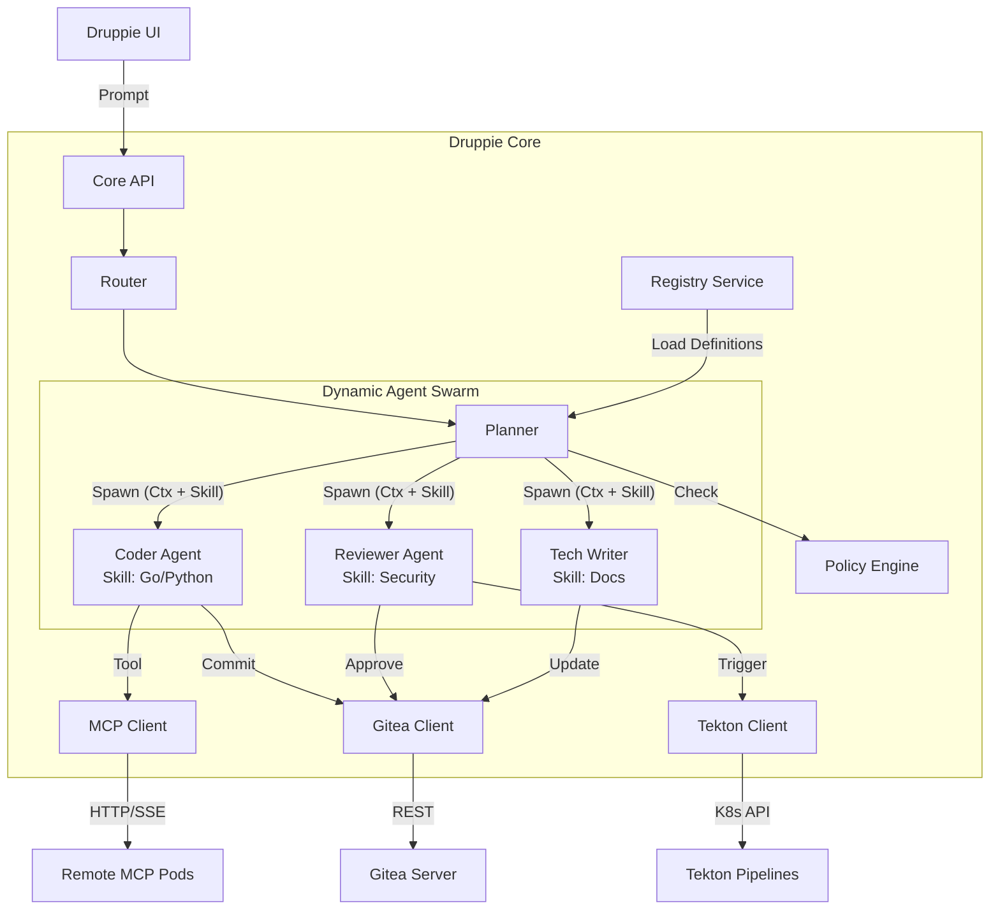
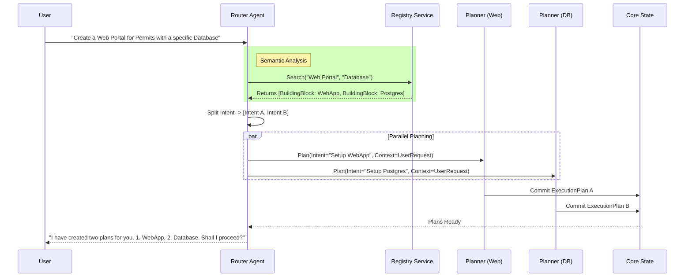

# Druppie Core Specification

## 1. System Overview
**Druppie Core** is the central orchestrator of the Druppie Platform. It functions as a scalable, Kubernetes-native autonomous agent system designed to plan, build, deploy, and govern software workloads for Water Authorities. It operates on a "Spec-Driven" architecture where intents are translated into declarative infrastructure and code.

**Key Principles:**
*   **AI-First**: All operations are driven by LLM-based reasoning (Planner/Router).
*   **Spec-Driven**: All artifacts (Code, Infrastructure) are defined as declarative specs (YAML/HCL).
*   **Kubernetes-Native**: The core itself runs as a container and interacts directly with the K8s API.
*   **Compliance-by-Design**: Every action is checked against policy engines before execution.
*   **Security-by-Design**: Every action is checked against security policies before execution.
*   **Traceability-by-Design**: Every action is logged and stored in a traceability/observability database.
*   **Cost-by-Design**: Every action is checked against cost policies before execution.
*   **Performance-by-Design**: Every action is checked against performance policies before execution.
*   **Resilience-by-Design**: Every action is checked against resilience/resiliency policies before execution.

---

## 2. Epics & Multi-Agent Work Breakdown

### Epic 1: Core Reasoning Engine & Orchestration
**Goal**: Establish the "Brain" that accepts natural language prompts and formulates execution plans.

*   **Story 1.1: Router Agent Implementation (The Hub)**
    *   **Role**: Triage incoming requests.
    *   **Logic**: Analyze intent. If "General Question" -> Knowledge Bot. If "Create/Change" -> Builder Agent. If "Approval" -> Governance Agent.
    *   **Output**: Routed Context Object.
*   **Story 1.2: Multi-Agent Planner**
    *   **Role**: Break down complex requests into steps (Chain of Thought).
    *   **Capability**: Support sequential execution (Step A -> Step B) and parallel execution (Step A & B). Pass skill to agent to ensure it has the right tools and know what it can do.
    *   **Artifact**: `ExecutionPlan` JSON object.
*   **Story 1.3: Context & Memory Management**
    *   **Requirement**: Maintain state across multi-turn conversations (Thread ID).
    *   **Storage**: Persist conversation history and working variables in Redis or CosmosDB/Postgres.
*   **Story 1.4: Building Block Resolution & Project Scoping**
    *   **Search Strategy**: Before planning, query the Registry (Epic 2) to find existing Building Blocks that match the user's intent.
    *   **Decomposition**: If a monolithic request requires multiple distinct capabilities (e.g., "Web App + Database"), split it into multiple Building Blocks.
    *   **Project Rule**: Enforce the rule: "One Building Block = One Project". If a block is missing, scope a new Project to build it.

### Epic 2: Registry & Capability Management
**Goal**: Enable the AI to "know what it can do" by reading dynamic definitions of Tools and Skills.

*   **Story 2.1: Building Block Registry API**
    *   **Function**: A read-heavy API to index `.md` or `.yaml` definitions from the `bouwblokken/` directory.
    *   **Schema**: extract `name`, `capabilities`, `inputs`, `outputs` from definitions.
*   **Story 2.2: Skill Loader**
    *   **Function**: Dynamic injection of "Persona" instructions (e.g., "Act as Python Expert") based on `skills/` definitions.
*   **Story 2.3: MCP Client (Model Context Protocol)**
    *   **Function**: Connect to remote tools running in separate pods (e.g., `mcp-weather`, `mcp-database`).
    *   **Protocol**: Support SSE (Server-Sent Events) transport to discover and invoke tools over HTTP.

### Epic 3: Project Factory & Source Control
**Goal**: Abstract the creation and management of Git repositories.

*   **Story 3.1: Gitea Integration Client**
    *   **Action**: Create Repo, Branch, Commit, Pull Request.
    *   **Auth**: Token-based authentication against the internal Gitea service.
*   **Story 3.2: Scaffolding Engine**
    *   **Action**: Generate initial project structure based on templates (e.g., "New Python Service" = `pyproject.toml`, `Dockerfile`, `k8s/deploy.yaml`).
    *   **Spec**: driven by Building Block definitions.

### Epic 4: Build Plane Interface (The Factory)
**Goal**: Trigger and monitor the production of artifacts (Containers).

*   **Story 4.1: Tekton Trigger Interface**
    *   **Action**: Create `PipelineRun` objects in Kubernetes.
    *   **Params**: Pass Git Commit Hash and Image Tags.
*   **Story 4.2: Async Build Monitoring**
    *   **Action**: Watch `PipelineRun` status. Stream logs to the Core/User upon failure.
    *   **Notify**: Send event when build is `Succeeded` or `Failed`.

### Epic 5: Runtime Operations (Deploy & Run)
**Goal**: Manage the lifecycle of running applications.

*   **Story 5.1: GitOps Enforcer (Flux Wrapper)**
    *   **Action**: Commit manifest changes to the `infra` repository (triggering Flux).
    *   **Logic**: Do not touch the cluster directly (kubectl apply) except for ephemeral debug tasks. Always go through Git.
*   **Story 5.2: Resource Observation**
    *   **Action**: Query K8s API for Pod status, Logs, and Events.
    *   **Use Case**: User asks "Why is my drone-service crashing?" -> Core reads `kubectl logs`.
*   **Story 5.3: Automated Verification (Post-Deploy)**
    *   **Action**: Run smoke tests and health checks against the newly deployed service.
    *   **Logic**: Verify endpoints (e.g., `/health`) return 200 OK before marking the task as complete.
*   **Story 5.4: Dynamic Documentation & Cataloging**
    *   **Action**: Update the internal Service Catalog (Registry) with the new deployment details (URL, Version).
    *   **Doc**: Auto-generate/update `README.md` or Architecture models (Archi) to reflect the live state.

### Epic 6: Governance & RBAC
**Goal**: Ensure safety and compliance.

*   **Story 6.1: OPA/Kyverno Policy Check**
    *   **Logic**: Pre-flight check. Before generating any plan, validate against policy rules (e.g., "No Public S3 buckets").
*   **Story 6.2: Human-in-the-Loop (HITL) Service**
    *   **State**: Support `SUSPENDED` state for plans requiring approval.
    *   **UI**: Generate "Approval Card" with diff summary.
*   **Story 6.3: Audit Logger**
    *   **Data**: Log `Prompt`, `Plan`, `Action`, and `Result` to the Traceability DB (Loki/Postgres).

### Epic 7: Project Traceability & Kanban Interaction
**Goal**: Visualize the state of work and ensure human oversight via a Kanban interface.

*   **Story 7.1: Kanban State Sync**
    *   **Action**: Map `ExecutionPlan` steps to Kanban columns (To Do, In Progress, Review, Done).
    *   **Real-time**: Push state changes via Websocket to the UI to update the board instantly.
*   **Story 7.2: Human-in-the-Loop Interaction**
    *   **Function**: Allow users to drag a card back from "In Progress" to "To Do" or "Blocked".
    *   **Agent Reaction**: The Core must detect this state change and pause/cancel the corresponding AI Agent task.
*   **Story 7.3: Project History & Timeline**
    *   **View**: Generate a timeline view showing exactly *who* (Agent or Human) moved a card and *when*.
    *   **Compliance**: Ensure this visual history matches the immutable Audit Log.

### Epic 8: Core API Exposure (User & Admin Interfaces)
**Goal**: Provide secure, RBAC-aware endpoints for interacting with all Core functions, distinguishing between End-Users and Platform Admins.

*   **Story 8.1: Unified User Gateway**
    *   **Function**: A unified Graph/REST API that exposes:
        *   `Chat/Intent` (The main entry point).
        *   `Plan/Status` (Viewing progress).
        *   `Task/Approve` (HITL actions).
    *   **Scope**: Users can only see/act on Projects they own or have been granted access to.
*   **Story 8.2: Admin Management API (The Control Plane)**
    *   **Function**: A privileged API set for Platform Engineers to manage the system itself:
        *   `Start/Stop Agents`: Temporarily disable specific agents (e.g., if a model is acting up).
        *   `Manage Skills`: CRUD operations to upload new Personas/System Prompts.
        *   `Manage MCP`: Register/Deregister external tool endpoints.
        *   `Manage BuildingBlocks`: Admin override to approve/deprecate building block definitions.
    *   **Action**: Middleware that checks JWT tokens (OIDC) against Keycloak roles before allowing access to Admin APIs.
    *   **Role**: Map `group:platform-admins` to full CRUD on Skills/MCPs, while `group:users` only gets Read access to available skills.

### Epic 9: Compliance & Regulatory Engine
**Goal**: Automate the verification and evidence generation for regulatory standards (BIO, GDPR/AVG, EU AI Act).

*   **Story 9.1: Digital Compliance Registry**
    *   **Function**: Store compliance frameworks (e.g., "BIO Overheidsinformatiebeveiliging") as machine-readable rulesets.
    *   **Mapping**: Map high-level controls (e.g., "Data Encryption") to low-level policies (e.g., OPA Rule: `storage_must_be_encrypted`).
*   **Story 9.2: Automated Compliance Scans**
    *   **Trigger**: Run specifically tagged Scan Agents during the `Build` phase.
    *   **Checks**: Static analysis for GDPR PII patterns, Container Scanning for CVEs, and Configuration Checks for Architecture guidelines.
    *   **Content**: List all active controls, the evidence collected (Log ID, Scan Result), and the timestamp of verification.

### Epic 10: Brand & Media Governance
**Goal**: Enforce company styling, tone-of-voice, and media standards across generated artifacts.

*   **Story 10.1: Style Guide Knowledge Base**
    *   **Input**: Ingest Brand Guidelines (PDF/Brandbook) and Media Asset definitions.
    *   **Usage**: Provide context to Frontend Agents (Color palettes, Typography) and Content Agents (Tone of Voice).
*   **Story 10.2: Media Asset Resolution**
    *   **Function**: When an Agent needs an image/logo, query the **Media Management (Strapi)** building block instead of hallucinating or generating generic content.
    *   **Constraint**: Force usage of approved assets (e.g., "Official Water Authority Logo" vs "Generic Water Drop").
*   **Story 10.3: UI/UX Linter**
    *   **Action**: A specialized review step for generated Frontend code.
    *   **Check**: Verify Tailwind classes match the approved Design Token set (e.g., `bg-primary-500` is allowed, hardcoded hex `#123456` is flagged).

---

## 3. Technical Architecture

### 3.1 Component Diagram (Logical)


### 3.2 Router Decomposition Flow
This sequence illustrates how a complex user intent (e.g., "I need a web app with a database") is split into parallel work streams.



### 3.3 Data Models

**ExecutionPlan Object**
```json
{
  "plan_id": "uuid",
  "intent": "deploy_new_service",
  "status": "in_progress",
  "steps": [
    {
      "step_id": 1,
      "agent": "coder:python",
      "action": "scaffold_repo",
      "params": { "name": "drone-processor" },
      "status": "completed"
    },
    {
      "step_id": 2,
      "agent": "reviewer:security",
      "action": "scan_code",
      "status": "pending"
    }
  ]
}
```

---

## 4. Implementation Guidelines

### 4.1 Language: Go (Golang)
The Core Service must be implemented in **Go** (version 1.22+) to ensure high concurrency, low latency, and strong typing.
*   **Framework**: Use `chi` or `gin` for REST API routing.
*   **Concurrency**: Use Goroutines and Channels heavily for handling multiple Agent threads simultaneously without blocking.
*   **K8s Client**: Use `client-go` for all interactions with the Kubernetes API (Creating PipelineRuns, watching Pods).
*   **Modular Monolith**: Structure the application as a Modular Monolith initially (single binary, distinct packages for `router`, `planner`, `registry`) to simplify deployment while keeping boundaries clean for future microservices split.

### 4.2 Containerization: Docker
*   **Base Image**: Use `distroless/static` for the final production image to minimize attack surface (no shell, no package manager).
*   **Multi-Stage Build**:
    *   Stage 1 (`builder`): `golang:alpine` with all build tools.
    *   Stage 2 (`runner`): Copy only the binary from Stage 1.
*   **Security**: The container must run as a **non-root user** (UID 10001).

### 4.3 Deployment: Helm
All operational manifests must be packaged as a Helm Chart (`druppie`).
*   **Values.yaml**: Must expose configuration for:
    *   `replicaCount` (HPA settings).
    *   `image.tag` (Version pinning).
    *   `env`: Secret references for OpenAI/Azure Keys.
    *   `rbac.enabled`: Toggle specifically for creating a `ServiceAccount` and `ClusterRoleBinding` needed for `client-go` to work.
*   **Templates**:
    *   `deployment.yaml`: The main workload.
    *   `service.yaml`: Internal ClusterIP.
    *   `ingress.yaml`: Traefik/Nginx ingress rule.
    *   `serviceaccount.yaml`: Critical for K8s API access.

---

## 5. API Interface (OpenAPI Draft)

*   `POST /v1/chat/completions`: Standard OpenAI-compatible endpoint for UI integration.
*   `GET /v1/agents`: List available agent personas.
*   `POST /v1/workflow/approve/{id}`: Approve a blocked step.
*   `GET /v1/system/health`: Core health status.
