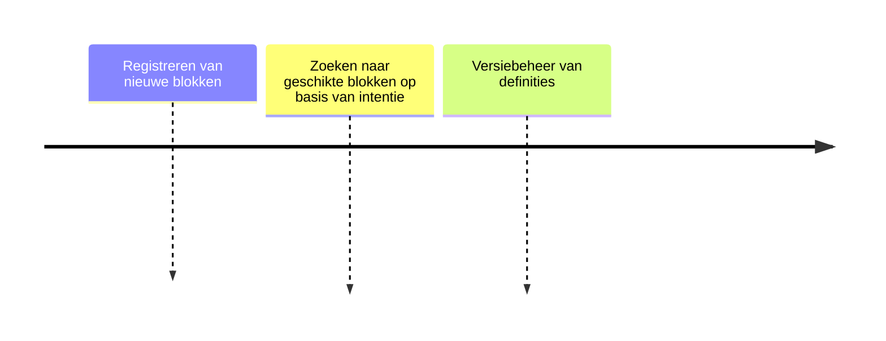

# Bouwblok Definities

## Functionele Beschrijving
Catalogus met specificaties van bouwblokken, skills, agents en MCP services. Druppie Core raadpleegt dit register om te bepalen welke capability de vraag kan beantwoorden.

**Stappen:**

## Technische Beschrijving
### Componenten
Registry DB, Search API, Definition Schema

### Data Flow
Core -> Registry -> Capability Metadata

**Benodigde Skills:**
- [Metadata Definition](../skills/research.md)
- [Vector Search Implementation](../skills/build.md)
- [Skill Discovery Testing](../skills/test.md)
- [Capability Indexing](../skills/deploy.md)
<!-- Prompts: Definieer metadata schema, Implementeer vector-search, Verifieer correcte skills, Indexeer initiële set -->

## Bouwblokken
- [ ] [Traceability DB](./traceability_db.md)

## Mens in de Loop Requirements
N.v.t.

## Compliance Eisen
- [Compliance Overview](../compliance/overview.md)
