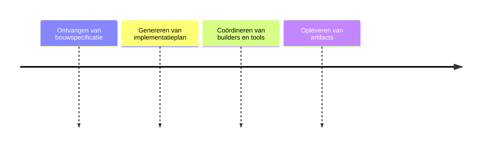

# Build Plane

## Functionele Beschrijving
Een Specificatie gestuurde AI omgeving voor het realiseren van een oplossing. Waarbij verschillenden AI-Experts samen werken om een totaal oplossing te realiseren.

**Stappen:**

## Technische Beschrijving
### Componenten
Build Controller, Agent Swarm, Artifact Repository

### Data Flow
Spec -> Build Controller -> Agents -> Artifacts

**Benodigde Skills:**
- [Agent Coordination Research](../skills/research.md)
- [Multi-agent Logic Build](../skills/build.md)
- [Output Quality Testing](../skills/test.md)
- [Env Activation](../skills/deploy.md)
<!-- Prompts: Onderzoek optimale agent samenstelling, Implementeer multi-agent coördinatie, Test generatie snelheid, Activeer build plane omgeving -->

## Bouwblokken
- [ ] [Builder Agent](../build_plane/builder_agent.md)
- [ ] [Foundry](../build_plane/foundry.md)

## Mens in de Loop Requirements
N.v.t.

## Compliance Eisen
- [Compliance Overview](../compliance/overview.md)
