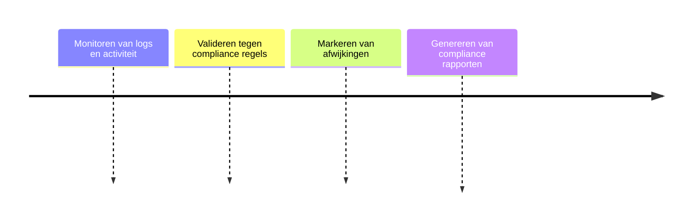

# Druppie Compliance Layer

## Functionele Beschrijving
Overkoepelende beveiligingslaag. Voert continue, dagelijkse compliance checks uit over alle logs en markeert kwetsbaarheden op basis van audit regels.

**Stappen:**

## Technische Beschrijving
### Componenten
Security Scanner, Audit Rules Engine, Reporting Dashboard

### Data Flow
Logs -> Scanner -> Audit DB -> Dashboard

**Benodigde Skills:**
- [Security Framework Identification](../skills/research.md)
- [Audit Rule Creation](../skills/build.md)
- [Compliance Testing](../skills/test.md)
- [Rule Activation](../skills/deploy.md)
<!-- Prompts: Identificeer relevant security frameworks, Schrijf audit regels, Draai compliance checks, Activeer ruleset -->

## Bouwblokken
- [ ] [Traceability DB](./traceability_db.md)
- [ ] [Policy Engine](./policy_engine.md)

## Mens in de Loop Requirements
Rapporten kunnen handmatige review vereisen.

## Compliance Eisen
- [Compliance Overview](../compliance/overview.md)
