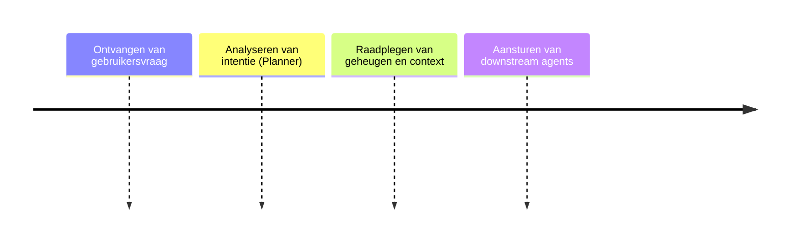

# Druppie Core (Orchestrator)

## Functionele Beschrijving
Het brein van de architectuur (Semantic Kernel). Gebruikt LLMs vanuit foundry of eigen datacenter om intentie te bepalen en taken te plannen.

**Stappen:**

## Technische Beschrijving
### Componenten
Semantic Kernel, Planner, Memory, RAG, Safety Filter

### Data Flow
Input -> Safety -> Planner -> Execution -> Output

**Benodigde Skills:**
- [Orchestration Logic Design](../skills/research.md)
- [Semantic Kernel Implementation](../skills/build.md)
- [Planner Testing](../skills/test.md)
- [Core Service Deployment](../skills/deploy.md)
<!-- Prompts: Ontwerp orchestratie logica, Implementeer Semantic Kernel, Test planner gedrag, Deploy core service -->

## Bouwblokken
- [ ] [Bouwblok Definities](./bouwblok_definities.md)
- [ ] [Policy Engine](./policy_engine.md)
- [ ] [MCP Interface](../runtime/mcp_interface.md)

## Mens in de Loop Requirements
N.v.t.

## Compliance Eisen
- [Compliance Overview](../compliance/overview.md)
