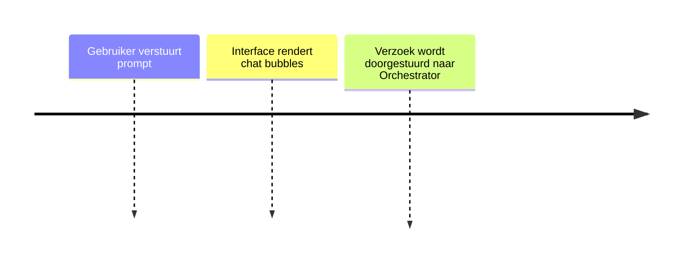

# Druppie UI (Copilot)

## Functionele Beschrijving
De gebruikersinterface (Chat) dit kan Copilot zijn voor simple vragen of een specifieke Druppie Applicatie. Ontvangt vragen en stuurt deze door naar de backend.

**Stappen:**

## Technische Beschrijving
### Componenten
Frontend UI, API Gateway

### Data Flow
Gebruiker -> UI -> Backend

**Benodigde Skills:**
- [Requirements Analyse](../skills/research.md)
- [Frontend Development](../skills/build.md)
- [Validation](../skills/test.md)
- [Deployment](../skills/deploy.md)
<!-- Prompts: Analyseer user requirements, Genereer responsive HTML/JS, Valideren van rendering, Verpakken van assets -->

## Bouwblokken
- [ ] [Druppie Core (Orchestrator)](./druppie_core.md)
- [ ] [Identity & Access Management (IAM)](../compliance/iam.md)

## Mens in de Loop Requirements
N.v.t.

## Compliance Eisen
- [Compliance Overview](../compliance/overview.md)
