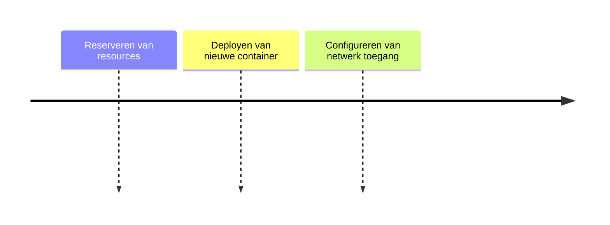

# Dynamic Slot

## Functionele Beschrijving
Ruimte voor nieuwe applicaties die door de Builder Agent worden gedeployed.

**Stappen:**

## Technische Beschrijving
### Componenten
Namespace, Resource Quota, Ingress

### Data Flow
Deployment -> New Pod -> Active Service

**Benodigde Skills:**
- [Resource Requirement Calc](../skills/research.md)
- [Manifest Generation](../skills/build.md)
- [Deployment Simulation](../skills/test.md)
- [Manifest Application](../skills/deploy.md)
<!-- Prompts: Bepaal resource requirements, Genereer K8s manifests, Simuleer deployment, Apply manifests -->

## Bouwblokken
- [ ] [Runtime](./runtime.md)
- [ ] [Builder Agent](./builder_agent.md)

## Mens in de Loop Requirements
N.v.t.

## Compliance Eisen
- [Compliance Overview](../compliance/overview.md)
