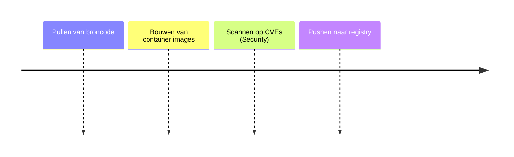

# Foundry

## Functionele Beschrijving
Standaard IT ontwikkel tools: AI models, Secure Build Pipeline en Testing middelen. Bouwt en test container images en scant op kwetsbaarheden.

**Stappen:**

## Technische Beschrijving
### Componenten
CI/CD Pipeline, Docker Engine, Vulnerability Scanner

### Data Flow
Code -> Build -> Scan -> Image Registry

**Benodigde Skills:**
- [Tool Selection](../skills/research.md)
- [Dockerfile & Pipeline Config](../skills/build.md)
- [Scanner Verification](../skills/test.md)
- [Registry Access Config](../skills/deploy.md)
<!-- Prompts: Bepaal security scan tools, Schrijf Dockerfiles, Bouw test images, Configureer build runners -->

## Bouwblokken
- [ ] [Runtime](./runtime.md)

## Mens in de Loop Requirements
N.v.t.

## Compliance Eisen
- [Compliance Overview](../compliance/overview.md)
