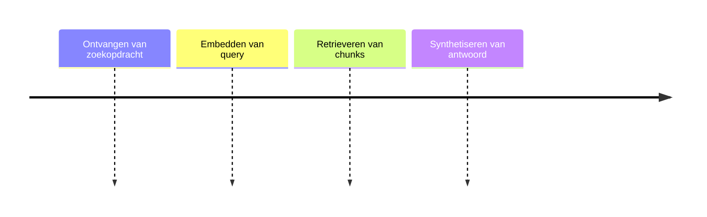

# Knowledge Bot

## Functionele Beschrijving
Bestaande workload die informatie ophaalt uit documenten.

**Stappen:**

## Technische Beschrijving
### Componenten
Vector DB Client, Embedding Model, Response Generator

### Data Flow
Query -> Vector Search -> Context -> Answer

**Benodigde Skills:**
- [Model Selection](../skills/research.md)
- [Pipeline Build](../skills/build.md)
- [Retrieval Accuracy Check](../skills/test.md)
- [Pod Deployment](../skills/deploy.md)
<!-- Prompts: Selecteer embedding model, Bouw ingest pipeline, Meet retrieval accuracy, Deploy pod -->

## Bouwblokken
- [ ] [Runtime](./runtime.md)

## Mens in de Loop Requirements
N.v.t.

## Compliance Eisen
- [Compliance Overview](../compliance/overview.md)
