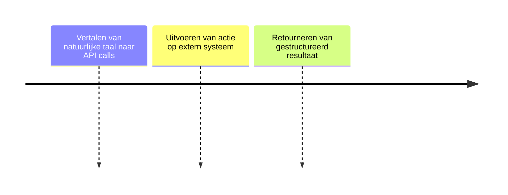

# MCP Interface

## Functionele Beschrijving
Een interface waarmee AI toegang kan krijgen tot systemen/data via natuurlijke taal (Model Context Protocol).

**Stappen:**

## Technische Beschrijving
### Componenten
MCP Server, Tool Definitions, Connection Managers

### Data Flow
AI Call -> MCP -> External System -> Result

**Benodigde Skills:**
- [System Identification](../skills/research.md)
- [MCP Server Implementation](../skills/build.md)
- [Tool Execution Testing](../skills/test.md)
- [Endpoint Exposure](../skills/deploy.md)
<!-- Prompts: Identificeer te ontsluiten systemen, Implementeer MCP server, Test tool execution, Expose MCP endpoint -->

## Bouwblokken
- [ ] [Druppie Core (Orchestrator)](./druppie_core.md)

## Mens in de Loop Requirements
N.v.t.

## Compliance Eisen
- [Compliance Overview](../compliance/overview.md)
