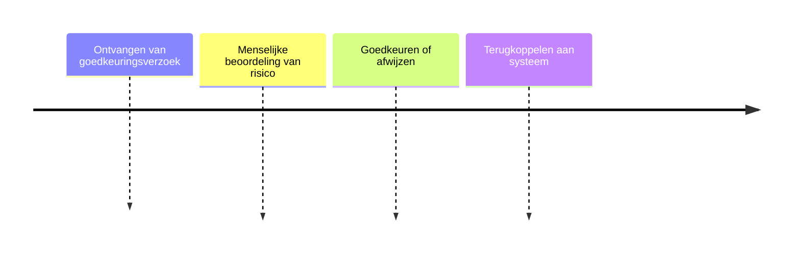

# Mens in de Loop

## Functionele Beschrijving
Human-in-the-Loop stap. Vereist handmatige goedkeuring voor risicovolle acties of specifieke kennisvragen.

**Stappen:**

## Technische Beschrijving
### Componenten
Approval Dashboard, Notification Service, Audit Logger

### Data Flow
Policy Engine -> Human -> Approval Status

**Benodigde Skills:**
- [Approval Workflow Design](../skills/research.md)
- [Dashboard & Notification Build](../skills/build.md)
- [User Flow Testing](../skills/test.md)
- [Module Activation](../skills/deploy.md)
<!-- Prompts: Ontwerp workflow, Bouw approval dashboard, Test user flow, Activeer Human-in-the-Loop -->

## Bouwblokken
- [ ] [Policy Engine](./policy_engine.md)

## Mens in de Loop Requirements
Dit blok *is* de mens in de loop.

## Compliance Eisen
- [Compliance Overview](../compliance/overview.md)
