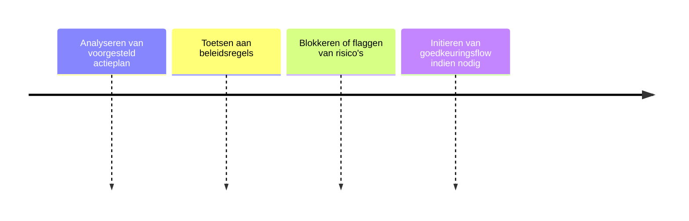

# Policy Engine

## Functionele Beschrijving
Controleert of verzoeken voldoen aan bedrijfsregels (bijv. Wetgeving, Ethiek, en controls zoals geen SQL toegang zonder goedkeuring).

**Stappen:**

## Technische Beschrijving
### Componenten
Rule Engine, Policy Database, Violation Handler

### Data Flow
Orchestrator -> Policy Check -> Decision

**Benodigde Skills:**
- [Risk Inventory](../skills/research.md)
- [OPA Policy Coding](../skills/build.md)
- [Violation Simulation](../skills/test.md)
- [Policy Bundle Deployment](../skills/deploy.md)
<!-- Prompts: Inventariseer risico's, Codificeer beleid, Simuleer violations, Push policy bundle -->

## Bouwblokken
- [ ] [Mens in de Loop](./mens_in_de_loop.md)

## Mens in de Loop Requirements
Initieert goedkeuring bij violations.

## Compliance Eisen
- [Compliance Overview](../compliance/overview.md)
