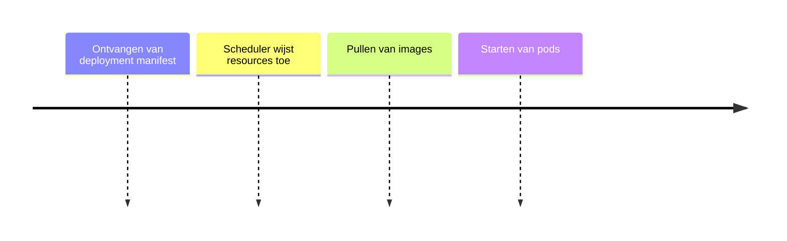

# Runtime

## Functionele Beschrijving
Een hardware infrastructuur waarop wij veilig en compliant zonder menselijk tussenkomst snel Bouwblokken kunnen deployen.

**Stappen:**

## Technische Beschrijving
### Componenten
Kubernetes API, Scheduler, Kubelet, Network Policy

### Data Flow
Manifest -> API Server -> Pod Running

**Benodigde Skills:**
- [Cluster Architecture Design](../skills/research.md)
- [Terraform Provisioning](../skills/build.md)
- [Failover Validation](../skills/test.md)
- [CI/CD Integration](../skills/deploy.md)
<!-- Prompts: Ontwerp cluster architectuur, Provision kubernetes cluster, Validatie van failover, Koppel cluster aan CI/CD -->

## Bouwblokken
- [ ] [MCP Interface](./mcp_interface.md)

## Mens in de Loop Requirements
N.v.t.

## Compliance Eisen
- [Compliance Overview](../compliance/overview.md)
