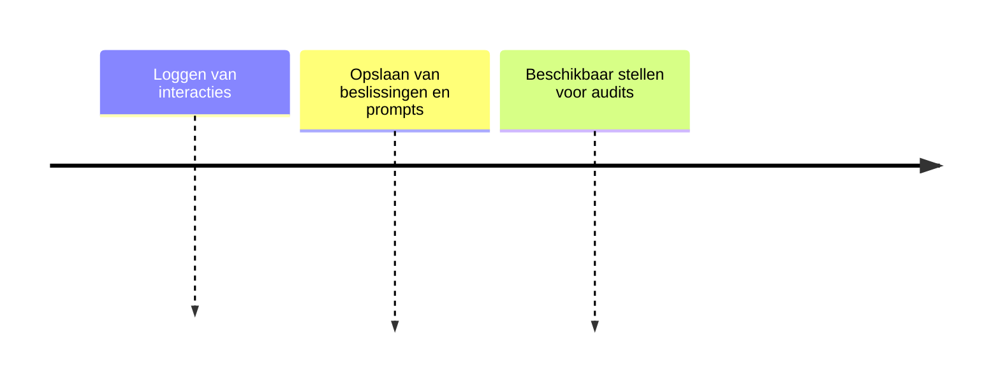

# Traceability DB

## Functionele Beschrijving
Slaat alle stappen, prompts en goedkeuringen op voor auditing doeleinden.

**Stappen:**

## Technische Beschrijving
### Componenten
Timeseries DB, Audit Log Schema, Query API

### Data Flow
System Components -> Logging -> Database

**Benodigde Skills:**
- [Audit Schema Definition](../skills/research.md)
- [Logging Implementation](../skills/build.md)
- [Immutability Verification](../skills/test.md)
- [Storage Provisioning](../skills/deploy.md)
<!-- Prompts: Bepaal audit log schema, Implementeer structured logging, Verifieer onwijzigbaarheid, Provision storage -->

## Bouwblokken
- [ ] [Druppie Compliance Layer](./compliance_layer.md)

## Mens in de Loop Requirements
N.v.t.

## Compliance Eisen
- [Compliance Overview](../compliance/overview.md)
