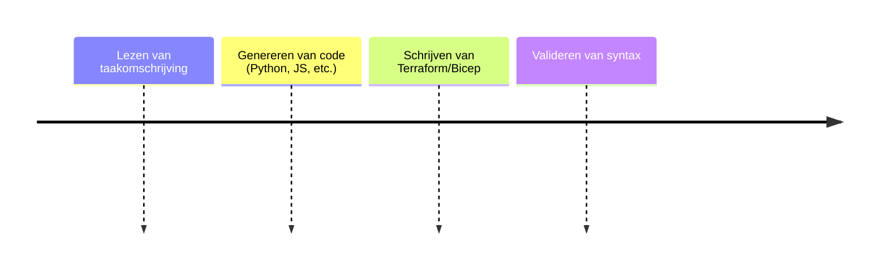

# Builder Agent

## Functionele Beschrijving
Gespecialiseerde AI die code en Infrastructure-as-Code (IaC) genereert.

**Stappen:**

## Technische Beschrijving
### Componenten
Code LLM, Syntax Checker, File Writer

### Data Flow
Task -> LLM -> Code Files

**Benodigde Skills:**
- [Coding LLM Selection](../skills/research.md)
- [Code Generation Logic](../skills/build.md)
- [Unit Test Generation](../skills/test.md)
- [Build Handover](../skills/deploy.md)
<!-- Prompts: Selecteer het beste coding LLM, Implementeer code generatie, Genereer unit tests, Koppel aan Foundry -->

## Bouwblokken
- [ ] [Foundry](./foundry.md)

## Mens in de Loop Requirements
N.v.t.

## Compliance Eisen
- [Compliance Overview](../compliance/overview.md)
