# AI‑Builder Agent

## Inleiding

Een **AI‑Builder Agent** is een interactieve software-agent die samen met de gebruiker een **specificatie** (spec) opstelt en verfijnt, en vervolgens één of meerdere **LLM’s** inzet om op basis van die specificatie en beschikbare **skills** (tools/capabilities) code te schrijven, te testen en iteratief te verbeteren.

Het doel is: **van idee → heldere spec → werkende implementatie**, met controle, auditability en herhaalbaarheid.

Dit document is gelaagd opgebouwd:
- 🔰 **Beginner**: wat is een AI‑Builder en hoe werkt het in simpele termen?
- 🧠 **Expert**: architectuur, state machine, guardrails, skill contracts en agentic workflow patterns

Mermaid-diagrammen worden gebruikt voor uitleg en voorbeelden.

---

## 1. Wat is een AI‑Builder Agent? (Beginner)

Een AI‑Builder Agent is:

> Een “bouwassistent” die samen met jou uitzoekt **wat je precies wil**, en daarna **software bouwt** op basis van die afspraken.

In plaats van dat je één prompt geeft (“maak een app”), werkt de AI‑Builder zo:

1. **Vraagt door** tot de spec duidelijk is
2. **Vat samen** wat er gebouwd moet worden
3. **Laat een code‑LLM** code genereren volgens de spec
4. **Runt tests** en checkt kwaliteit
5. **Itereert** totdat het klopt

---

## 2. Waarom spec-driven? (Beginner)

Zonder spec-driven aanpak:
- onduidelijke requirements
- wisselende output
- lastig te testen
- moeilijk te onderhouden

Met een spec:
- iedereen is het eens over de scope
- je krijgt consistente code
- je kunt gates en tests toevoegen
- je kunt later makkelijk uitbreiden

---

## 3. Hoofdrollen in het systeem

Een AI‑Builder omgeving bestaat meestal uit:

- **User**: levert requirements, feedback, domeinkennis
- **AI‑Builder Agent**: spec + planning + besluitvorming
- **Code LLM**: schrijft code op basis van spec + context
- **Skill Layer**: tools (repo lezen, build uitvoeren, tests draaien, linten, deployen)
- **Artifact Store**: code, testresultaten, logs, releases


---

## 4. Kernverantwoordelijkheden van de AI‑Builder Agent

### Voor beginners
- Doorvragen en de spec duidelijk maken
- Taken opdelen in stappen
- Code laten genereren
- Testen laten draaien
- Feedback verwerken

### Voor experts
- Spec governance (versioning, approvals)
- Risk management (scope creep, security)
- Orchestratie van multi-agent flows
- Deterministische output via structured prompting
- Evaluatie en kwaliteitsgates (tests, lint, policies)

---

## 5. De “Spec Refinement Loop” (Beginner)

De agent refine’t de spec in korte iteraties:


**Belangrijk:**
- De agent stelt vragen om ambiguïteit weg te nemen
- De spec wordt steeds concreter
- Elke stap is traceerbaar (versies)

---

## 6. Van spec naar code (Agentic AI)

Wanneer de spec “ready” is, schakelt de AI‑Builder naar implementatie:


De agent werkt hier “agentic”:
- maakt een plan
- voert acties uit via tools/skills
- evalueert resultaten
- past aan
- herhaalt

---

## 7. Skill Contracts (Expert)

De AI‑Builder Agent gebruikt **skills** als gestandaardiseerde capabilities.

Een skill heeft een contract:

- Inputs (parameters)
- Processing logic (wat doet de skill)
- Outputs (resultaten, status, artifacts)
- Failure modes (wat kan misgaan)
- Safety constraints (wat mag niet)

Voorbeeld (conceptueel):

```yaml
skill:
  name: run_tests
  inputs:
    command: string
  outputs:
    status: pass|fail
    report_path: string
  constraints:
    timeout_seconds: 900
    no_network: true
```

Door skills te gebruiken kan de agent:
- betrouwbaar acties uitvoeren
- output structureren
- beslissingen nemen op basis van resultaten

---

## 8. Guardrails & kwaliteitsgates (Expert)

Een AI‑Builder Agent hoort niet zomaar code te “spuwen”.
Het moet **kwaliteit borgen**.

### Typische gates
- Unit tests (must pass)
- Linting (must pass)
- Type checks (must pass)
- Security scan (no critical)
- Coverage threshold (bijv. ≥ 80%)


---

## 9. Multi-model routing (Expert)

Een AI‑Builder kan meerdere modellen gebruiken:

- **Reasoning model**: spec refinement, planning, debugging
- **Coding model**: code generation
- **Review model**: code review, style, security checks
- **Eval model**: test failure classification, flaky detection

```mermaid
flowchart TD
  Agent[AI‑Builder] --> R[Reasoning LLM]
  Agent --> C[Coding LLM]
  Agent --> V[Verifier LLM]
  Agent --> E[Eval/Classifier]
```



---

## 10. Output van de AI‑Builder Agent

De agent levert niet alleen code, maar ook:

- **Automated Tests**: Volledige testpiramide (Unit, Integration, E2E) conform [Automated Testing Strategy](../design/automated_testing_docs.md).
- **Living Documentation**: Gegenereerde API-docs (OpenAPI), code docs (Sphinx) en architectuurdiagrammen (Mermaid).
- Spec document (versioned)
- Implementatie (commits/PR)
- Test reports en Coverage reports
- Changelog / release notes
- “How to run” instructies
- Risico’s en beperkingen

---

## 11. Veelgemaakte valkuilen

- Geen duidelijke spec → scope creep
- Geen tests → onbetrouwbare output
- Geen logging/audit → oncontroleerbaar
- Agent schrijft “te veel” tegelijk → moeilijk te reviewen
- Skills zonder contract → chaos

---

## 12. Samenvatting

### Beginner
- AI‑Builder vraagt door en maakt een duidelijke spec
- Daarna schrijft hij code via een LLM en test hij het

### Expert
- AI‑Builder is een orchestrator: spec → plan → execute → evaluate → iterate
- Skills + gates maken het betrouwbaar en enterprise-ready

