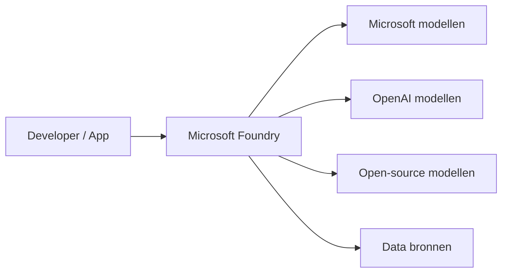
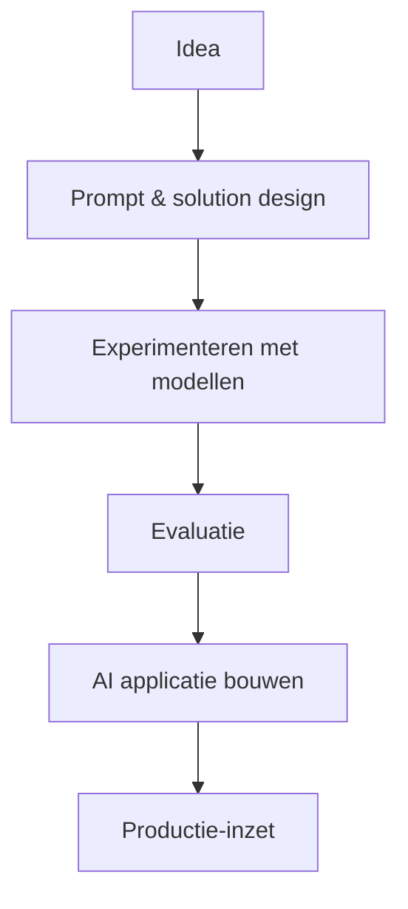
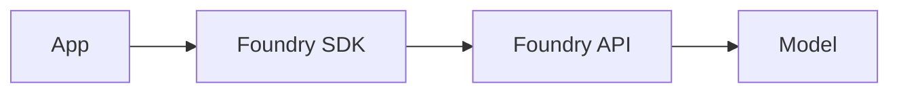
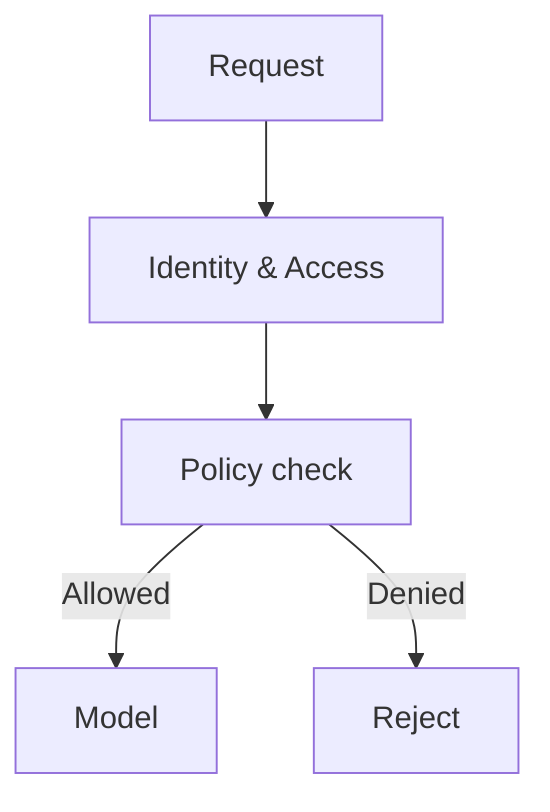
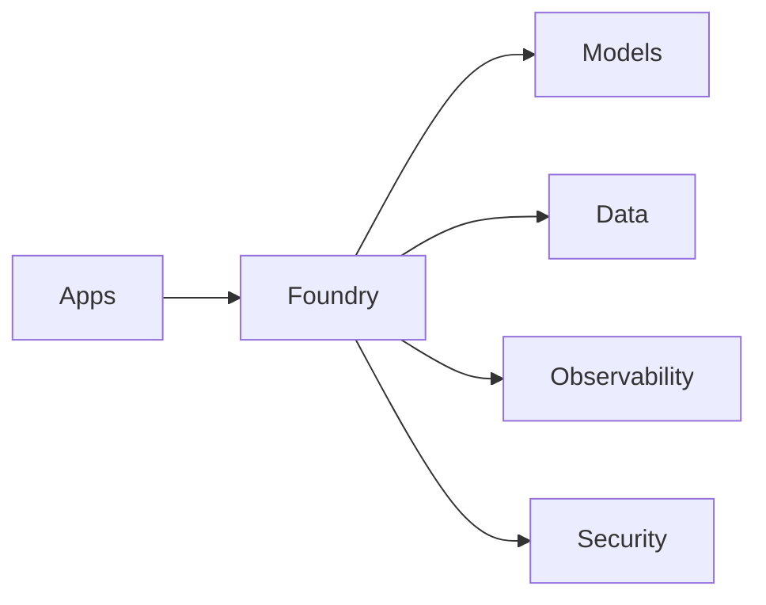
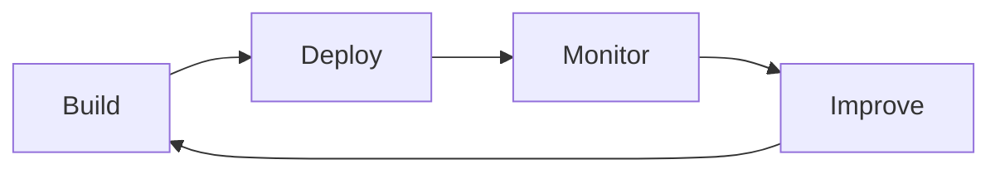
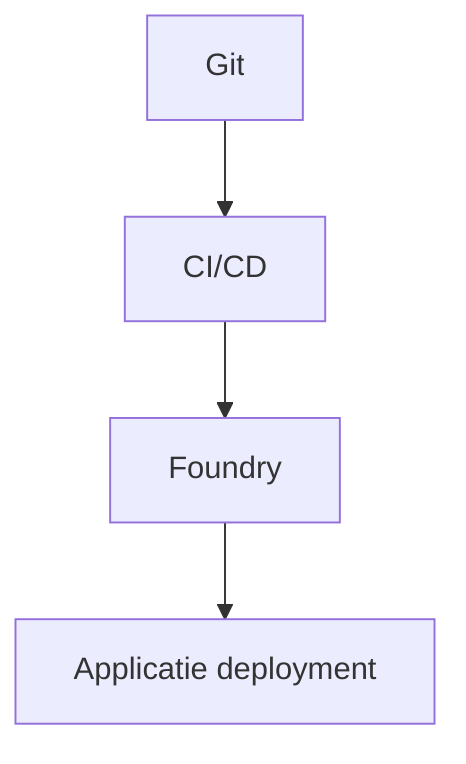

# Foundry

## Inleiding

**Foundry**, tegenwoordig bekend als **Azure AI Foundry**, is een **end-to-end platform** binnen Microsoft Azure voor het **bouwen, orkestreren, beveiligen en beheren van AI-oplossingen**.

Het platform is ontworpen om:
- AI-modellen (van Microsoft, OpenAI en derden) **toegankelijk** te maken
- AI-applicaties **productieklaar** te bouwen
- Governance, security en compliance **standaard mee te nemen**

Dit document is gelaagd opgebouwd:
- 🔰 **Beginners** begrijpen wat Foundry is en waarvoor je het gebruikt
- 🧠 **Experts** krijgen inzicht in architectuur, integratiepatronen en enterprise-inzet

Mermaid-diagrammen worden gebruikt om de werking te verduidelijken.

---

## 1. Wat is Foundry? (Beginner)

Foundry is:

> Een **centrale AI-ontwikkelomgeving** waarin je AI-modellen kunt **selecteren, testen, combineren en inzetten** in applicaties.

Je kunt Foundry zien als:
- Een **AI control plane**
- Een **model hub**
- Een **bouwplaats voor AI-applicaties**

Zonder Foundry:
- Losse AI API-calls
- Weinig overzicht
- Handmatige integraties

Met Foundry:
- Gecentraliseerd beheer
- Veilige toegang tot modellen
- Snellere time-to-value

---

## 2. Hoog Overzicht van de Architectuur (Beginner)

Foundry fungeert als **tussenlaag**:
- Apps praten met Foundry
- Foundry regelt modelkeuze, routing en security

---

## 3. Welke AI-modellen kun je gebruiken?

### 3.1 Microsoft & OpenAI Modellen
- GPT-modellen
- Embedding-modellen
- Vision & speech modellen
- Copilot-gerelateerde modellen

### 3.2 Open-source & externe modellen
- LLaMA
- Mistral
- Phi
- Andere foundation models

Foundry maakt het mogelijk om:
- Modellen te **vergelijken**
- Modellen te **switchen zonder codewijziging**
- Meerdere modellen te **combineren in één oplossing**

---

## 4. Foundry als AI Build Platform

### Van idee naar AI-oplossing

Foundry ondersteunt:
- Prompt engineering
- Model-evaluatie
- Versiebeheer
- Deployment

---

## 5. Foundry & Toegang tot AI (API & SDK)

### Hoe gebruik je Foundry?

- Via **webportal**
- Via **API**
- Via **SDK’s** (bijv. Python, JavaScript)

Voordelen:
- Gestandaardiseerde API
- Centrale authenticatie
- Consistente logging en quota

---

## 6. Governance, Security & Compliance (Beginner → Expert)

### Security Principes
- Identity & Access Management
- Isolatie per project / omgeving
- Data-afbakening

### Governance
- Wie mag welk model gebruiken?
- Welke data mag worden gebruikt?
- Kosten- en quota-beheer

---

## 7. Foundry in Enterprise Architectuur (Expert)

### Positionering

Foundry is:
- Geen los AI-model
- Maar een **platformlaag** tussen apps en AI-capabilities

---

## 8. Foundry & AI Lifecycle Management (Expert)

Foundry ondersteunt de volledige AI lifecycle:
- Experimentatie
- Validatie
- Versiebeheer
- Monitoring
- Iteratie

---

## 9. Integratie met Platformen & DevOps (Expert)

Foundry kan geïntegreerd worden met:
- CI/CD pipelines
- Kubernetes platforms
- GitOps flows
- MCP Servers

---

## 10. Veelgebruikte Use-cases

- Chatbots & copilots
- Document analyse
- RAG-oplossingen
- AI-gedreven besluitvorming
- Integratie met bedrijfsprocessen

---

## 11. Best Practices

### Voor beginners
- Start met één use-case
- Gebruik standaardmodellen
- Houd prompts simpel

### Voor experts
- Gebruik evaluatiesets
- Scheidt test en productie
- Combineer meerdere modellen
- Monitor kosten en performance

---

## 12. Samenvatting

### Beginner
- Foundry is een centrale AI-omgeving
- Je krijgt eenvoudig toegang tot meerdere AI-modellen
- Security en governance zijn standaard geregeld

### Expert
- Foundry is een enterprise AI control plane
- Het abstraheert modelkeuze en lifecycle
- Het versnelt veilige AI-adoptie op schaal
