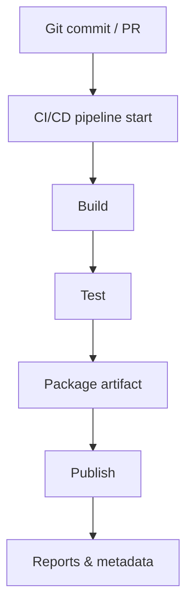
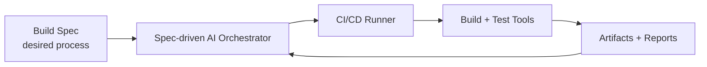
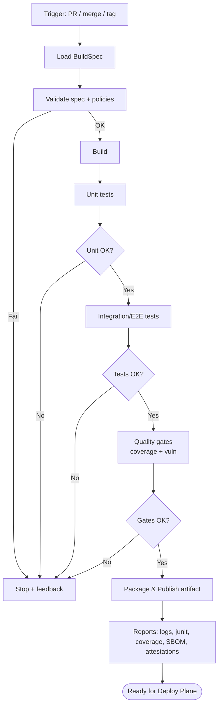
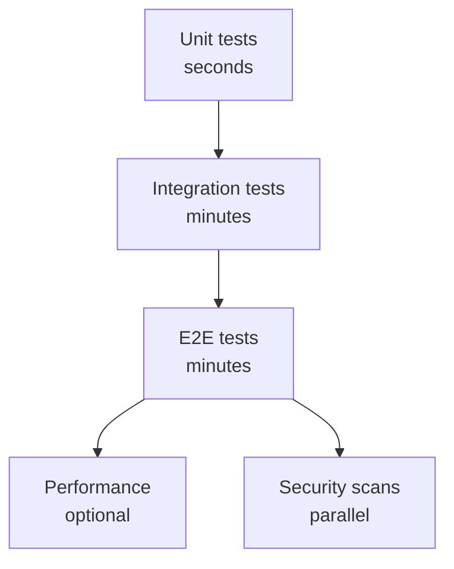
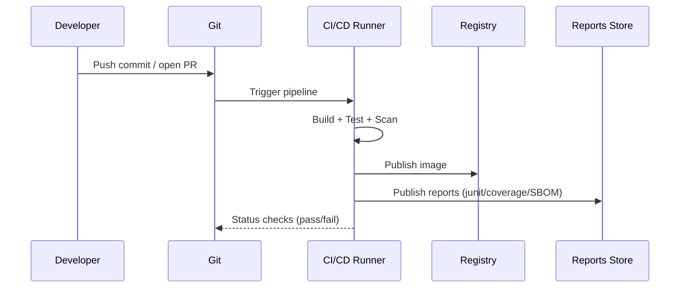
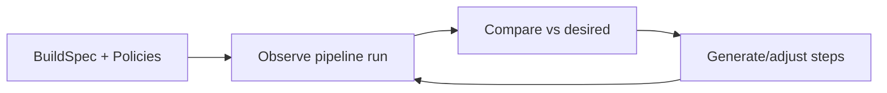
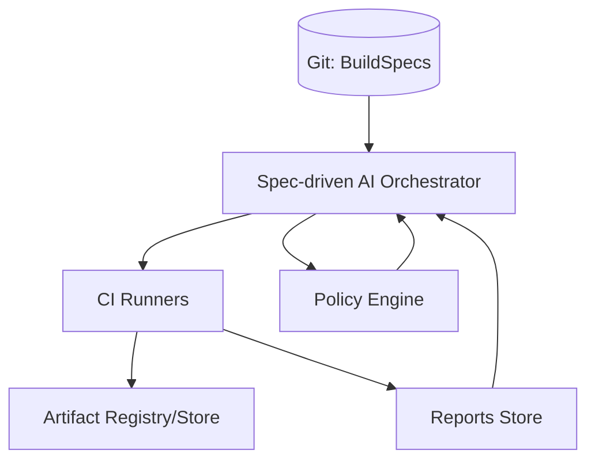
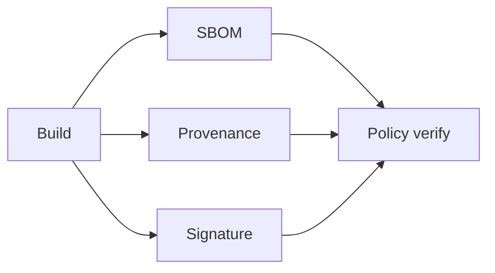
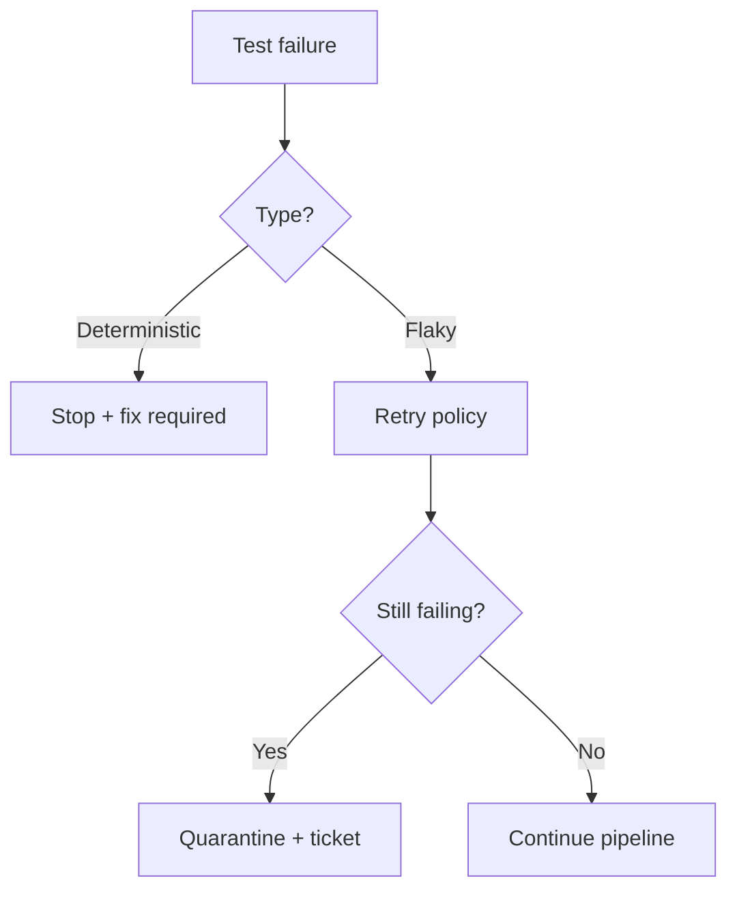
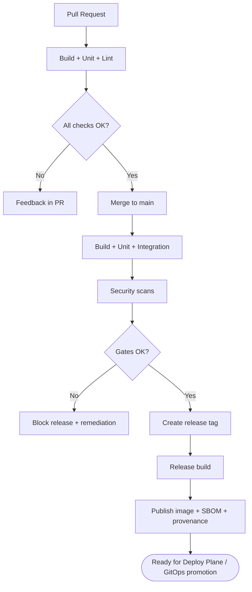

# Build Plane – Spec-driven AI voor Bouwen & Testen via CI/CD

## Inleiding

De **Build Plane** is het deel van je platform dat verantwoordelijk is voor het **bouwen, testen en verpakken** van software op een **herhaalbare, auditeerbare en policy-gedreven** manier.  
In een moderne platform-architectuur is de Build Plane vaak de “fabriek” die van **broncode + specificaties** een **release-artifact** maakt (bijv. container image + SBOM + testresultaten).

In dit document beschrijven we een **spec-driven AI** aanpak:

> Een AI-agent (of meerdere) voert Build Plane-taken uit op basis van **specificaties** (specs), niet op basis van losse instructies.

Hierdoor wordt het proces:
- **Consistent** (zelfde regels, zelfde output)
- **Beheersbaar** (policies, approvals, gates)
- **Schaalbaar** (veel teams, veel services)
- **Traceerbaar** (wie/wat/waarom via spec + logs)

Dit document is gelaagd:
- 🔰 **Beginner**: wat is de Build Plane en hoe loopt “code → build → test”
- 🧠 **Expert**: architectuur, spec-schema’s, decision logic, supply chain security, caching, hermetic builds

---

## 1. Wat is de Build Plane? (Beginner)

De Build Plane is alles wat gebeurt **voordat** je applicatie draait in Kubernetes (of productie):

1. Code ophalen uit Git
2. Build uitvoeren (compile, package)
3. Tests draaien (unit/integration/e2e)
4. Artifact maken (bijv. container image)
5. Artifact publiceren (registry)
6. Resultaten opslaan (logs, reports, SBOM)
7. Eventueel: promotie en release metadata genereren



---

## 2. Spec-driven AI: het kernidee

### Waarom “spec-driven”?
In plaats van “de pipeline doet X omdat iemand dat ooit zo schreef”, definieer je **wat je wil** in een spec:

- welke taal/runtime
- welke build tool
- welke test suites
- welke kwaliteitsgates
- welke outputs vereist zijn (image, SBOM, attestations)
- welke policies gelden (geen kritieke kwetsbaarheden, coverage threshold, etc.)

De AI-agent gebruikt deze spec om:
- de pipeline te genereren of aan te sturen
- beslissingen te nemen (gates)
- fouten te diagnostiseren en fixes voor te stellen
- resultaten te formatteren en te publiceren



### Gerelateerde Ontwerpen
*   [Component Interactie](../design/component_interaction.md): Hoe de Build Plane praat met de Runtime.
*   [Automated Rebuild](../design/automated_rebuild.md): Hoe de Build Plane reageert op security patches.
*   [Automated Testing](../design/automated_testing_docs.md): De teststrategie die hier wordt uitgevoerd.


---

## 3. De Build Plane bouwblokken

### 3.1 Git & Triggering
Triggers die de Build Plane activeren:
- Pull Request (validatie)
- Merge naar main (release candidate)
- Tag (release)
- Manual (hotfix / backfill)

### 3.2 CI/CD Framework
Een CI/CD framework is de “execute layer”:
- voert jobs uit in containers/VMs
- beheert secrets
- geeft logs en artifacts door
- ondersteunt concurrency en caching

Voorbeelden (vendor-neutraal): GitHub Actions, GitLab CI, Jenkins, Tekton, Buildkite.

### 3.3 Build System
Afhankelijk van je stack:
- Node: npm/pnpm/yarn + bundlers
- Java: Maven/Gradle
- Python: uv/poetry/pip + build backends
- Go: go build + modules
- .NET: dotnet build/test/publish

### 3.4 Test Framework
Tests worden uitgevoerd door:
- Unit tests (bijv. JUnit, pytest, Jest)
- Integration tests (bijv. Testcontainers)
- Contract tests (bijv. Pact)
- E2E tests (bijv. Playwright/Cypress)
- Security tests (SAST/DAST) & dependency scans

### 3.5 Artifact & Registry
De output is meestal:
- Container image (OCI)
- Helm chart / manifests bundle
- SBOM (CycloneDX/SPDX)
- Attestations (provenance)

---

## 4. Het Spec Model (Beginner → Intermediate)

Een **Build Spec** beschrijft het proces declaratief. Voorbeeld:

```yaml
apiVersion: platform.build/v1
kind: BuildSpec
metadata:
  name: checkout-service
spec:
  language: nodejs
  runtimeVersion: "20"
  build:
    command: "pnpm build"
    artifact:
      type: oci-image
      imageName: "registry.example.com/checkout"
  tests:
    - name: unit
      command: "pnpm test"
      required: true
    - name: integration
      command: "pnpm test:integration"
      required: true
  qualityGates:
    coverageMinPct: 80
    vulnMaxSeverity: high
  publish:
    tags:
      - "{git.sha}"
      - "{semver}"
  caching:
    enabled: true
    keys:
      - "pnpm-lock.yaml"
```

**Wat levert dit op?**
- De AI kan op basis hiervan:
  - een pipeline genereren
  - build/test uitvoeren
  - gates evalueren
  - outputs publiceren

---

## 5. Build Plane workflow (met gates)



---

## 6. Testen: van simpel naar volwassen

### 6.1 Testlagen (Beginner)

- **Unit tests**: snel, veel, lokaal
- **Integration tests**: meerdere componenten samen
- **E2E tests**: test de “gebruikersflow”
- **Performance tests**: latency/throughput
- **Security tests**: kwetsbaarheden en misconfiguraties



### 6.2 Test framework integratie (Expert)

Een volwassen Build Plane:
- draait tests **parallel** waar mogelijk
- gebruikt **test reports** (JUnit, coverage, screenshots)
- heeft **flaky test handling** (retry policy, quarantine)
- scheidt **deterministische** checks van **best-effort** checks
- gebruikt **ephemeral test environments** (bijv. namespace-per-PR)

---

## 7. CI/CD pipeline als “execution engine”

### 7.1 Minimal pipeline (concept)
Een pipeline heeft typisch:
1. Checkout
2. Setup runtime
3. Restore cache
4. Build
5. Test
6. Package
7. Scan
8. Publish
9. Report



### 7.2 Spec-driven AI rol in de pipeline
De AI fungeert als:
- **Planner**: vertaalt spec naar jobs/stappen
- **Policy engine**: interpreteert gates
- **Diagnostician**: analyseert failures en geeft actiegerichte feedback
- **Curator**: formatteert outputs (release notes, changelog, metadata)

---

## 8. Expert: Architectuur van de Build Plane

### 8.1 Control-loop model
De AI-agent kan als controller werken:



### 8.2 Componenten (reference architecture)
- **Spec Registry**: opslag van BuildSpecs (bijv. in Git)
- **Orchestrator (AI)**: parseert specs, maakt plan
- **Runner pool**: CI executors
- **Artifact store**: registry + object storage
- **Telemetry**: logs, metrics, traces
- **Policy layer**: quality/security compliance



---

## 9. Supply chain security (Expert)

Een sterke Build Plane maakt builds:
- **Reproduceerbaar** (pin dependencies)
- **Traceerbaar** (SBOM + provenance)
- **Policy-compliant** (vuln thresholds)
- **Least privilege** (short-lived creds)

### Typische outputs
- SBOM (wat zit er in het artifact?)
- Provenance attestation (hoe is het artifact gebouwd?)
- Signature (is het artifact vertrouwd?)



---

## 10. Caching, hermetic builds en performance (Expert)

### Caching
- dependency cache (maven/gradle/npm)
- docker layer cache
- remote cache (build system)

### Hermetic build (ideaal)
- geen externe netwerktoegang tijdens build (of gecontroleerd)
- alle inputs zijn pinned en bekend
- output is deterministisch

**Waarom?**
- minder “works on my machine”
- sneller
- veiliger

---

## 11. Failures & decision logic (Expert)

### Veelvoorkomende fouten
- dependency download failures
- test failures (logic/contract)
- flaky tests
- security gate failures
- registry publish failures

### Decision logic (voorbeeld)
- Unit fail → stop, feedback
- Integration fail → stop, produce repro instructions
- Flaky signature → retry N keer, dan quarantine
- Security gate fail → block release, open issue
- Publish fail → retry/backoff, then fail hard



---

## 12. Praktisch voorbeeld: PR → Test → Main → Release



---

## 13. Samenvatting

### Beginner
- De Build Plane bouwt en test je app automatisch via CI/CD
- Uitkomst is een artifact (bijv. container image) + testresultaten

### Expert
- Spec-driven AI maakt het proces declaratief, auditeerbaar en policy-driven
- Gates (kwaliteit/security) bepalen of je naar productie mág
- Supply chain outputs (SBOM/provenance) maken releases vertrouwd

