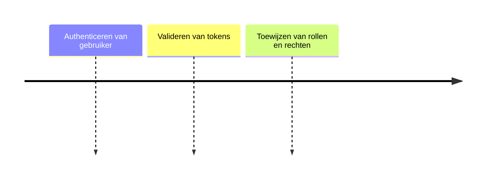

# Identity & Access Management (IAM)

## Functionele Beschrijving
Beheert identiteiten en toegang (IAM). Zorgt ervoor dat alleen geautoriseerde gebruikers acties uitvoeren.

**Stappen:**

## Technische Beschrijving
### Componenten
Identity Provider, Token Service, Directory

### Data Flow
UI -> IAM -> Access Token

**Benodigde Skills:**
- [Role Definition](../skills/research.md)
- [App Registration Config](../skills/build.md)
- [Token Validation](../skills/test.md)
- [Service Principal Provisioning](../skills/deploy.md)
<!-- Prompts: Bepaal benodigde IAM rollen, Configureer App Registration, Valideer token generatie, Provision service principal -->

## Bouwblokken
- [ ] [Druppie UI (Copilot)](./druppie_ui.md)

## Mens in de Loop Requirements
N.v.t.

## Compliance Eisen
- [Compliance Overview](../compliance/overview.md)
