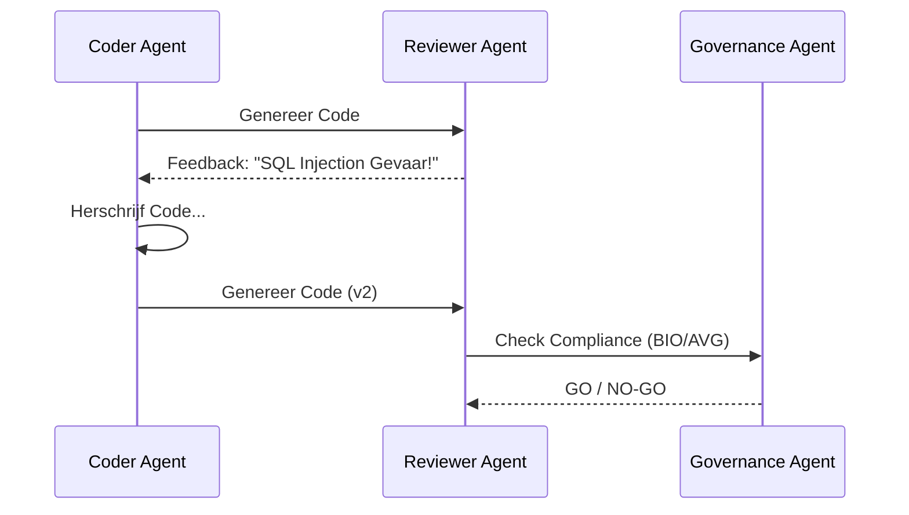
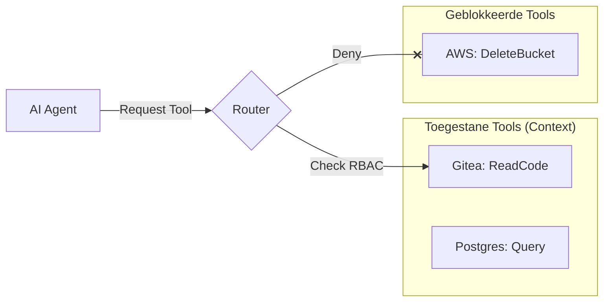
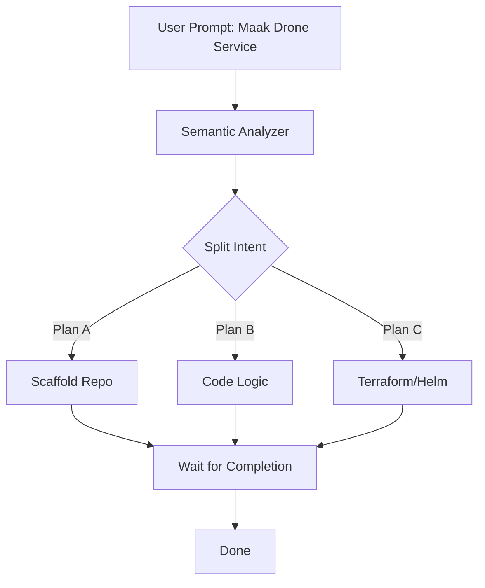
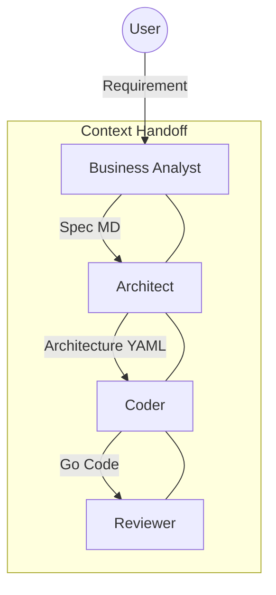
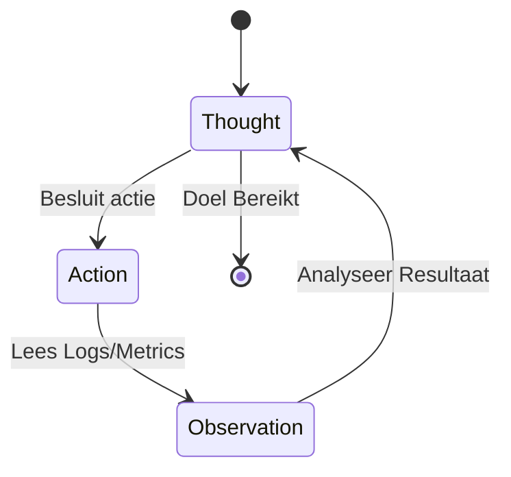

# Technische Ontwerp: AI Agent Patterns (Agentic Design)

## 1. Reflection (Zelf-Correctie)
*Het vermogen van de AI om zijn eigen werk te beoordelen en te verbeteren voordat het naar de gebruiker gaat.*

### Implementatie in Druppie
*   **The Reviewer Loop**: Elke generatie van code (door de `Coder Agent`) wordt niet direct gecommit, maar eerst doorgegeven aan een `Reviewer Persona`.
*   **Prompt Structuur**:
    1.  *Coder*: Genereert Code.
    2.  *Reviewer*: "Analyseer deze code op Security bugs en Performance issues. Geef een lijst met verbeterpunten."
    3.  *Coder*: "Herschrijf de code op basis van deze feedback."
*   **Component**: De `Governance Agent` fungeert als de ultieme reviewer die checks doet tegen de [Compliance Registry](../story/druppie_specification.md).

## 2. Tool Use (Capability Invocation)
*Het gebruik van externe tools om acties uit te voeren in de echte wereld.*

### Implementatie in Druppie
*   **MCP (Model Context Protocol)**: Druppie gebruikt MCP als de standaard interface voor Tools.
    *   *Lezen*: Gitea (Code lezen), PostgreSQL (Data ophalen).
    *   *Schrijven*: Tekton (Pipeline starten), Flux (GitOps repo updaten).
*   **Veiligheid**: Tools zijn niet "altijd aan". De Router bepaalt welke subset van tools een agent mag zien (Least Privilege).

## 3. Planning (Thinking Fast and Slow)
*Complexe taken opbreken in stappen.*

### Implementatie in Druppie
*   **Chain of Thought**: De [Router Agent](../story/druppie_specification.md#epic-1-core-reasoning-engine--orchestration) splitst een grote vraag ("Bouw een Drone Service") op in een `ExecutionPlan`:
    1.  Scaffold Repo.
    2.  Schrijf Code.
    3.  Maak Dockerfile.
    4.  Creeër Helm Chart.
*   **Stateful Plan**: Dit plan wordt opgeslagen in Redis. Als stap 2 faalt, weet de AI dat hij niet opnieuw hoeft te beginnen bij stap 1, maar stap 2 moet fixen.

## 4. Multi-Agent Collaboration (Swarm Intelligence)
*Specialisten samen laten werken.*

### Implementatie in Druppie
*   **Decompositie**: Zie [Router Decomposition Flow](../story/druppie_specification.md#32-router-decomposition-flow).
*   **Handoffs**:
    *   *Business Analyst Agent*: Praat met de gebruiker, verheldert requirements -> Output: `Specs.md`.
    *   *Architect Agent*: Leest `Specs.md`, kiest bouwblokken -> Output: `Architecture.yaml`.
    *   *Coder Agent*: Leest `Architecture.yaml`, schrijft code.
*   **Voordeel**: Elke agent heeft een smallere context window nodig en een specifiekere prompt, wat leidt tot hogere kwaliteit.

## 5. ReAct (Reasoning + Acting)
*Een iteratieve loop van Denken -> Doen -> Observeren.*

### Implementatie in Druppie
*   **Debug Loop**:
    *   *Thought*: "De build is gefaald. Ik moet de logs bekijken."
    *   *Action*: `tekton.getLogs({ runId: "123" })`
    *   *Observation*: "Error: package 'foo' not found."
    *   *Thought*: "Ah, ik ben een dependency vergeten in `go.mod`. Ik ga die toevoegen."
    *   *Action*: `git.commit({ file: "go.mod", content: "..." })`
*   **Observability**: De agents hebben toegang tot *echte* feedback van het systeem (via Logs en Metrics), niet alleen hun eigen aannames.

---

## Samenvatting Architectuur
De **Druppie Core** is een implementatie van deze 5 patterns in een Kubernetes-native jasje:

| Pattern | Druppie Component |
| :--- | :--- |
| **Reflection** | Governance & Reviewer Agents |
| **Tool Use** | MCP Client & Server Architecture |
| **Planning** | Core Planner & ExecutionPlan State |
| **Multi-Agent** | Router & Registry (Skill Injection) |
| **ReAct** | Build Plane Feedback Loop (Tekton/Flux) |
