# Technisch Ontwerp: Secure Agentic RAG Network

## 🎯 Doelstelling
Dit ontwerp beschrijft een **Agentic Network** dat ongestructureerde data (bestanden) en publieke data (web) combineert om intelligente acties uit te voeren.

Kernpunt is **Security by Design data-toegang**: Een gebruiker mag via de AI NOOIT informatie vinden die hij via de normale bestandsverkenner niet zou mogen zien.

---

## 🏗️ Architectuur: Het Agenten Netwerk

We gebruiken een **Multi-Agent** opzet waarbij specifieke taken zijn gedelegeerd.

```mermaid
graph TD
    User("👤 Gebruiker (Context: Groepen)") <--> |"Chat Interface"| Router("🤖 Router Agent")

    subgraph DataPlane ["📚 Knowledge & Data"]
        FS("📂 FileSystem (SMB/SharePoint)")
        VDB[("🧠 Vector DB (Qdrant)")]
        Web("🌐 Web Search (MCP)")
    end

    subgraph Agents ["🕵️ Agent Network"]
        Ingester("🤖 Ingest Agent")
        RAG("🤖 RAG Agent (Search)")
        Action("🤖 Action Agent")
    end

    subgraph Execution ["⚙️ Uitvoering"]
        Argo("🚀 Argo Workflow")
        ExtSys("🖥️ Extern Systeem (API)")
    end

    %% Inest Flow
    FS --> |"1. Read File + ACLs"| Ingester
    Ingester --> |"2. Embed + Tags"| VDB

    %% Query Flow
    Router --> |"3. Vraag + User Token"| RAG
    RAG --> |"4. Vector Search + Filter"| VDB
    RAG -- "5. Search Web (Opt)" --> Web
    RAG --> |"6. Synthesized Answer"| Router

    %% Action Flow
    Router --> |"7. Intent: Update Systeem"| Action
    Action --> |"8. Trigger Process"| Argo
    Argo --> |"9. Update"| ExtSys
```



---

## 🔐 Security by Design: De "ACL-Aware" RAG

Het grootste risico bij RAG (Retrieval Augmented Generation) is dat de AI alle documenten "leest" en antwoord geeft op basis van een geheim document. Dit lossen we op via **Metadata Filtering**.

### Stap 1: Ingestie met Rechten (The Ingest Agent)
De Ingest Agent leest niet alleen de tekst, maar ook de **Access Control List (ACL)** van het bestand.

*   **Input**: `Project_Begroting_2025.xlsx`
*   **ACL**: Read access voor group: `Management`, `Finance`.
*   **Action**:
    1.  Chunk de tekst.
    2.  Genereer Vector Embedding.
    3.  Sla op in VectorDB met metadata:
        ```json
        {
          "content": "Het budget is 1 miljoen...",
          "source": "Project_Begroting_2025.xlsx",
          "allowed_groups": ["Management", "Finance"]
        }
        ```

### Stap 2: Zoeken met Context (The RAG Agent)
Wanneer gebruiker `Jan` een vraag stelt, stuurt de frontend zijn **JWT Token** (van Keycloak) mee.

1.  **Extract Claims**: De RAG Agent ziet in het token: `Jan` is lid van `["Engineering", "Public"]`.
2.  **Search Query**: De Agent construeert een filter-query voor de VectorDB:
    *   *Vector*: (De vraag van Jan)
    *   *Filter*: `metadata.allowed_groups IN ["Engineering", "Public"]`
3.  **Resultaat**: Omdat `Finance` niet in de lijst van Jan staat, vindt de VectorDB **0 resultaten** voor de begroting. De AI antwoordt: *"Ik kan die informatie niet vinden."*

---

## 🔄 De Flow: Van Vraag naar Actie

### Scenario: "Update de voorraadstatus gebaseerd op leveranciersnieuws"

1.  **Vraag**: Gebruiker vraagt: *"Zoek uit of onze leverancier X leveringsproblemen heeft en update zo nodig ons ERP systeem."*
2.  **Router**:
    *   Herkent vraag als "Onderzoek + Actie".
    *   Roept eerst **RAG Agent** en **Web Agent** aan.
3.  **Informatie Vergaring**:
    *   **Web Agent**: Zoekt via MCP (Brave Search): *"Leverancier X faillissement nieuws"*. -> Vindt nieuwsartikel.
    *   **RAG Agent**: Zoekt intern contract: *"Contract Leverancier X"*. -> Vindt clausule over leveringsplicht (mits gebruiker recht heeft!).
4.  **Redenering**:
    *   Router combineert info: *"Nieuws meldt stakingen, Contract zegt: 5 dagen boetevrij."*
    *   Conclusie: *"Risico op vertraging."*
5.  **Actie**:
    *   Router roept **Action Agent** aan: *"Start 'Update Voorraad Risico' proces voor Vendor X."*
    *   **Action Agent**:
        *   Valideert intentie.
        *   Roept MCP Tool aan: `start_workflow(workflow_id="update_erp_risk", vendor="X")`.
6.  **Uitvoering**:
    *   **Argo Workflow** start.
    *   Roept de API van het ERP systeem aan om de vlag "DeliveryRisk" op "High" te zetten.

---

## 🛠️ Technische Componenten

*   **Vector Database**: **Qdrant** of Weaviate. Deze ondersteunen native high-performance filtering op metadata.
*   **Ingest Framework**: **LangChain** of **LlamaIndex** voor het lezen van files en splitsen van tekst.
*   **MCP Servers**:
    *   `mcp-filesystem`: Voor het lezen van lokale shares/SharePoint.
    *   `mcp-websearch`: Voor toegang tot Brave/Bing.
    *   `mcp-kubernetes`: Voor het triggeren van Argo workflows.

## ✅ Samenvatting
Dit ontwerp garandeert dat de AI krachtig is (combi intern + extern), maar **nooit lekt**. De beveiliging zit niet in de "prompt" ("Negeer geheime data"), maar hard in de database query ("Je KRIJGT geen geheime data").
