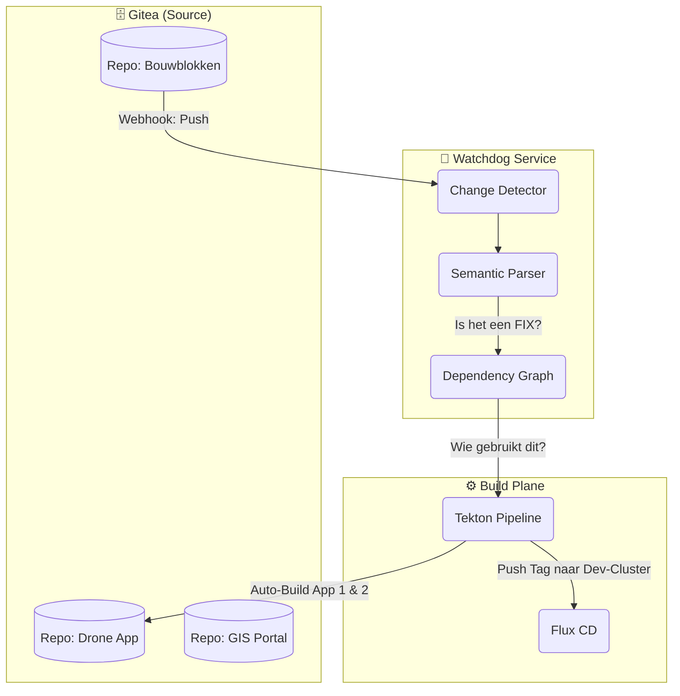

# Technisch Ontwerp: Automated Rebuild & Patching

## 🎯 Doelstelling
We willen een **automatisch "Self-Healing" mechanisme** implementeren dat continu de definities van onze Bouwblokken bewaakt.
Wanneer er een **Bugfix** of **Security Patch** wordt gedetecteerd in een fundamenteel bouwblok (bijv. "Update Base Image Python"), moet het systeem:
1.  Detecteren welke applicaties dit bouwblok gebruiken.
2.  Deze applicaties automatisch herbouwen en uitrollen naar **TEST**.
3.  De update klaarzetten voor promotie naar PROD (via de Deployment Strategy).

Dit voorkomt dat applicaties verouderen en onveilig worden.

---

## 🏗️ Architectuur: De "Dependency Watchdog"

We introduceren een nieuw background proces: de **Dependency Watchdog**. Dit is een lichtgewicht service (of CronJob) die luistert naar wijzigingen in Gitea.



---

## 🔄 Proces Flow

### Stap 1: Change Detection
De Watchdog ontvangt een webhook event van Gitea wanneer er een commit is op de `bouwblokken` repository.

### Stap 2: Semantic Analysis ("Is dit een Fix?")
De Watchdog analyseert de commit message volgens de **Conventional Commits** standaard:
*   `fix: update python to 3.11.2 (CVE-XYZ)` ✅ -> **Actie vereist!**
*   `chore: update readme` ❌ -> Negeren.
*   `feat: add new capability` ❌ -> Negeren (vereist handmatige implementatie).

### Stap 3: Dependency Resolution
De Watchdog kijkt in zijn grafiek (gevoed door de SBOMs in de Traceability DB):
*"Welke applicaties hebben een `FROM: bouwblokken/python-base:3.11` in hun Dockerfile?"*
Resultaat: `Drone App` en `GIS Portal`.

### Stap 4: Automated Rebuild (Cascade)
De Watchdog triggert **Tekton** pipelines voor de geraakte applicaties:
1.  **Checkout**: Haalt de broncode van `Drone App`.
2.  **Patch**: Update de dependency (bijv. in `Dockerfile` of `requirements.txt`).
3.  **Build & Test**: Draait de unit tests om te garanderen dat de fix niets breekt.
4.  **Publish**: Pusht `drone-app:v1.2.1-fix` naar de registry.

### Stap 5: Deploy naar TEST
De Watchdog past de `HelmRelease` voor de **TEST** omgeving aan (via een Git commit op de `fleet-infra` repo):
*   Versie: `v1.2.1-fix`
*   Strategy: **Blitz** (Want het is TEST, mag direct).

### Stap 6: Aanbod aan Productie
De Watchdog maakt automatisch een **Pull Request** aan voor de **PROD** omgeving:
*   Titel: `fix(deps): propagate security patch to prod`
*   Strategy: **Cautious** (Zie Deployment Design).
*   Status: *Pending Approval*.

De beheerder hoeft alleen maar "Merge" te klikken (of de Policy Engine doet het als het een Critical CVE was).

---

## 🛠️ Technische Componenten

### 1. Renovate Bot (De Engine)
We hoeven de "Watchdog" niet zelf te bouwen. We gebruiken **Renovate Bot**.
*   Dit is de industrie-standaard voor geautomatiseerd dependency management.
*   Het snapt Dockerfiles, Helm Charts, Kubernetes manifests en Git submodules.
*   Het kan geconfigureerd worden om bij `fix:` commits automatisch te mergen naar branches die naar TEST deployen.

### 2. Configuratie (`renovate.json`)
We plaatsen dit in de root van onze repo's:

```json
{
  "extends": ["config:base"],
  "packageRules": [
    {
      "matchUpdateTypes": ["patch", "pin", "digest"],
      "matchPackagePatterns": ["^bouwblokken/"],
      "automerge": true,
      "automergeType": "branch",
      "branchPrefix": "fix/auto-rebuild-"
    }
  ],
  "semanticCommits": "enabled"
}
```

## ✅ Samenvatting
Door **Renovate Bot** in te zetten als onze "Watchdog", realiseren we een self-healing platform.
*   **Security**: Patches in base-images sijpelen automatisch door naar alle 50+ applicaties.
*   **Stabiliteit**: Omdat we *eerst* naar TEST uitrollen en testen, gaat productie nooit stuk door een automatische update.
*   **Snelheid**: De "Fix" cyclus gaat van weken naar minuten.
