# Technisch Ontwerp: Automated Testing & Documentation

## 🎯 Doelstelling
Om de ontwikkelingssnelheid hoog te houden zonder in te boeten op kwaliteit, moet het test- en documentatieproces **volledig geautomatiseerd** zijn.
*   **Testen**: Van unit tests tot end-to-end (E2E) gebruikersscenario's.
*   **Documentatie**: Documentatie mag nooit achterlopen op de code ("Living Documentation").

---

## 🏗️ Automated Testing Strategy (The Testing Pyramid)

We hanteren de 'Test Piramide' strategie, geïntegreerd in de **Tekton** pipeline.

```mermaid
graph TD
    subgraph Pyramid ["De Test Piramide"]
        E2E("🔼 E2E (UI/Workflow) - 10%")
        Integration("🔹 Integratie (API) - 20%")
        Unit("🔻 Unit (Code) - 70%")
    end

    subgraph Tools ["🛠️ Tooling"]
        Jest("Jest / PyTest (Unit)")
        Newman("Postman / Newman (API)")
        Playwright("Playwright (UI)")
    end
    
    subgraph DocGen ["📄 Documentation Generation"]
        Pydoc("Sphinx / JSDoc")
        Swagger("OpenAPI Generator")
        Mermaid("Mermaid Live")
    end

    Unit --> Jest
    Integration --> Newman
    E2E --> Playwright
    
    Jest --> |"Genereer Coverage Report"| DocGen
    Newman --> |"Genereer API Docs"| Swagger
```

### 1. Unit Testing (De Basis)
*   **Wanneer**: Bij elke commit.
*   **Wat**: Test individuele functies en classes.
*   **Tool**: `PyTest` (Python) of `Jest` (Node.js).
*   **Eis**: Coverage > 80% (bewaakt door SonarQube).

### 2. Integration Testing (De Koppeling)
*   **Wanneer**: Na de build, vóór deployment naar TEST.
*   **Wat**: Test of de API endpoints goed reageren.
*   **Tool**: `Newman`. We draaien een Postman collectie tegen de container.

### 3. End-to-End Testing (De Ervaring)
*   **Wanneer**: Na deployment op TEST.
*   **Wat**: Simuleer een echte gebruiker ("Klik op knop X, verwacht Scherm Y").
*   **Tool**: `Playwright`.
*   **Scenario**: "Drone piloot uploadt foto, AI anonimiseert, Ecoloog ziet kaart."

---

## 📄 Automated Documentation Strategy ("Docs-as-Code")

Documentatie wordt **gegenereerd uit de bron**, niet handmatig geschreven. Dit garandeert dat de docs altijd kloppen met de werkelijkheid.

### 1. API Documentatie (Swagger/OpenAPI)
*   De code is de bron (`@app.route('/api/v1/drones')`).
*   Tijdens de build genereert de pipeline automatisch een `swagger.json`.
*   Deze wordt gepubliceerd naar **Kong Developer Portal**. Developers zien altijd de *actuele* API specs.

### 2. Code Documentatie
*   Docstrings in de code leggen de intentie uit.
*   Tools als **Sphinx** (Python) of **TypeDoc** (TS) genereren hieruit een leesbare HTML website ("ReadTheDocs").

### 3. Architectuur Platen (Mermaid)
*   Zoals in dit ontwerpdocument, gebruiken we **Mermaid**.
*   Deze diagrammen staan als tekst in Markdown. GitHub/Gitea renderen ze direct.
*   Hierdoor is Versiebeheer op diagrammen mogelijk ("Diff Viewer" toont: "Pijl A wees eerst naar B, nu naar C").

### 4. Living Readme
De Builder Agent update automatisch de `README.md` van een project met:
*   Huidige Build Status (Badges).
*   Laatste Test Coverage %.
*   Link naar de actuele Swagger docs.

---

## 🔄 De Workflow

1.  **Developer**: Commit code (`feat: add new drone sensor`).
2.  **Pipeline**:
    *   Draait Unit Tests -> ✅
    *   Genereert API Docs -> 📄 `openapi.yaml`
    *   Bouwt container.
3.  **Deployment (TEST)**:
    *   Update omgeving.
4.  **Verification**:
    *   Draait Playwright E2E tests -> ✅
    *   Publiseert docs naar het interne kennisportaal.

## ✅ Samenvatting
Door testen en documentatie te automatiseren:
1.  **Verhogen we het vertrouwen**: We *weten* dat het werkt, we hopen het niet.
2.  **Verlagen we drempels**: Nieuwe ontwikkelaars hebben altijd actuele documentatie.
3.  **Besparen we tijd**: Geen handmatige Word-documenten meer updaten.
