# Technisch Ontwerp: Continuous Compliance & Lifecycle Monitoring

## 🎯 Doelstelling
Compliance is geen eenmalig vinkje bij de start van een project. Het is een continu proces dat loopt van het eerste idee tot de uiteindelijke uitfasering van een applicatie.

Dit ontwerp beschrijft hoe wij **Compliance by Design** borgen over de gehele levenscyclus (Lifecycle Management), met specifieke aandacht voor de **AI Act** en het **Algoritmeregister**.

---

## 🏗️ De "Compliance Loop" Architectuur

We hanteren het "Three Lines of Defense" model, maar dan geautomatiseerd.

```mermaid
graph TD
    subgraph Design ["Fase 1: Design (De Belofte)"]
        Spec("📝 Specificatie & AI Register")
        Risk("⚖️ Risk Assessment (AIIA)")
    end

    subgraph Build ["Fase 2: Build (De Validatie)"]
        Code("💻 Code Creation")
        Scan("🛡️ Static Analysis (Trivy/Sonar)")
        PolicyBuild("👮 Policy Check (Gatekeeper)")
    end

    subgraph Run ["Fase 3: Run (De Handhaving)"]
        Deploy("🚀 Deployment")
        Enforce("🛑 Runtime Enforcement (Kyverno)")
        Monitor("📈 Drift & Audit (Prometheus/Loki)")
    end

    subgraph Retire ["Fase 4: Feedback & Retire"]
        Audit("📜 Audit Trail")
        Archief("🗄️ Archivering & Deletion")
    end

    %% Flow
    Spec --> Risk
    Risk --> |"Approved"| Code
    Code --> Scan
    Scan --> PolicyBuild
    
    PolicyBuild --> |"Compliant"| Deploy
    PolicyBuild --> |"Violation"| Code
    
    Deploy --> Enforce
    Enforce --> |"Allowed"| Monitor
    
    Monitor --> |"Drift Detected"| Audit
    Audit --> |"Feedback"| Design
    
    Monitor --> |"End of Life"| Archief
```

---

## 🔄 Lifecycle Fases in Detail

### Fase 1: Design & Registratie (De Bron)
Compliance begint bij de registratie in het **AI Register**. Zonder registratie, geen bouw.
*   **Actie**: De Builder Agent helpt de gebruiker een `algorithm.yaml` aan te maken.
*   **Controle**:
    *   Is het doel duidelijk omschreven?
    *   Is de risicoklasse (Laag/Hoog) bepaald?
    *   Is de eigenaar (mens) bekend?

### Fase 2: Build & Validatie (De Poort)
Tijdens het bouwen (Tekton) checken we of de realiteit (code) overeenkomt met de belofte (design).
*   **SBOM Check**: Gebruiken we veilige componenten? (Trivy).
*   **Quality Check**: Is de code uitlegbaar en onderhoudbaar? (SonarQube).
*   **Dataset Check**: Komt de gebruikte dataset hash (DVC) overeen met een geautoriseerde bron?
*   **Register Update**: Bij succesvolle build wordt het versie-nummer in het AI Register automatisch opgehoogd.

### Fase 3: Runtime Handhaving (De Bewaker)
Wat als iemand de regels probeert te omzeilen na deployment?
*   **Kyverno Policies**:
    *   *No Register, No Run*: Een pod zonder geldig `algorithm-id` label wordt direct gestopt.
    *   *Geofencing*: Data gelabeld als "Intern-Only" mag niet op Cloud-nodes draaien.
*   **Model Monitoring**:
    *   We monitoren niet alleen CPU/RAM, maar ook **Model Drift**.
    *   Signaal: *"Het AI model geeft vandaag 40% vaker 'Risico' aan dan gisteren. Is de data veranderd?"* -> Trigger alert naar Data Scientist.

### Fase 4: Feedback & Retirement (De Schoonmaker)
Compliance gaat ook over opruimen (Dataminimalisatie / AVG).
*   **Retentie Policies**:
    *   Systeem verwijdert automatisch data uit MinIO die ouder is dan X jaar (tenzij gemarkeerd als 'Legal Hold').
*   **Her-certificering**:
    *   Elk jaar stuurt de **Knowledge Bot** een vraag naar de Eigenaar: *"Het algoritme 'Muskusrat V1' draait nog. Is dit nog actueel?"*
    *   Geen antwoord = Automatische uitfasering (Scale to 0).

---

## 🛡️ Borging: Het Dashboard
Alle signalen komen samen in één **Compliance Dashboard** (in de Druppie UI).

1.  **Stoplicht Model**:
    *   🟢 **Green**: Alles compliant.
    *   🟠 **Orange**: Waarschuwing (bijv. "Certificaat verloopt bijna" of "Model drift > 5%").
    *   🔴 **Red**: Overtreding (blokkade actief).
2.  **Audit Trail (Traceability DB)**:
    *   De auditor (Accountant/Inspectie) kan met één druk op de knop de historie zien: *"Toon mij alle wijzigingen aan Algoritme X tussen 2024 en 2025, en wie deze heeft goedgekeurd."*

## ✅ Samenvatting
Wij borgen compliance door het **onderdeel te maken van de techniek**:
1.  **Static**: In de pipeline (Trivy/Sonar).
2.  **Dynamic**: In het cluster (Kyverno).
3.  **Administratief**: In het AI Register (gekoppeld aan GitOps).

Hierdoor is "voldoen aan de wet" geen extra werk, maar het logische gevolg van het gebruik van het platform.
