# Technisch Ontwerp: Component Interactie (Build & Runtime)

## 🎯 Doelstelling
Dit ontwerp detailleert de "End-to-End Flow" binnen het Druppie platform. Het beschrijft hoe de componenten van de **Build Plane** (het maken van software) naadloos integreren met de **Runtime** (het draaien van software), met focus op de geautomatiseerde checks en balances.

Dit is de realisatie van de **Spec-Driven** en **Compliance-by-Design** filosofie.

---

## 🏗️ De Componenten Architectuur

In onderstaand schema zien we de reis van een "Idee" naar een "Draaiende container".

```mermaid
graph TD
    subgraph UserInteraction ["🗣️ Interactie"]
        User("👤 Gebruiker") <--> |"Chst & Specs"| Agent("🤖 Builder Agent")
    end

    subgraph BuildPlane ["🛠️ Build Plane (Foundry)"]
        Agent --> |"1. Commit Code & Config"| Git("🗄️ Gitea (Source)")
        Git --> |"2. Webhook"| Tekton("⚙️ Tekton (CI Pipeline)")
        
        Tekton --> |"3a. Build & Sign"| Registry("📦 Container Registry")
        Tekton --> |"3b. Scan & Test"| Scanner("🛡️ Trivy / SonarQube")
        Tekton --> |"3c. Update Status"| TraceDB("📜 Traceability DB")
    end

    subgraph GitOps ["🔄 GitOps Bridge"]
        Flux("reconciler: Flux CD")
        Flux <--> |"4. Pull Config"| Git
    end

    subgraph Runtime ["🚀 Runtime (Kubernetes)"]
        Flux --> |"5. Apply Manifest"| K8sAPI("Kubernetes API")
        
        K8sAPI --> |"6. Validate Request"| Kyverno("👮 Policy Engine (Kyverno)")
        Kyverno -.-> |"Check Signatures"| Registry
        Kyverno -.-> |"Check AI Register"| TraceDB
        
        Kyverno --> |"7a. Allow"| Kubelet("📦 Workload (Pod)")
        Kyverno --> |"7b. Deny"| K8sAPI
    end
    
    subgraph Observability ["👁️ Observability"]
        Kubelet --> |"8. Logs & Metrics"| Loki("Loki / Prometheus")
    end
```

---

## 🔄 Proces Flow Beschrijving

### Fase 1: Intent & Code (De Build Plane)
1.  **Specificatie**: De gebruiker vraagt de **Builder Agent** om een nieuwe Drone Service. De Agent genereert code (Python) en infra-definitie (Helm/Kustomize).
2.  **Commit**: De Agent pusht alles naar **Gitea**. Dit is het eerste audit-moment ("Wie heeft dit gemaakt?").
3.  **Continuous Integration (Tekton)**:
    *   **Build**: Bouwt de container image.
    *   **Test**: Draait unit tests.
    *   **Security**: Scant op bekende vulnerabilities (CVE's).
    *   **Compliance**: Valideert of `algorithm.yaml` aanwezig is.
    *   **Sign**: Als alles groen is, wordt de image digitaal ondertekend (Cosign) en gepusht naar de Registry.

### Fase 2: Reconciliatie (GitOps Bridge)
4.  **Sync**: **Flux CD** bewaakt de Git repo. Zodra er een nieuwe image-tag in de config staat, wordt dit opgepikt.
    *   *Merk op*: Er is geen directe toegang van CI naar Cluster. Flux trekt (Pulls) de wijziging naar binnen. Dit is veiliger.

### Fase 3: Validatie & Deployment (De Runtime)
5.  **API Call**: Flux stuurt het verzoek ("Start Service V2") naar de Kubernetes API.
6.  **Admission Control (Kyverno)**: Voordat de Pod start, grijpt Kyverno, onze Policy Engine, in:
    *   **Validatie 1**: "Is deze image ondertekend door onze Foundry?" (Voorkomt malafide containers).
    *   **Validatie 2**: "Heeft deze deployment een AI Register ID?"
    *   **Validatie 3**: "Vraagt deze pod niet om root-rechten?"
7.  **Execution**:
    *   *Allow*: De Pod wordt gestart op de juiste node (bijv. On-Prem GPU node).
    *   *Deny*: De update wordt geweigerd en Flux rapporteert een error.

### Fase 4: Feedback Loop
8.  **Observability**: De draaiende applicatie stuurt logs en metrics naar de PLG stack. De **Builder Agent** kan deze data lezen om te zien of zijn creatie goed werkt ("Self-Healing").

---

## 🛡️ Security Controles per Laag

| Laag | Component | Controle | Doel |
| :--- | :--- | :--- | :--- |
| **Code** | Gitea | Branch Protection | Niemand kan direct naar `main` pushen zonder review (door mens of Agent). |
| **Build** | Tekton | Image Scanning | Geen lekke software in productie. |
| **Artifact** | Registry | Image Signing | Garanderen van herkomst (Supply Chain Security). |
| **Deployment**| Flux | Drift Detection | Voorkomen van handmatige aanpassingen ("ClickOps"). |
| **Runtime** | Kyverno | Policy Enforcement | Afdwingen van Run-Time regels (Non-Root, Network Policies). |

## ✅ Samenvatting
Dankzij deze keten is "Compliance" geen papierwerk, maar een geautomatiseerde poortwachter.
*   De **Builder Agent** zorgt voor snelheid.
*   **Tekton & Kyverno** zorgen voor veiligheid.
*   **Git & Flux** zorgen voor stabiliteit.
