# Technisch Ontwerp: Data Lifecycle & Versiebeheer (Drone/Satelliet)

## 🎯 Doelstelling
Dit ontwerp beschrijft de end-to-end flow voor het beheren van grote, veranderlijke datasets zoals drone- en satellietbeelden. Centraal staan **versiebeheer**, **privacy** (anonimisering) en **traceerbaarheid**.

We beantwoorden de vraag: *"Hoe gaan we van een SD-kaart met ruwe foto's naar een geanonimiseerde, versie-beheerde kaartlaag voor de organisatie?"*

---

## 🏗️ De Data Pipeline Architectuur

```mermaid
graph TD
    subgraph Source ["📂 Bron"]
        SDCard("💾 SD-Kaart / Satelliet Feed")
    end

    subgraph DataLake ["🌊 Data Lake (MinIO)"]
        BucketRaw[("🪣 Raw (Versleuteld)")]
        BucketScrub[("🪣 Scrubbed (Privé)")]
        BucketOrtho[("🪣 Ortho (Public/Intern)")]
    end

    subgraph Processing ["⚙️ Processing (Tekton/Argo)"]
        Ingest("📥 Ingest & DVC Init")
        Anonymizer("🧹 AI Anonimiser (YOLOv8)")
        Stitcher("🧩 WebODM (Stitching)")
    end

    subgraph Versioning ["📌 Versiebeheer"]
        Git("🗄️ Gitea (Metadata .dvc)")
    end

    subgraph Serving ["🌍 Serving"]
        GeoServer("🗺️ GeoServer (WMS/WFS)")
        AI("🤖 AI Models")
    end

    %% Flow
    SDCard --> |"1. Upload"| Ingest
    Ingest --> |"2. Store V1"| BucketRaw
    Ingest --> |"3. Commit Hash"| Git
    
    BucketRaw --> |"4. Trigger"| Anonymizer
    Anonymizer --> |"5. Detect Faces/License Plates"| Anonymizer
    Anonymizer --> |"6. Store V1-Scrubbed"| BucketScrub
    
    BucketScrub --> |"7. Process"| Stitcher
    Stitcher --> |"8. Generate Ortho"| BucketOrtho
    
    BucketOrtho --> |"9. Serve"| GeoServer
    BucketOrtho --> |"10. Train"| AI
```

---

## 🔄 Proces Stappen

### Stap 1: Creatie & Ingestie (Raw Data)
*   **Actie**: Een dronepiloot uploadt 500 foto's naar de `landing-zone`.
*   **Versiebeheer**:
    *   Het systeem berekent een unieke hash (MD5) van de dataset.
    *   **DVC** slaat de foto's op in MinIO `bucket-raw`.
    *   DVC maakt een pointer file (`raw_flight_2025.dvc`) en commit deze naar **Gitea**.
    *   *Resultaat*: We hebben een onwijzigbare kopie van het origineel ("Bewijslast").

### Stap 2: Anonimisering (Privacy-by-Design)
Voordat beelden breed gedeeld worden, moeten persoonsgegevens verwijderd worden.
*   **Processing**: Een **Tekton** pipeline start een container met AI-detectie (bijv. een YOLO model getraind op gezichten en kentekens).
*   **Actie**: De AI blurt (vervaagt) alle gedetecteerde privacy-gevoelige pixels.
*   **Opslag**: De opgeschoonde beelden gaan naar `bucket-scrubbed`.
*   **Versiebeheer**: DVC trackt deze nieuwe set. We weten nu: *De dataset in `bucket-scrubbed` is afgeleid van Hash X uit `bucket-raw` met algoritme Versie Y.*

### Stap 3: Aan elkaar plakken (Stitching)
De losse foto's worden één kaart.
*   **Tool**: **WebODM** pakt de beelden uit `bucket-scrubbed`.
*   **Actie**: Uitvoeren van SfM (Structure from Motion) om een 2D Orthofoto (GeoTIFF) en 3D Point Cloud (.laz) te maken.
*   **Opslag**: Resultaat gaat naar `bucket-ortho`. Dit bestand is vaak enorm (GB's), dus MinIO is essentieel.

### Stap 4: Beschikbaar Stellen (Serving)
Andere tools hebben nu toegang nodig.
*   **GIS Gebruikers**: **GeoServer** indexeert de GeoTIFF uit `bucket-ortho` en serveert deze als **WMS** (Web Map Service). De ecoloog ziet de kaart in QGIS of GeoNode.
*   **AI Modellen**: Een Data Scientist wil een nieuw schadedetectie-model trainen.
    *   Hij doet: `dvc get https://gitea/project/drone.git data/ortho`
    *   DVC haalt exact de juiste versie van de Orthofoto uit MinIO.
    *   Dit garandeert **reproduceerbaarheid**: "Dit model is getraind op de geanonimiseerde kaart van 12 mei 2025".

---

## 🛡️ Security & Compliance

1.  **Toegangsbeheer (IAM)**:
    *   `bucket-raw`: Alleen toegankelijk voor de Anonimiser-Service en de CISO (voor forensisch onderzoek).
    *   `bucket-ortho`: Leesbaar voor de hele organisatie.
2.  **Audit Trail**:
    *   In **Gitea** zien we de historie: "Commit 1: Raw Upload" -> "Commit 2: Anonymized" -> "Commit 3: Processed".
3.  **Data Act**:
    *   Omdat we alles opslaan in open formaten (GeoTIFF) en standaarden (WMS), kunnen we data makkelijk delen met ketenpartners (andere waterschappen) zonder vendor lock-in.

## ✅ Samenvatting
Door **DVC** te koppelen aan **MinIO** en **WebODM**, creëren we een "Tijdmachine" voor onze data. We kunnen altijd terugkijken hoe een foto eruit zag vóór anonimisering (indien bevoegd) en we weten precies welke data is gebruikt voor welk AI-model.
