# Technisch Ontwerp: Deployment Strategieën & Rolling Upgrades

## 🎯 Doelstelling
Dit ontwerp beschrijft hoe wijzigingen (updates) gecontroleerd worden uitgerold naar de verschillende omgevingen (TEST, ACC, PROD). Het doel is de balans te vinden tussen **snelheid** (in Test) en **stabiliteit** (in Productie).

De gebruiker heeft regie over de **"Rollout Pace"**: hoe agressief of conservatief een update wordt doorgevoerd, afhankelijk van de impact van de wijziging (Major vs. Minor/Patch).

---

## 🏗️ Het Concept: Spec-Driven Deployment Profile

In plaats van handmatig `kubectl` commando's te tikken, definieert de gebruiker (of de Builder Agent) een **Deployment Profile** in de `service.yaml`.

De Kubernetes `Deployment` resource biedt native ondersteuning voor Rolling Upgrades via `spec.strategy`. Wij tunen deze parameters op basis van het profiel.

### De Paremeters
1.  **Max Surge**: Hoeveel *extra* pods mogen er tijdelijk bij komen? (Hoger = Sneller, kost meer resources).
2.  **Max Unavailable**: Hoeveel pods mogen er *stuk* zijn tijdens de update? (0 = Zero Downtime).
3.  **Min Ready Seconds**: Hoe lang moet een nieuwe pod "goed" draaien voordat we hem vertrouwen en de volgende stap zetten? (Dit is de "wachttijd").

---

## 📊 Strategie Matrix

We onderscheiden drie standaard profielen die de **Builder Agent** automatisch toepast.

| Profiel | Omgeving | Type Wijziging | Max Surge | Max Unavail | Ready Wait (s) | Gedrag |
| :--- | :--- | :--- | :--- | :--- | :--- | :--- |
| **Blitz** | TEST | Alles | 100% | 50% | 0s | **Zo snel mogelijk**. Vervang de helft direct. Downtime is acceptabel. |
| **Cautious** | PROD | Minor / Patch | 25% | 0 | 30s | **Stabiel**. Stap-voor-stap (1 op 4). Geen downtime. Wacht 30s per stap. |
| **Paranoid** | PROD | Major | 1 | 0 | 300s | **Zeer Voorzichtig**. Eén pod per keer. Wacht 5 minuten (300s) per pod. |

---

## ⚙️ Technische Implementatie (Helm/Flux)

De implementatie vindt plaats in de **Helm Chart** die door Flux wordt uitgerold.

### 1. Configuratie (`values.yaml`)
De gebruiker specificeert in de `HelmRelease`:

```yaml
apiVersion: helm.toolkit.fluxcd.io/v2beta1
kind: HelmRelease
metadata:
  name: drone-api
spec:
  values:
    # Keuze door gebruiker/agent:
    deploymentStrategy: "Paranoid" # Want: Major upgrade V1 -> V2
```

### 2. Vertaling naar Kubernetes (`deployment.yaml`)
De Helm chart vertaalt de string "Paranoid" naar harde cijfers:

```yaml
apiVersion: apps/v1
kind: Deployment
spec:
  replicas: 10
  minReadySeconds: {{ .Values.readinessDelay | default 0 }} # De "Wachttijd"
  strategy:
    type: RollingUpdate
    rollingUpdate:
      maxSurge: {{ .Values.maxSurge }}
      maxUnavailable: {{ .Values.maxUnavailable }}
```

---

## 🔄 Visuele Flow: "De Paranoid Rollout"

Stel we upgraden de Drone API van V1 naar V2 in Productie (Paranoid Mode).
We hebben 4 Pods actief.

```mermaid
sequenceDiagram
    participant Flux as 🔄 Flux CD
    participant K8s as ☸️ Kubernetes
    participant Pod1 as 📦 Pod-1 (V1)
    participant Pod2 as 📦 Pod-2 (V1)
    participant PodNew as ✨ Pod-New (V2)

    Note over Flux, PodNew: Start Major Update (Paranoid: Surge 1, Wait 300s)
    
    Flux->>K8s: Apply Deployment Image: V2
    
    K8s->>PodNew: Start 1x V2 Pod
    Note right of PodNew: Opstarten...
    PodNew-->>K8s: Readiness Probe OK!
    
    Note over K8s: ⏱️ Wacht 300 seconden (MinReadySeconds)
    
    K8s-->>K8s: Geen crashes? Metrics OK?
    
    K8s->>Pod1: Terminate V1 Pod
    Pod1-->>K8s: Shutdown
    
    Note over K8s: Herhaal voor volgende Pod...
```



### Safety Gates (Health Checks)
Tijdens de "Wachttijd" (die 5 minuten) monitort Kubernetes de **Liveness** en **Readiness** probes.
*   Als de nieuwe V2 pod crasht (Reboot Loop), stopt de rollout automatisch.
*   De oude V1 pods blijven draaien.
*   Gebruikers merken (bijna) niets, behalve dat de update "hangt".

---

## 🚀 Gebruikerservaring

### Scenario: Developer configureert een update
De developer praat tegen de **Builder Agent**:

> **User**: *"Ik wil de nieuwe Drone AI (V2) naar productie brengen. Het is een grote wijziging, dus doe maar rustig aan."*

> **Agent**: *"Begrepen. Ik configureer de HelmRelease voor 'drone-ai' met strategie **Paranoid**. Dit betekent dat de uitrol 1 pod per 5 minuten vervangt. Akkoord?"*

> **User**: *"Maak er maar 2 minuten van."*

> **Agent**: *"Aangepast. `minReadySeconds` gezet op 120s."*

De Agent commiit vervolgens:
```yaml
# deploy/prod/drone-ai-release.yaml
spec:
  values:
    deploymentStrategy: "Custom"
    customStrategy:
      maxSurge: 1
      maxUnavailable: 0
      readinessDelay: 120
```

## 📚 Bronkeuze: Ramped Slow Rollout & Blue/Green

Naar aanleiding van [best practices](https://octopus.com/devops/kubernetes-deployments/kubernetes-deployment-strategies/), hebben we gekozen voor **Ramped Slow Rollout** als de *standaard* "base option" voor productie. Dit biedt de beste balans tussen veiligheid en resource-efficiëntie.

Echter, voor specifieke **High-Compliance** updates (bijv. een nieuwe versie van de Policy Engine), voegen we de **Blue/Green** strategie toe.

---

## 🔵/🟢 Uitbreiding: Blue/Green Deployment

Voor kritieke componenten waar **geen enkele fout** getolereerd wordt tijdens de switch, of waar een **Human Auditor** expliciet "Go" moet geven, gebruiken we Blue/Green.

### Het Concept
We draaien twee volledige versies naast elkaar:
*   **🔵 Blue**: De huidige Live versie (v1).
*   **🟢 Green**: De nieuwe versie (v2), volledig opgestart maar ontvangt *geen* publiek verkeer.

### Implementatie in Druppie (Service Switch)
In plaats van een `Deployment` update, gebruiken we een wissel van de `Service` selector.

```yaml
# 1. Huidige situatie (Verkeer naar Blue)
kind: Service
metadata:
  name: policy-engine
spec:
  selector:
    app: policy-engine
    version: v1  # <--- WIJST NAAR BLUE
```

De **Builder Agent** orchestreert dit proces:
1.  Deploy `policy-engine-v2` (Green).
2.  Voer automatische tests uit op Green (via port-forward of private ingress).
3.  **✋ Human-in-the-Loop**: Vraag CISO/Auditor om goedkeuring.
4.  Bij "GO": Patch de Service selector naar `version: v2`.
5.  Verkeer gaat *instant* naar Green.
6.  Na 1 uur stabiel draaien: Verwijder Blue.

### Voordelen voor Compliance
*   **Isolatie**: De nieuwe versie raakt de productie data/gebruikers pas *na* expliciete goedkeuring.
*   **Instant Rollback**: Bij problemen patchen we de selector direct terug naar `v1` (die staat nog aan).

---

## ✅ Samenvatting & Keuze

| Use Case | Strategie | Profiel | Omschrijving |
| :--- | :--- | :--- | :--- |
| **Standaard Dev** | Rolling Update | *Blitz* | Snelheid boven stabiliteit. |
| **Standaard Prod** | Ramped Slow Rollout | *Paranoid* | Veilig, native K8s, geen extra kosten. |
| **High Compliance** | Blue/Green | *Audit-Gate* | Vereist dubbele resources, maar biedt 100% isolatie en goedkeuring. |

Door simpelweg gebruik te maken van de native kracht van Kubernetes RollingUpdates en Services, gecombineerd met slimme defaults, geven we de gebruiker volledige controle over het risico.
