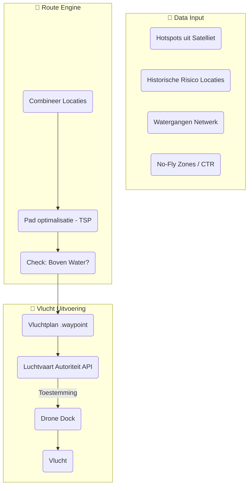

# Functioneel Ontwerp: Drone Route Planner

## 🎯 Doelstelling
Het automatiseren van de inspectievluchten zodat een drone efficiënt en veilig de **betrouwbaarheid van watergangen** en **hotspots uit satellietdata** kan inspecteren.

Dit component is de "logistieke schakel" tussen de [Exoten Detectie](./exoten_detectie.md) en de fysieke uitvoering.

---

## 🏗️ Proces Flow (Planning & Vlucht)

---

## 🧩 Componenten & Werking

### 1. De Slimme Routeplanner (Algoritme)
*   **Taak**: Bereken de meest efficiënte route om X inspectiepunten te bezoeken binnen de batterijduur van de drone.
*   **Constraints (Veiligheid)**:
    *   **Boven Water**: De drone moet 95% van de tijd boven water vliegen. Dit minimaliseert het risico voor grond-objecten en privacy.
    *   **Batterij**: Inclusief "Return to Home" marge.
*   **Logica**: Reistijd vs. Inspectietijd. Soms is het sneller om een stuk "rechtdoor" te vliegen (over weiland) als dit mag, dan de meanderende rivier te volgen. De planner weegt deze opties.

### 2. Integratie met Luchtvaart (Compliance)
*   Voordat een plan wordt "gecommit", checkt de planner de **No-Fly Zones** (vliegvelden, natura2000).
*   Indien vereist, dient de planner het vluchtplan digitaal in bij de luchtvaartautoriteit (UTM - Unmanned Traffic Management).

### 3. De Mission Upload
*   Het gevalideerde plan (Waypoints, Hoogte, Snelheid, Camera Acties) wordt verstuurd naar het docking station.
*   De drone voert de missie volledig autonoom uit.

---

## 🛡️ Privacy by Design
*   **Vliegroute**: Door primair boven water te vliegen, vermijden we tuinen en openbare wegen.
*   **Camera**: De camera staat standaard in een hoek die "vooruit/omlaag" kijkt (Nadir/Oblique) gericht op het water, waardoor de horizon (en dus ramen/mensen in de verte) geminimaliseerd wordt.

## 🔗 Relaties
*   Wordt getriggerd door **[Exoten Detectie](./exoten_detectie.md)** (Hotspots).
*   Levert beelden aan **[Data Lifecycle](./data_lifecycle_drone.md)** (Raw Images).
