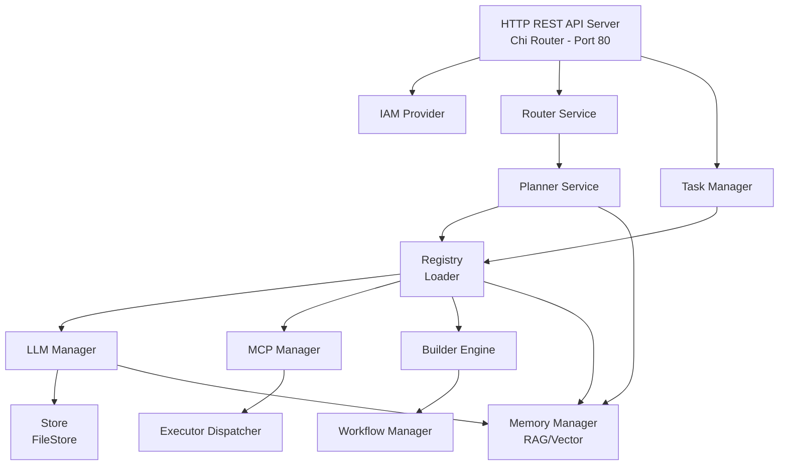
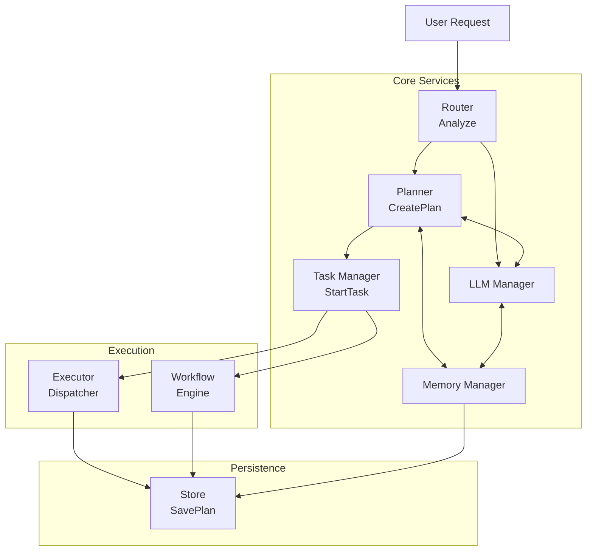
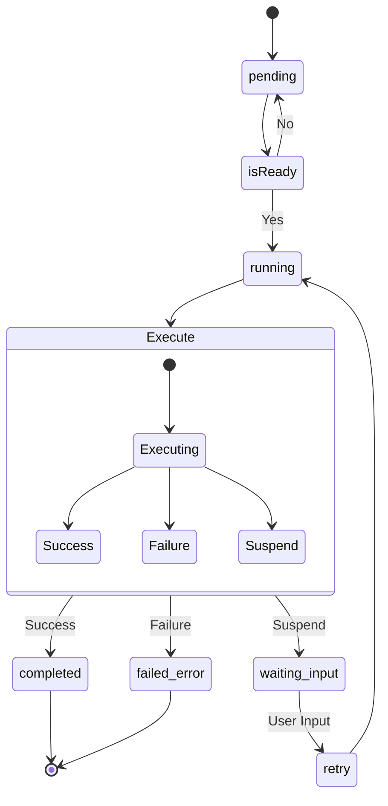
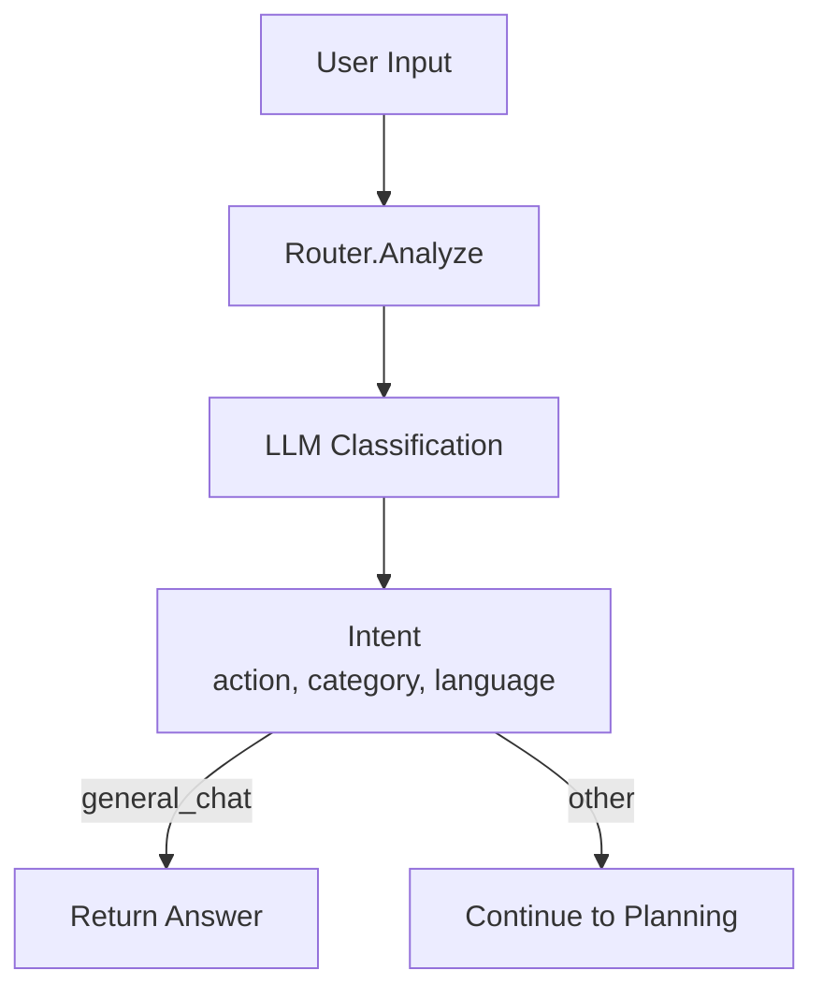
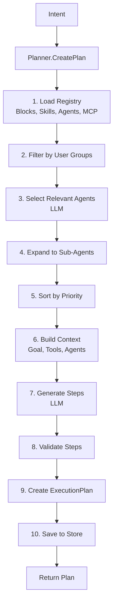
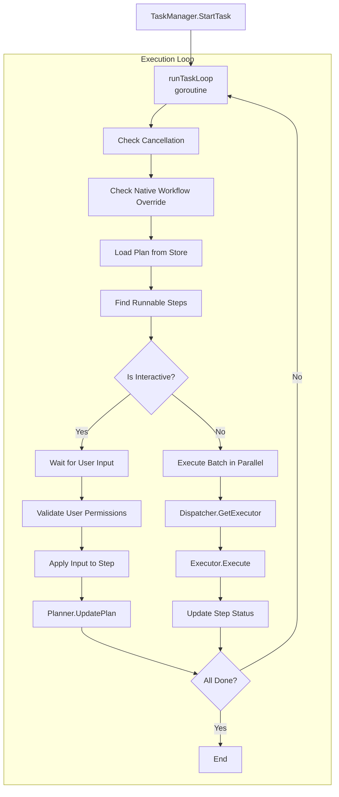

# Druppie Technical Specification for GoLang Implementation

## Document Information
- **Project**: Druppie - Spec-Driven AI Platform
- **Version**: 1.0
- **Target Language**: Go 1.24+
- **Purpose**: Complete technical specification for recreating Druppie in GoLang
- **Date**: January 2026

---

## Table of Contents

1. [Project Overview](#1-project-overview)
2. [Architecture Design](#2-architecture-design)
3. [Data Models](#3-data-models)
4. [API Specifications](#4-api-specifications)
5. [Component Breakdown](#5-component-breakdown)
6. [Business Logic](#6-business-logic)
7. [Dependencies](#7-dependencies)
8. [Implementation Phases](#8-implementation-phases)

---

## 1. Project Overview

### 1.1 Application Purpose

Druppie is an **enterprise-grade Spec-Driven AI platform** with **Human-in-the-Loop** automation capabilities. It is designed for government and enterprise environments (specifically Dutch government: Waterschap/Gemeente) with heavy emphasis on **Security**, **Privacy (GDPR)**, and **Compliance (BIO/NIS2/AI Act)**.

### 1.2 Key Features

1. **Multi-LLM Support**: Gemini, Ollama, OpenRouter, LM Studio with automatic failover
2. **Dynamic Agent System**: Registry-based agent loading with skills and workflows
3. **Compliance-First**: Built-in audit trails, approval workflows, and policy enforcement
4. **Model Context Protocol (MCP)**: Integration with external tools via MCP specification
5. **Human-in-the-Loop**: Interactive approval steps for critical decisions
6. **Execution Planning**: LLM-generated execution plans with dependency management
7. **Multi-Tenancy**: User/group-based access control with IAM providers
8. **Build System Integration**: Docker, Tekton, and Local build providers
9. **Task Resumption**: Stopped/failed plans can be resumed from last state
10. **Native Workflows**: Predefined workflow engines for specific use cases

### 1.3 Target Users

- **Government Organizations**: Dutch municipalities, water boards
- **Enterprise Teams**: Development, compliance, security teams
- **AI Researchers**: Experimenting with multi-agent systems
- **Platform Administrators**: Managing AI agents and compliance rules

### 1.4 Technology Stack

- **Language**: Go 1.24+
- **HTTP Framework**: Chi Router (v5)
- **LLM Integration**: Google Generative AI SDK, HTTP clients
- **Data Format**: JSON (persistence), YAML (configuration)
- **Authentication**: Local (bcrypt), Keycloak, Demo modes
- **Build Systems**: Docker API, Kubernetes (Tekton CRDs)

---

## 2. Architecture Design

### 2.1 System Architecture



### 2.2 Design Patterns

#### 2.2.1 Dependency Injection

All services receive their dependencies via constructor injection:
- Enables testing with mocks
- Clear dependency graph
- No global state

#### 2.2.2 Strategy Pattern

**LLM Providers**: Multiple provider implementations (Gemini, Ollama, OpenRouter) with common interface
**Builder Engines**: Multiple build strategies (Docker, Tekton, Local) with common interface
**IAM Providers**: Multiple auth strategies (Local, Keycloak, Demo) with common interface

#### 2.2.3 Registry Pattern

**Dynamic Loading**: Agents, Skills, Building Blocks, MCP Servers loaded from filesystem at startup
**Hot Reload**: Configuration changes can be reloaded without restart

#### 2.2.4 Repository Pattern

**Store Interface**: Abstract data persistence with FileStore implementation
**Swap Implementation**: Can replace with database backend without changing business logic

#### 2.2.5 Observer Pattern

**Task Manager**: Publishes events to OutputChan and TaskDoneChan for monitoring

#### 2.2.6 State Machine

**Execution Plans**: Steps transition through states: pending → running → completed/failed/waiting_input

### 2.3 Component Relationships



### 2.4 Data Flow

#### 2.4.1 Request Processing Flow

1. **User Sends Prompt** → `/v1/chat/completions`
2. **IAM Middleware** → Validates authentication token
3. **Router.Analyze()** → Determines intent and action type
4. **Decision Point**:
   - If `general_chat` → Return direct answer
   - Otherwise → Proceed to planning
5. **Planner.CreatePlan()** → Generate execution steps using LLM
6. **TaskManager.StartTask()** → Begin async execution
7. **Task Loop**:
   - Load steps from plan
   - Execute runnable steps (parallel or sequential)
   - Wait for user input if needed
   - Update plan on completion
8. **Planner.UpdatePlan()** → Generate next steps based on results
9. **Repeat** until all steps completed

#### 2.4.2 Execution Step Flow



---

## 3. Data Models

### 3.1 Core Domain Models

#### 3.1.1 Intent

**Purpose**: Represents analyzed user request

```go
type Intent struct {
    InitialPrompt string `json:"initial_prompt"`        // Original user input
    Prompt        string `json:"prompt"`                // Processed/summarized prompt
    Action        string `json:"action"`                // create_project, orchestrate_complex, general_chat
    Category      string `json:"category"`              // infrastructure, service, create content
    ContentType   string `json:"content_type,omitempty"` // video, blog, code, image, audio
    Language      string `json:"language"`              // en, nl, fr, de
    Answer        string `json:"answer,omitempty"`      // Direct answer for general_chat
}
```

**Actions**:
- `create_project`: User wants to create a new project
- `update_project`: User wants to modify existing project
- `query_registry`: User is searching for tools/blocks
- `orchestrate_complex`: User needs multi-step automation
- `general_chat`: Simple question/answer

#### 3.1.2 Step

**Purpose**: Single unit of work in execution plan

```go
type Step struct {
    ID            int                    `json:"step_id"`
    AgentID       string                 `json:"agent_id"`           // Which agent executes this
    Action        string                 `json:"action"`             // What to do
    Params        map[string]interface{} `json:"params"`             // Action parameters
    Result        string                 `json:"result,omitempty"`   // Output/user feedback
    Error         string                 `json:"error,omitempty"`    // Error message if failed
    Status        string                 `json:"status"`             // pending, running, completed, waiting_input, failed
    DependsOn     []int                  `json:"depends_on,omitempty"` // Step IDs that must complete first
    AssignedGroup string                 `json:"assigned_group,omitempty"` // Group required for approval
    ApprovedBy    string                 `json:"approved_by,omitempty"`    // User who approved
}
```

**Status Values**:
- `pending`: Not started yet
- `running`: Currently executing
- `completed`: Successfully finished
- `failed`: Execution failed
- `waiting_input`: Paused for user input/approval
- `cancelled`: User stopped the step
- `skipped`: Step was bypassed
- `rejected`: User rejected the result

**Common Actions**:
- `ask_questions`: Interactive Q&A with user
- `create_code`: Generate source code files
- `build_project`: Compile/build code
- `run_tests`: Execute test suite
- `content-review`: Human review step
- `audit_request`: Compliance approval step
- `create_video`: Generate video content
- `create_audio`: Generate audio content
- `read_files`: Read files from plan directory

#### 3.1.3 ExecutionPlan

**Purpose**: Complete execution plan with all steps

```go
type ExecutionPlan struct {
    ID             string   `json:"plan_id"`             // Unique identifier (plan-{timestamp})
    CreatorID      string   `json:"creator_id,omitempty"` // User who created plan
    Intent         Intent   `json:"intent"`              // Original analyzed intent
    Status         string   `json:"status"`              // running, completed, stopped, waiting_input, cancelled
    Steps          []Step   `json:"steps"`               // Ordered list of steps
    SelectedAgents []string `json:"selected_agents"`     // Agents involved in plan
    Files          []string `json:"files,omitempty"`     // Uploaded/generated files
    AllowedGroups  []string `json:"allowed_groups,omitempty"` // Groups who can access plan
}
```

**Status Values**:
- `created`: Plan generated but not started
- `running`: Actively executing
- `completed`: All steps finished successfully
- `stopped`: Execution halted due to error
- `waiting_input`: Paused for user interaction
- `cancelled`: User manually stopped

#### 3.1.4 BuildingBlock

**Purpose**: Reusable tool/service definition

```go
type BuildingBlockType string

const (
    TypeInfrastructure BuildingBlockType = "infrastructure"
    TypeService        BuildingBlockType = "service"
    TypeTool           BuildingBlockType = "tool"
)

type BuildingBlock struct {
    ID           string            `json:"id" yaml:"id"`
    Name         string            `json:"name" yaml:"name"`
    Description  string            `json:"description" yaml:"description"`
    Type         BuildingBlockType `json:"type" yaml:"type"`
    Capabilities []string          `json:"capabilities" yaml:"capabilities"`
    Inputs       []string          `json:"inputs" yaml:"inputs"`
    Outputs      []string          `json:"outputs" yaml:"outputs"`
    GitRepo      string            `json:"git_repo" yaml:"git_repo"`
    Labels       map[string]string `json:"labels,omitempty" yaml:"labels,omitempty"`
    AuthGroups   []string          `json:"auth_groups,omitempty" yaml:"auth_groups,omitempty"`
}
```

**Loading**: From `blocks/*.md` files with YAML frontmatter

#### 3.1.5 Skill

**Purpose**: Reusable system prompt for LLM interactions

```go
type Skill struct {
    ID           string   `json:"id" yaml:"id"`
    Name         string   `json:"name" yaml:"name"`
    Description  string   `json:"description" yaml:"description"`
    SystemPrompt string   `json:"system_prompt" yaml:"system_prompt"`
    AllowedTools []string `json:"allowed_tools" yaml:"allowed_tools"`
    AuthGroups   []string `json:"auth_groups,omitempty" yaml:"auth_groups,omitempty"`
}
```

**Loading**: From `skills/*.md` files with YAML frontmatter + body as SystemPrompt

#### 3.1.6 AgentDefinition

**Purpose**: Template for spawning AI agents

```go
type AgentDefinition struct {
    ID           string            `json:"id" yaml:"id"`
    Name         string            `json:"name" yaml:"name"`
    Type         string            `json:"type" yaml:"type"`  // spec-agent, execution-agent, support-agent, system-agent
    Description  string            `json:"description" yaml:"description"`
    Instructions string            `json:"instructions" yaml:"instructions"` // System prompt
    Provider     string            `json:"provider" yaml:"provider"`  // LLM provider override
    Model        string            `json:"model" yaml:"model"`        // Model override
    Skills       []string          `json:"skills" yaml:"skills"`
    Tools        []string          `json:"tools" yaml:"tools"`        // BuildingBlock/MCP IDs
    SubAgents    []string          `json:"sub_agents" yaml:"sub_agents"` // Agents this agent can delegate to
    Condition    string            `json:"condition" yaml:"condition"`   // When to trigger agent
    Workflow     string            `json:"workflow" yaml:"workflow"`     // Mermaid diagram or workflow description
    Prompts      map[string]string `json:"prompts,omitempty" yaml:"prompts,omitempty"` // Native workflow prompts
    Priority     float64           `json:"priority" yaml:"priority"`
    AuthGroups   []string          `json:"auth_groups,omitempty" yaml:"auth_groups,omitempty"`
}
```

**Agent Types**:
- `spec-agent`: Creates specifications/designs
- `execution-agent`: Implements/builds solutions
- `support-agent`: Assists users, answers questions
- `system-agent`: Internal platform operations

**Loading**: From `agents/*.md` or `agents/*.yaml` with frontmatter + body as Instructions

#### 3.1.7 MCPServer

**Purpose**: External tool server definition

```go
type MCPServer struct {
    ID         string           `json:"id" yaml:"id"`
    Name       string           `json:"name" yaml:"name"`
    URL        string           `json:"url,omitempty" yaml:"url,omitempty"`     // HTTP endpoint
    Command    string           `json:"command,omitempty" yaml:"command,omitempty"` // Binary path
    Args       []string         `json:"args,omitempty" yaml:"args,omitempty"`   // CLI arguments
    Transport  string           `json:"transport" yaml:"transport"`  // sse, stdio
    Tools      []ToolDefinition `json:"tools,omitempty" yaml:"tools,omitempty"` // Tool catalog
    AuthGroups []string         `json:"auth_groups,omitempty" yaml:"auth_groups,omitempty"`
}

type ToolDefinition struct {
    Name        string `json:"name" yaml:"name"`
    Description string `json:"description" yaml:"description"`
}
```

**Transport Types**:
- `sse`: HTTP Server-Sent Events
- `stdio`: Process stdin/stdout

**Loading**: From `mcp/*.md` or `mcp/*.yaml` with frontmatter

**Special**: Template support with `{{plan_id}}` variable substitution for plan-scoped servers

#### 3.1.8 ComplianceRule

**Purpose**: Policy definition (future use)

```go
type ComplianceRule struct {
    ID          string `json:"id" yaml:"id"`
    Name        string `json:"name" yaml:"name"`
    Description string `json:"description" yaml:"description"`
    RegoPolicy  string `json:"rego_policy" yaml:"rego_policy"`  // OPA Rego code
    Sensitivity string `json:"sensitivity" yaml:"sensitivity"`  // low, medium, high
}
```

**Loading**: From `compliance/*.md` with frontmatter + body as RegoPolicy

#### 3.1.9 User (IAM)

**Purpose**: Authenticated user

```go
type User struct {
    ID       string   `json:"id"`
    Username string   `json:"username"`
    Email    string   `json:"email"`
    Groups   []string `json:"groups"` // Group IDs user belongs to
}

type StoredUser struct {
    ID           string   `json:"id"`
    Username     string   `json:"username"`
    PasswordHash string   `json:"password_hash"` // bcrypt hash
    Email        string   `json:"email"`
    Groups       []string `json:"groups"`
}

type StoredGroup struct {
    ID           string   `json:"id"`
    Name         string   `json:"name"`
    MemberGroups []string `json:"member_groups"` // Nested group IDs
}
```

**Storage**: `.druppie/iam/users.json`, `.druppie/iam/groups.json`, `.druppie/iam/sessions.json`

**Default Admin**: username=`admin`, password=`admin`, groups=`["group-admin"]`

#### 3.1.10 Memory & Context

**Purpose**: Optimizing LLM context window usage

```go
type MemoryType string

const (
    MemoryShortTerm MemoryType = "short_term" // In-context sliding window within execution
    MemoryLongTerm  MemoryType = "long_term"  // Vector/semantic search across plans
)

type HistoryEntry struct {
    Timestamp time.Time `json:"timestamp"`
    Role      string    `json:"role"`    // user, ai, system
    Content   string    `json:"content"` // Full text
    Summary   string    `json:"summary,omitempty"` // Compressed/summarized version
    Tokens    int       `json:"tokens"`
    PlanID    string    `json:"plan_id"`
}

type MemoryContext struct {
    MaxTokens    int            `json:"max_tokens"`
    Recent Turns []HistoryEntry `json:"recent_turns"`
    RelevantFacts []string      `json:"relevant_facts"` // Retrived from long term memory
}
```

**Strategy**:
- **Sliding Window**: Keep last N turns full fidelity
- **Summarization**: Summarize older turns into consolidated "facts"
- **Vector Search**: Retrieve relevant past plan segments when context needed

### 3.2 Configuration Models

#### 3.2.1 Config

**Purpose**: Application configuration

```go
type Config struct {
    LLM            LLMConfig            `yaml:"llm"`
    Server         ServerConfig         `yaml:"server"`
    Build          BuildConfig          `yaml:"build"`
    Git            GitConfig            `yaml:"git"`
    Git            GitConfig            `yaml:"git"`
    IAM            IAMConfig            `yaml:"iam"`
    Memory         MemoryConfig         `yaml:"memory"`
    ApprovalGroups map[string][]string  `yaml:"approval_groups"`
}

type MemoryConfig struct {
    MaxWindowTokens int  `yaml:"max_window_tokens"` // e.g. 128000
    SummarizeAfter  int  `yaml:"summarize_after"`   // Turn count
    VectorStorePath string `yaml:"vector_store_path"`
}

type LLMConfig struct {
    DefaultProvider string                    `yaml:"default_provider"`
    TimeoutSeconds  int                       `yaml:"timeout_seconds"`
    Retries         int                       `yaml:"retries"`
    Providers       map[string]ProviderConfig `yaml:"providers"`
}

type ProviderConfig struct {
    Type         string `yaml:"type"`   // gemini, ollama, openrouter, lmstudio
    Model        string `yaml:"model"`
    APIKey       string `yaml:"api_key"`
    URL          string `yaml:"url"`
    ProjectID    string `yaml:"project_id"`
    ClientID     string `yaml:"client_id"`
    ClientSecret string `yaml:"client_secret"`
}

type ServerConfig struct {
    Port        string `yaml:"port"`
    CleanupDays int    `yaml:"cleanup_days"` // Auto-delete plans older than N days
}

type BuildConfig struct {
    DefaultProvider string                    `yaml:"default_provider"`
    Providers       map[string]BuildProviderConfig `yaml:"providers"`
}

type BuildProviderConfig struct {
    Type       string `yaml:"type"` // tekton, local, docker
    Namespace  string `yaml:"namespace"`
    WorkingDir string `yaml:"working_dir"`
}

type GitConfig struct {
    Provider string `yaml:"provider"`
    URL      string `yaml:"url"`
    User     string `yaml:"user"`
    Token    string `yaml:"token"`
}

type IAMConfig struct {
    Provider string            `yaml:"provider"` // local, keycloak, demo
    Keycloak KeycloakConfig    `yaml:"keycloak"`
}

type KeycloakConfig struct {
    URL          string `yaml:"url"`
    Realm        string `yaml:"realm"`
    ClientID     string `yaml:"client_id"`
    ClientSecret string `yaml:"client_secret"`
}
```

**File Locations**:
- Default: `core/config_default.yaml`
- User Override: `.druppie/config.yaml`

**Loading Priority**: User override > Default

### 3.3 Data Persistence

#### 3.3.1 Storage Structure

```
.druppie/
├── config.yaml                  # User configuration
├── mcp_servers.json            # Dynamic MCP server configs
├── iam/
│   ├── users.json
│   ├── groups.json
│   └── sessions.json
└── plans/
    ├── plan-1704638400/
    │   ├── plan.json           # Execution plan
    │   ├── logs/
    │   │   └── execution.log   # Detailed logs
    │   └── src/                # Generated source code
    │       └── ...
    └── plan-1704638401/
        └── ...
```

#### 3.3.2 Store Interface

```go
type Store interface {
    // Plans
    SavePlan(plan model.ExecutionPlan) error
    GetPlan(id string) (model.ExecutionPlan, error)
    ListPlans() ([]model.ExecutionPlan, error)
    DeletePlan(id string) error

    // Logging
    LogInteraction(planID string, tag string, input string, output string) error
    AppendRawLog(planID string, message string) error
    GetLogs(id string) (string, error)

    // Config
    SaveConfig(data []byte) error
    LoadConfig() ([]byte, error)

    // MCP
    SaveMCPServers(data []byte) error
    LoadMCPServers() ([]byte, error)
}
```

**Implementation**: `FileStore` - JSON/YAML file-based persistence

---

## 4. API Specifications

### 4.1 HTTP Server Configuration

- **Framework**: Chi Router v5
- **Port**: 80 (configurable)
- **Base Path**: `/v1`
- **Content-Type**: `application/json`
- **Authentication**: Bearer token in `Authorization` header

### 4.2 Middleware Stack

1. **Error Logging**: Log only errors (status >= 400, not 404)
2. **Recovery**: Panic recovery
3. **IAM**: Authentication (skipped for `/v1/health`, `/iam/login`, `/info`)

### 4.3 Public Endpoints

#### 4.3.1 System Info

```
GET /info
```

**Response**:
```json
{
  "auth_required": true,
  "iam": {
    "provider": "local"
  }
}
```

**Description**: Returns system configuration info

#### 4.3.2 Version

```
GET /v1/version
```

**Response**:
```json
{
  "version": "1.0.1"
}
```

#### 4.3.3 Health Check

```
GET /v1/health
```

**Response**: `OK` (200)

### 4.4 Authentication Endpoints

#### 4.4.1 Login

```
POST /v1/iam/login
```

**Request**:
```json
{
  "username": "admin",
  "password": "admin"
}
```

**Response**:
```json
{
  "token": "7f8a9b0c1d2e3f4a5b6c7d8e9f0a1b2c",
  "user": {
    "id": "user-admin",
    "username": "admin",
    "email": "admin@druppie.local",
    "groups": ["group-admin"]
  }
}
```

**Errors**:
- 400: Invalid request body
- 401: Invalid credentials

#### 4.4.2 Logout

```
POST /v1/iam/logout
Authorization: Bearer {token}
```

**Response**: 200 OK

#### 4.4.3 List Users (Admin Only)

```
GET /v1/iam/users
Authorization: Bearer {token}
```

**Response**:
```json
[
  {
    "id": "user-admin",
    "username": "admin",
    "email": "admin@druppie.local",
    "groups": ["group-admin"]
  }
]
```

#### 4.4.4 Create User (Admin Only)

```
POST /v1/iam/users
Authorization: Bearer {token}
```

**Request**:
```json
{
  "username": "john",
  "password": "secret123",
  "email": "john@example.com",
  "groups": ["developer"]
}
```

**Response**: 201 Created

**Errors**:
- 400: Invalid request
- 409: Username exists

#### 4.4.5 Update User (Admin Only)

```
PUT /v1/iam/users/{username}
Authorization: Bearer {token}
```

**Request**:
```json
{
  "email": "newemail@example.com",
  "groups": ["developer", "tester"],
  "password": "newpassword"
}
```

**Response**: 200 OK

#### 4.4.6 Delete User (Admin Only)

```
DELETE /v1/iam/users/{username}
Authorization: Bearer {token}
```

**Response**: 200 OK

**Note**: Cannot delete `admin` user (403 Forbidden)

#### 4.4.7 List Groups (Admin Only)

```
GET /v1/iam/groups
Authorization: Bearer {token}
```

**Response**:
```json
[
  {
    "id": "group-admin",
    "name": "Administrators",
    "member_groups": []
  }
]
```

#### 4.4.8 Create Group (Admin Only)

```
POST /v1/iam/groups
Authorization: Bearer {token}
```

**Request**:
```json
{
  "id": "group-developer",
  "name": "Developers",
  "member_groups": []
}
```

**Response**: 201 Created

#### 4.4.9 Update Group (Admin Only)

```
PUT /v1/iam/groups/{id}
Authorization: Bearer {token}
```

**Request**:
```json
{
  "name": "Senior Developers",
  "member_groups": ["group-junior"]
}
```

**Response**: 200 OK

#### 4.4.10 Delete Group (Admin Only)

```
DELETE /v1/iam/groups/{id}
Authorization: Bearer {token}
```

**Response**: 200 OK

### 4.5 Chat/Planning Endpoints

#### 4.5.1 Chat Completion

```
POST /v1/chat/completions
Authorization: Bearer {token}
```

**Request**:
```json
{
  "prompt": "Create a REST API in Go",
  "plan_id": "plan-1704638400"  // Optional: continue existing plan
}
```

**Response**:
```json
{
  "intent": {
    "action": "analyzing"
  },
  "plan": {
    "plan_id": "plan-1704638400",
    "creator_id": "admin",
    "intent": {
      "initial_prompt": "Create a REST API in Go",
      "prompt": "Create a REST API in Go",
      "action": "create_project",
      "category": "service",
      "language": "en"
    },
    "status": "running",
    "steps": [
      {
        "step_id": 1,
        "agent_id": "user",
        "action": "user_query",
        "status": "running",
        "result": "Create a REST API in Go"
      }
    ],
    "selected_agents": []
  }
}
```

**Behavior**:
1. Creates or continues execution plan
2. Immediately returns plan ID to UI
3. Processes asynchronously in background
4. Router analyzes intent
5. If `general_chat` → Returns direct answer
6. Otherwise → Planner creates execution steps → TaskManager starts execution

**Errors**:
- 400: Invalid request body
- 401: Unauthorized
- 500: Failed to save plan

### 4.6 Plan Management Endpoints

#### 4.6.1 List Plans

```
GET /v1/plans
Authorization: Bearer {token}
```

**Response**:
```json
[
  {
    "plan_id": "plan-1704638400",
    "creator_id": "admin",
    "intent": { ... },
    "status": "running",
    "steps": [ ... ],
    "selected_agents": ["developer"],
    "files": [],
    "allowed_groups": []
  }
]
```

**Filtering**: 
- Shows only plans where:
  - User is creator OR
  - User is in `allowed_groups` OR
  - Plan has no creator (legacy/demo)

#### 4.6.2 Get Plan

```
GET /v1/plans/{id}
Authorization: Bearer {token}
```

**Response**:
```json
{
  "plan_id": "plan-1704638400",
  "creator_id": "admin",
  "intent": {
    "initial_prompt": "Create a REST API in Go",
    "prompt": "Create a REST API in Go",
    "action": "create_project",
    "category": "service",
    "language": "en"
  },
  "status": "running",
  "steps": [
    {
      "step_id": 1,
      "agent_id": "developer",
      "action": "create_code",
      "params": {
        "language": "go",
        "framework": "chi"
      },
      "result": "",
      "status": "running",
      "depends_on": []
    }
  ],
  "selected_agents": ["developer"],
  "files": ["main.go", "go.mod"]
}
```

**URL Parameter**: `{id}` can be with or without `plan-` prefix

**Errors**:
- 401: Unauthorized
- 404: Plan not found

#### 4.6.3 Delete Plan

```
DELETE /v1/plans/{id}
Authorization: Bearer {token}
```

**Response**: 200 OK

**Behavior**:
1. Stops running task (if active)
2. Deletes plan directory and all files

#### 4.6.4 Resume Plan

```
POST /v1/plans/{id}/resume
Authorization: Bearer {token}
```

**Response**: 200 OK

**Behavior**:
1. Loads plan from storage
2. Resets `cancelled`/`stopped`/`failed`/`waiting_input` steps to `pending`
3. Starts TaskManager execution loop

**Errors**:
- 404: Plan not found
- 500: Failed to update plan

#### 4.6.5 Stop Plan

```
POST /v1/plans/{id}/stop
Authorization: Bearer {token}
```

**Response**: 200 OK

**Behavior**:
1. Cancels running task
2. Sets plan status to `cancelled`
3. Marks active/pending steps as `cancelled`

#### 4.6.6 Add Group to Plan

```
POST /v1/plans/{id}/groups/{group}
Authorization: Bearer {token}
```

**Response**: 200 OK

**Behavior**: Adds group to `allowed_groups` (if not already present)

**Errors**:
- 404: Plan not found
- 500: Failed to save plan

#### 4.6.7 Remove Group from Plan

```
DELETE /v1/plans/{id}/groups/{group}
Authorization: Bearer {token}
```

**Response**: 200 OK

**Behavior**: Removes group from `allowed_groups`

#### 4.6.8 Get Plan Groups

```
GET /v1/plans/{id}/groups
Authorization: Bearer {token}
```

**Response**:
```json
["group-admin", "group-developer"]
```

#### 4.6.9 List Plan Files

```
GET /v1/plans/{id}/files
Authorization: Bearer {token}
```

**Response**:
```json
["main.go", "go.mod", "handlers.go"]
```

**Description**: Returns list of files in `.druppie/plans/{id}/src/`

**Filters**: Excludes `.git` and `node_modules`

#### 4.6.10 Get File Content

```
GET /v1/plans/{id}/files/content?path=main.go
Authorization: Bearer {token}
```

**Response**: File content (Content-Type based on file extension)

**Security**: Path traversal validation (must be within plan src directory)

**Errors**:
- 400: Missing `path` parameter
- 403: Forbidden path (outside plan directory)
- 404: File not found

#### 4.6.11 Update File Content

```
PUT /v1/plans/{id}/files/content?path=main.go
Authorization: Bearer {token}
Content-Type: text/plain
```

**Request Body**: New file content

**Response**: `OK`

**Errors**:
- 400: Missing `path` or failed to read body
- 403: Forbidden path
- 500: Failed to write file

#### 4.6.12 Get Plan Logs

```
GET /v1/plans/{id}/logs
Authorization: Bearer {token}
```

**Response**: Plain text log file

**Content**: All execution logs for the plan

### 4.7 Task Management Endpoints

#### 4.7.1 List Tasks (Approvals)

```
GET /v1/tasks
Authorization: Bearer {token}
```

**Response**:
```json
[
  {
    "plan_id": "plan-1704638400",
    "plan_name": "Create a REST API in Go",
    "step_id": 3,
    "description": "Manual review required by compliance policy.",
    "assigned_group": "compliance",
    "agent_id": "compliance"
  }
]
```

**Description**: Returns steps requiring user approval

**Filtering**:
- Only shows steps with status `waiting_input` or `requires_approval`
- Filtered by user's groups (or public if no group assigned)

### 4.8 Configuration Endpoints

#### 4.8.1 Get Configuration

```
GET /v1/config
Authorization: Bearer {token}
```

**Response**:
```json
{
  "llm": {
    "default_provider": "ollama",
    "timeout_seconds": 120,
    "retries": 3,
    "providers": {
      "gemini": {
        "type": "gemini",
        "model": "gemini-2.5-flash",
        "api_key": "***"
      },
      "ollama": {
        "type": "ollama",
        "model": "qwen3:8b",
        "url": "http://localhost:11434"
      }
    }
  },
  "server": {
    "port": "80",
    "cleanup_days": 7
  },
  "build": {
    "default_provider": "docker",
    "providers": { ... }
  },
  "iam": {
    "provider": "local"
  },
  "approval_groups": {
    "security": ["ciso", "group-admin"],
    "legal": ["legal", "group-admin"],
    "compliance": ["compliance", "group-admin"]
  }
}
```

**Sanitization**: Sensitive fields (passwords, API keys) are masked with `***`

#### 4.8.2 Update Configuration

```
PUT /v1/config
Authorization: Bearer {token}
Content-Type: application/json
```

**Request**:
```json
{
  "llm": {
    "default_provider": "gemini",
    "timeout_seconds": 180,
    "retries": 5,
    "providers": { ... }
  },
  "server": { ... },
  "build": { ... },
  "iam": { ... },
  "approval_groups": { ... }
}
```

**Response**: 200 OK

**Errors**:
- 400: Invalid config format
- 500: Failed to save config

### 4.9 Build System Endpoints

#### 4.9.1 Trigger Build

```
POST /v1/build
Authorization: Bearer {token}
```

**Request**:
```json
{
  "repo_url": "https://github.com/user/repo.git",
  "commit_hash": "abc123"
}
```

**Response**:
```json
{
  "build_id": "build-1704638400"
}
```

**Behavior**: Triggers build using configured build provider (Docker/Tekton/Local)

**Errors**:
- 400: Invalid request
- 500: Build failed

#### 4.9.2 Promote Build to Block

```
POST /v1/plans/{id}/builds/{buildID}/promote
Authorization: Bearer {token}
```

**Request**:
```json
{
  "name": "my-api-service",
  "description": "REST API service"
}
```

**Response**: `OK`

**Behavior**: Converts build artifacts into a reusable BuildingBlock

### 4.10 MCP Management Endpoints

#### 4.10.1 List MCP Servers

```
GET /v1/mcp/servers
Authorization: Bearer {token}
```

**Response**:
```json
[
  {
    "name": "filesystem",
    "url": "",
    "command": "npx",
    "args": ["-y", "@modelcontextprotocol/server-filesystem", "/tmp"],
    "type": "static"
  },
  {
    "name": "my-api",
    "url": "https://example.com/mcp",
    "command": "",
    "args": [],
    "type": "dynamic"
  }
]
```

**Types**:
- `static`: Loaded from registry (mcp/*.md)
- `dynamic`: User-added via API (persisted to `.druppie/mcp_servers.json`)
- `runtime-plan-scoped`: Temporary, plan-specific servers

#### 4.10.2 Add MCP Server

```
POST /v1/mcp/servers
Authorization: Bearer {token}
```

**Request**:
```json
{
  "name": "my-api",
  "url": "https://example.com/mcp"
}
```

**Response**: 201 Created

**Behavior**:
1. Connects to server
2. Discovers available tools
3. Saves to config
4. Refreshes tool registry

**Errors**:
- 400: Invalid request or connection failed
- 500: Failed to save config

#### 4.10.3 List MCP Tools

```
GET /v1/mcp/tools
Authorization: Bearer {token}
```

**Response**:
```json
[
  {
    "name": "read_file",
    "description": "Read file contents",
    "server": "filesystem"
  },
  {
    "name": "write_file",
    "description": "Write file contents",
    "server": "filesystem"
  }
]
```

**Description**: Aggregated list of all tools from all connected MCP servers

### 4.11 Registry Endpoints

#### 4.11.1 List Building Blocks

```
GET /v1/registry
Authorization: Bearer {token}
```

**Response**:
```json
[
  {
    "id": "trivy",
    "name": "Trivy Security Scanner",
    "description": "Container vulnerability scanner",
    "type": "tool",
    "capabilities": ["security", "scanning"],
    "inputs": ["container-image"],
    "outputs": ["vulnerability-report"],
    "git_repo": "https://github.com/aquasecurity/trivy",
    "labels": {
      "category": "security"
    },
    "auth_groups": []
  }
]
```

**Filtering**: Only returns blocks where user is in `auth_groups` (or no groups specified)

### 4.12 Interaction Logging Endpoint

#### 4.12.1 Log Interaction

```
POST /v1/interaction
Authorization: Bearer {token}
```

**Request**:
```json
{
  "plan_id": "plan-1704638400",
  "agent_id": "developer",
  "action": "create_code",
  "result": "Code generated successfully"
}
```

**Response**: 200 OK

**Description**: Appends entry to plan's execution log

### 4.13 UI Endpoints

#### 4.13.1 Admin UI

```
GET /admin
```

**Response**: HTML page

**File**: `ui/admin.html`

#### 4.13.2 Code Editor UI

```
GET /code
```

**Response**: HTML page

**File**: `ui/code.html`

---

## 5. Component Breakdown

### 5.1 Main Application (`druppie/main.go`)

**Package**: `main`

**Purpose**: Entry point, HTTP server, dependency wiring

**Responsibilities**:
1. Parse command-line flags
2. Initialize all services (Registry, Store, Config, LLM, MCP, Builder, IAM, Router, Planner, TaskManager)
3. Setup HTTP router and middleware
4. Register all API endpoints
5. Start background cleanup routine (delete old plans)
6. Start log drainer goroutine (route logs to plan files)
7. Serve HTTP on configured port

**Key Functions**:
- `main()`: Entry point
- `setup(*cobra.Command)`: Initialize all dependencies
- `ensureProjectRoot()`: Detect project root directory
- `findProjectRoot()`: Walk up directories to find root
- `getAuthContext()`: Build context with authenticated user

**Dependencies**:
- Chi Router
- Cobra (CLI framework)
- All internal packages

**Configuration**:
- Reads from `.druppie/config.yaml` or `core/config_default.yaml`
- Environment variable overrides via ConfigManager

### 5.2 CLI Command (`druppie/cli_cmd.go`)

**Package**: `main`

**Purpose**: Execute interactive CLI menu (shell script wrapper)

**Responsibilities**:
1. Ensure project root detected
2. Execute `./script/druppie.sh` with user arguments

**Key Functions**:
- `newCliCmd()`: Create Cobra command
- `runCli([]string)`: Execute shell script

**Usage**: `druppie cli` or `go run ./druppie cli`

### 5.3 Generate Command (`druppie/generate.go`)

**Package**: `main`

**Purpose**: Generate search index for documentation

**Responsibilities**:
1. Walk all markdown files
2. Extract headings and content
3. Generate JSON search index
4. Save to `search_index.json`

**Key Functions**:
- `newGenerateCmd()`: Create Cobra command
- `generateSearchIndex()`: Main generation logic

**Usage**: `druppie generate`

### 5.4 Task Manager (`druppie/task_manager.go`)

**Package**: `main`

**Purpose**: Orchestrate execution of plans

**Responsibilities**:
1. Start/stop/resume execution tasks
2. Execute steps with dependency resolution
3. Handle parallel execution
4. Manage user input for interactive steps
5. Auto-approve based on user permissions
6. Route logs to output channels
7. Handle native workflow interception

**Data Structures**:
```go
type TaskStatus string

const (
    TaskStatusPending      TaskStatus = "Pending"
    TaskStatusRunning      TaskStatus = "Running"
    TaskStatusWaitingInput TaskStatus = "Waiting Input"
    TaskStatusCompleted    TaskStatus = "Completed"
    TaskStatusCancelled    TaskStatus = "Cancelled"
    TaskStatusError        TaskStatus = "Error"
)

type Task struct {
    ID        string
    Plan      *model.ExecutionPlan
    Status    TaskStatus
    InputChan chan string
    Ctx       context.Context
    Cancel    context.CancelFunc
}

type TaskManager struct {
    mu              sync.Mutex
    tasks           map[string]*Task
    planner         *planner.Planner
    OutputChan      chan string
    TaskDoneChan    chan string
    dispatcher      *executor.Dispatcher
    workflowManager *workflows.Manager
    MCPManager      *mcp.Manager
}
```

**Key Functions**:
- `NewTaskManager(...)`: Constructor
- `StartTask(context.Context, ExecutionPlan)`: Begin execution
- `StopTask(string)`: Cancel running task
- `FinishTask(string)`: Mark as completed
- `runTaskLoop(*Task)`: Main execution loop (goroutine)
- `executeStep(...)`: Execute individual step

**Execution Loop Logic**:
1. Check for context cancellation
2. Load plan from store
3. Check for native workflow engine override
4. Find runnable steps (dependencies satisfied, status=pending)
5. Identify interactive steps (ask_questions, content-review, audit_request)
6. Execute batch of automated steps in parallel
7. Wait for user input on interactive steps
8. Apply user input to step
9. Update plan with Planner.UpdatePlan()
10. Repeat until all steps completed

**Dependency Resolution**:
- Each step has `depends_on []int` field
- Step is runnable when all dependency step IDs have `status="completed"`

**Parallel Execution**:
- Non-interactive steps with satisfied dependencies execute concurrently
- Uses sync.WaitGroup to wait for batch completion

**User Input Handling**:
- Special commands: `/accept`, `/approve`, `/reject`, `/retry`, `/stop`
- `ask_questions`: Accept defaults or provide answers
- `content-review`: Approve or provide feedback
- `audit_request`: Approve/reject with group validation

**Auto-Approval**:
- CLI autopilot mode: Auto-accepts questions and approves audits if user has required group
- Server mode: Always requires explicit user action

**Native Workflow Interception**:
- Checks if selected agent has registered workflow
- If yes, delegates to WorkflowManager instead of JSON plan execution
- Clears pending steps to avoid conflicts

### 5.5 Registry (`internal/registry/`)

**Package**: `registry`

**Purpose**: Load and manage building blocks, skills, agents, MCP servers, compliance rules

#### 5.5.1 Registry Store (`store.go`)

**Data Structure**:
```go
type Registry struct {
    mu             sync.RWMutex
    BuildingBlocks map[string]model.BuildingBlock
    Skills         map[string]model.Skill
    Agents         map[string]model.AgentDefinition
    MCPServers     map[string]model.MCPServer
    Compliance     map[string]model.ComplianceRule
}
```

**Key Functions**:
- `NewRegistry()`: Constructor
- `ListBuildingBlocks([]string)`: Get blocks filtered by user groups
- `ListSkills([]string)`: Get skills filtered by user groups
- `ListAgents([]string)`: Get agents filtered by user groups
- `ListMCPServers([]string)`: Get MCP servers filtered by user groups
- `GetAgent(string)`: Get single agent by ID
- `Stats()`: Return counts of each entity type

**Group Filtering**:
- If entity has `auth_groups` field populated:
  - Only return if user is in one of those groups
  - Always return if user has no groups (legacy)
- If `auth_groups` is empty: Always return (public)

#### 5.5.2 Registry Loader (`loader.go`)

**Key Functions**:
- `LoadRegistry(string)`: Load all entities from root directory
- `walkAndLoad(...)`: Recursive directory walker
- `extractFrontmatter([]byte)`: Parse YAML frontmatter from markdown

**Loading Process**:
1. Walk directory tree
2. Filter by file extension (.md, .yaml, .yml)
3. Extract YAML frontmatter (for .md files)
4. Parse YAML into entity struct
5. Use file body as additional content (Instructions, SystemPrompt, RegoPolicy)
6. Fallback ID to filename if not in frontmatter
7. Store in registry map

**Directories**:
- `blocks/` → BuildingBlocks
- `skills/` → Skills
- `agents/` → AgentDefinitions
- `mcp/` → MCPServers
- `compliance/` → ComplianceRules

### 5.6 Router (`internal/router/router.go`)

**Package**: `router`

**Purpose**: Analyze user intent and determine action type

**Data Structure**:
```go
type Router struct {
    llm      llm.Provider
    store    store.Store
    registry *registry.Registry
    PlanID   string
    Debug    bool
}
```

**Key Functions**:
- `NewRouter(...)`: Constructor
- `Analyze(context.Context, string, string)`: Analyze user prompt

**System Prompt**:
```
You are the Router Agent of the Druppie Platform.
Your job is to analyze the User's input and determine their Intent.
You must output a JSON object adhering to this schema:
{
  "initial_prompt": "The user's original input string",
  "prompt": "Constructed summary of what the user wants in the user's original language",
  "action": "create_project | update_project | query_registry | orchestrate_complex | general_chat",
  "category": "infrastructure | service | search | create content | unknown",
  "content_type": "video | blog | code | image | audio | ... (optional)",
  "language": "en | nl | fr | de",
  "answer": "If action is general_chat, provide the direct answer to the user's question here. Otherwise null."
}
```

**Actions**:
- `create_project`: User wants new project/application
- `update_project`: Modify existing project
- `query_registry`: Search for tools/blocks
- `orchestrate_complex`: Multi-step workflow
- `general_chat`: Simple Q&A (no planning needed)

**Behavior**:
1. Try loading system prompt from registry (`router` agent)
2. Call LLM with prompt and system instruction
3. Parse JSON response into Intent struct
4. Log interaction to plan logs
5. Return Intent

**Fallbacks**:
- If LLM returns invalid JSON → Return error
- If `initial_prompt` empty → Use raw input
- If `prompt` empty → Use `summary` field or `initial_prompt`

### 5.7 Planner (`internal/planner/`)

**Package**: `planner`

**Purpose**: Generate and update execution plans using LLM

#### 5.7.1 Planner Service (`planner.go`)

**Data Structure**:
```go
type Planner struct {
    llm        llm.Provider
    Registry   *registry.Registry
    Store      store.Store
    Debug      bool
    MCPManager *mcp.Manager
}
```

**Key Functions**:
- `NewPlanner(...)`: Constructor
- `CreatePlan(context.Context, Intent, string)`: Generate initial plan
- `UpdatePlan(context.Context, *ExecutionPlan, string)`: Generate next steps
- `selectRelevantAgents(...)`: Filter agents by relevance to goal
- `cleanJSONResponse(string)`: Strip markdown/JSON fences from LLM output

**CreatePlan Flow**:
1. Load building blocks, MCP tools, agents from registry
2. Filter agents by user groups
3. Call LLM to select relevant agents based on intent
4. Expand selection to include sub-agents
5. Sort agents by priority
6. Load planner agent instructions from registry
7. Replace template variables: `%goal%`, `%action%`, `%language%`, `%tools%`, `%agents%`
8. Call LLM to generate execution steps
9. Parse JSON response (with retry on validation errors)
10. Normalize params (av_script aliases)
11. Validate critical params (e.g., av_script for content-review)
12. Create ExecutionPlan with generated steps
13. Log interaction
14. Return plan

**UpdatePlan Flow**:
1. Mark completed steps with user feedback
2. Reconstruct effective goal from all results
3. Check for `expand_loop` directive (internal micro-expansion)
4. Filter agents to those originally selected
5. Load planner instructions
6. Build context: completed steps + user feedback
7. Call LLM to generate next steps
8. Parse JSON response
9. Adjust step IDs to continue sequence
10. Resolve dependencies (string→int conversion)
11. Filter duplicates (optional)
12. Append new steps to plan
13. Save to store
14. Return updated plan

**Agent Selection**:
- Prompt LLM with goal and agent descriptions
- Request JSON array of agent IDs
- Parse and return selected IDs

**Prompt Template Variables**:
- `%goal%` → Intent.Prompt
- `%action%` → Intent.Action
- `%language%` → Intent.Language
- `%tools%` → List of building block names
- `%agents%` → Detailed agent descriptions

**Validation**:
- JSON syntax validation with retry (max 3 attempts)
- Required param validation (e.g., content-review must have av_script)
- Auto-correction on LLM errors

**JSON Cleanup**:
- Remove markdown fences: ```json...```
- Replace literal newlines/tabs with spaces
- Auto-close missing brackets/braces

#### 5.7.2 Expander (`expander.go`)

**Package**: `planner`

**Purpose**: Internal micro-expansion of loop directives (future use)

**Key Functions**:
- `expandLoop(Step, []Step, []Step)`: Generate repeated steps

**Usage**: When a step has `action="expand_loop"`, generate N copies of a template step

### 5.8 Store (`internal/store/store.go`)

**Package**: `store`

**Purpose**: Persist execution plans, logs, configuration

**Interface**:
```go
type Store interface {
    SavePlan(model.ExecutionPlan) error
    GetPlan(string) (model.ExecutionPlan, error)
    ListPlans() ([]model.ExecutionPlan, error)
    DeletePlan(string) error
    LogInteraction(string, string, string, string) error
    AppendRawLog(string, string) error
    GetLogs(string) (string, error)
    SaveConfig([]byte) error
    LoadConfig() ([]byte, error)
    SaveMCPServers([]byte) error
    LoadMCPServers() ([]byte, error)
}
```

**Implementation: FileStore**:
```go
type FileStore struct {
    baseDir string
    mu      sync.RWMutex
}
```

**Directory Structure**:
```
.druppie/
├── config.yaml
├── mcp_servers.json
├── iam/
│   ├── users.json
│   ├── groups.json
│   └── sessions.json
└── plans/
    └── plan-{timestamp}/
        ├── plan.json
        ├── logs/execution.log
        └── src/...
```

**Key Functions**:
- `NewFileStore(string)`: Constructor, creates directories
- `SavePlan(ExecutionPlan)`: Write plan.json with pretty-print
- `GetPlan(string)`: Read and parse plan.json
- `ListPlans()`: List all plan directories and parse each plan.json
- `DeletePlan(string)`: Remove entire plan directory
- `LogInteraction(...)`: Append formatted entry to execution.log
- `AppendRawLog(...)`: Append raw line to execution.log
- `GetLogs(string)`: Read full execution.log
- `SaveConfig([]byte)`: Write config.yaml
- `LoadConfig()`: Read config.yaml
- `SaveMCPServers([]byte)`: Write mcp_servers.json
- `LoadMCPServers()`: Read mcp_servers.json

**Thread Safety**: Uses RWMutex for concurrent access

### 5.9 LLM Manager (`internal/llm/`)

**Package**: `llm`

**Purpose**: Manage multiple LLM providers with failover

#### 5.9.1 Provider Interface (`provider.go`)

**Interface**:
```go
type Provider interface {
    Generate(context.Context, string, string) (string, error)
    Close() error
}
```

**Manager**:
```go
type Manager struct {
    defaultProvider Provider
    providers       map[string]Provider
    timeout         time.Duration
    retries         int
}
```

**Key Functions**:
- `NewManager(context.Context, LLMConfig)`: Initialize all configured providers
- `Generate(context.Context, string, string)`: Use default provider with retry
- `GetProvider(string)`: Get specific provider by name
- `Close()`: Close all providers

**Retry Logic**:
1. Create timeout context for each attempt
2. Call provider.Generate()
3. If error, log and wait 2 seconds
4. Retry up to configured max retries (default: 3)
5. Return last error if all attempts fail

**Provider Implementations**:

##### GeminiProvider

**Modes**:
1. **API Key Mode**: Use `genai.Client` with API key
2. **OAuth Mode**: Use HTTP client with Cloud Code API

**API Key Flow**:
```go
client, _ := genai.NewClient(ctx, option.WithAPIKey(apiKey))
model := client.GenerativeModel(modelName)
model.SystemInstruction = genai.NewUserContent(genai.Text(systemPrompt))
resp, _ := model.GenerateContent(ctx, genai.Text(prompt))
```

**OAuth Flow**:
1. Perform handshake: `loadCodeAssist` and `onboardUser`
2. Get effective project ID (managed project)
3. Call `v1internal:generateContent` endpoint
4. Set headers: User-Agent, X-Goog-Api-Client, Client-Metadata, X-Goog-User-Project
5. Parse response and extract text

##### OllamaProvider

**Endpoint**: `POST {baseURL}/api/generate`

**Payload**:
```json
{
  "model": "qwen3:8b",
  "prompt": "...",
  "system": "...",
  "stream": false,
  "format": "json"
}
```

##### OpenRouterProvider

**Endpoint**: `POST https://openrouter.ai/api/v1/chat/completions`

**Payload**:
```json
{
  "messages": [
    {"role": "system", "content": "..."},
    {"role": "user", "content": "..."}
  ],
  "model": "google/gemini-2.0-flash-exp:free",
  "temperature": 0.7
}
```

**Headers**:
- `Authorization: Bearer {api_key}`
- `HTTP-Referer: druppie`
- `X-Title: Druppie Core`

##### LMStudioProvider

**Endpoint**: `POST {baseURL}/chat/completions`

**Payload**:
```json
{
  "messages": [
    {"role": "system", "content": "..."},
    {"role": "user", "content": "..."}
  ],
  "model": "local-model",
  "temperature": 0.7,
  "max_tokens": -1,
  "stream": false
}
```

**Response Cleanup**:
- Strip `<think>...</think>` blocks (DeepSeek reasoning)
- Remove markdown code fences
- Trim whitespace

#### 5.9.2 Gemini Auth (`gemini_auth.go`)

**Purpose**: OAuth2 flow for Gemini Cloud Code API

**Key Functions**:
- `getGeminiClientWithAuth(...)`: Perform OAuth flow and return authenticated HTTP client
- `loadTokenFromDisk()`: Load cached token
- `saveTokenToDisk(...)`: Cache token
- `refreshAccessToken(...)`: Refresh expired token

**OAuth Flow**:
1. Check for cached token
2. If expired or missing, start device flow
3. Present user code and verification URL
4. Poll for authorization completion
5. Exchange code for access token
6. Cache token to disk
7. Return authenticated HTTP client

**Token Storage**: `.druppie/gemini_token.json`

### 5.10 MCP Manager (`internal/mcp/`)

**Package**: `mcp`

**Purpose**: Manage Model Context Protocol servers and tools

#### 5.10.1 Manager (`manager.go`)

**Data Structure**:
```go
type ServerConfig struct {
    Name    string   `json:"name"`
    URL     string   `json:"url,omitempty"`
    Command string   `json:"command,omitempty"`
    Args    []string `json:"args,omitempty"`
    Type    string   `json:"type,omitempty"` // dynamic, static, template
}

type Manager struct {
    mu            sync.RWMutex
    servers       map[string]*Client
    tools         map[string]string // ToolName -> ServerName
    cachedTools   []Tool
    ServerConfigs []ServerConfig
    store         store.Store
    registry      *registry.Registry
}
```

**Key Functions**:
- `NewManager(...)`: Constructor, loads configs, connects servers
- `Load()`: Read server configs from store
- `Save()`: Write server configs to store
- `ConnectAll(context.Context)`: Restore connections from configs + registry
- `AddServer(context.Context, string, string)`: Add HTTP server
- `RemoveServer(context.Context, string)`: Disconnect and remove server
- `ListAllTools()`: Get all tools from all servers
- `ExecuteTool(context.Context, string, map[string]interface{})`: Call tool on appropriate server
- `GetServers()`: List all server configs
- `EnsurePlanServer(context.Context, string)`: Provision plan-specific server from template

**Loading Priority**:
1. Dynamic servers (user-added, persisted to `.druppie/mcp_servers.json`)
2. Static servers (registry `mcp/*.md`, only if not already loaded)
3. Templates (skipped unless explicitly provisioned)

**Server Types**:
- **dynamic**: Added via API, persisted
- **static**: Loaded from registry, read-only
- **template**: Contains `{{plan_id}}` variable, not auto-connected
- **runtime-plan-scoped**: Provisioned from template, ephemeral

**Plan-Specific Servers**:
- Template: `plan-fs-template` with args like `["{{plan_id}}"]`
- Provisioning: Replace `{{plan_id}}` with actual plan ID
- Name: `plan-{plan_id}-fs`
- Not persisted, recreated on restart if needed

**Tool Registry**:
- Map tool names to server names
- When tool called, lookup server and delegate

#### 5.10.2 Client (`client.go`)

**Data Structure**:
```go
type Client struct {
    transport Transport
    tools     []Tool
}

type Tool struct {
    Name        string
    Description string
    InputSchema map[string]interface{}
}

type CallToolResult struct {
    Content []Content
    IsError bool
}

type Content struct {
    Type string
    Text string
    Data []byte
    MimeType string
}
```

**Key Functions**:
- `NewClient(Transport)`: Constructor
- `Connect(context.Context)`: Initialize connection
- `ListTools(context.Context)`: Fetch tool catalog
- `CallTool(context.Context, string, map[string]interface{})`: Invoke tool

**Protocol**:
- JSON-RPC 2.0 over HTTP (SSE) or stdio
- Methods: `tools/list`, `tools/call`

#### 5.10.3 Transport (`transport.go`)

**Interface**:
```go
type Transport interface {
    Connect(context.Context) error
    SendRequest(context.Context, string, interface{}) (json.RawMessage, error)
    Close() error
}
```

**Implementations**:

##### HTTPTransport (SSE)

**URL**: Server-Sent Events endpoint

**Connection**:
- POST to `/sse` endpoint
- Receive event stream
- Parse JSON-RPC responses

##### StdioTransport

**Command**: Execute binary
**Communication**: stdin/stdout
**Format**: Newline-delimited JSON

**Key Functions**:
- `NewHTTPTransport(string)`: Constructor for HTTP
- `NewStdioTransport(string, []string)`: Constructor for stdio
- `SendRequest(...)`: Send JSON-RPC request, wait for response

#### 5.10.4 Types (`types.go`)

**Data Structures**: (already covered above)

### 5.11 IAM (`internal/iam/`)

**Package**: `iam`

**Purpose**: Authentication and authorization

#### 5.11.1 Provider Interface (`provider.go`)

**Interface**:
```go
type Provider interface {
    Middleware() func(http.Handler) http.Handler
    GetUser(*http.Request) (*User, error)
    RegisterRoutes(chi.Router)
}
```

**Implementations**:

##### LocalProvider

**Storage**:
- `users.json`: User accounts with bcrypt password hashes
- `groups.json`: Group definitions with nested membership
- `sessions.json`: Active session tokens

**Data Structures**:
```go
type LocalProvider struct {
    storeDir string
    users    map[string]*StoredUser
    groups   map[string]*StoredGroup
    sessions map[string]string // token -> username
    mu       sync.RWMutex
}
```

**Key Functions**:
- `NewLocalProvider(string)`: Load users/groups/sessions from disk
- `Login(string, string)`: Authenticate and create session
- `Logout(string)`: Delete session
- `GetUserByToken(string)`: Lookup user by token
- `Middleware()`: HTTP middleware to validate Bearer token
- `RegisterRoutes(chi.Router)`: Register IAM API endpoints
- `RequireAdmin(http.Handler)`: Middleware to check admin group

**Default Accounts**:
- User: `admin`/`admin`, groups: `["group-admin"]`
- Group: `group-admin` (Administrators)

**Session Tokens**: 16-byte random hex strings

**Password Hashing**: bcrypt with default cost (10 rounds)

##### DemoProvider

**Purpose**: No-authentication mode for demos

**Behavior**:
- Always returns demo user: `{ID: "demo-user", Username: "demo", Groups: ["root", "admin"]}`
- No actual authentication

##### KeycloakProvider

**Purpose**: Integrate with external Keycloak server (stub implementation)

**Behavior**: Returns mock user (not fully implemented)

#### 5.11.2 Context Utilities (`context.go`)

**Key Functions**:
- `ContextWithUser(context.Context, *User)`: Add user to context
- `GetUserFromContext(context.Context)`: Extract user from context

#### 5.11.3 Session Management (`session.go`)

**Key Functions**:
- `SaveClientToken(string)`: Save token to `~/.druppie_token` for CLI
- `LoadClientToken()`: Load token from `~/.druppie_token`

#### 5.11.4 Demo Provider (`demo_provider.go`)

**Implementation**: Simple provider that always authenticates

### 5.12 Builder (`internal/builder/`)

**Package**: `builder`

**Purpose**: Build and deploy applications

#### 5.12.1 Interface (`interface.go`)

```go
type BuildEngine interface {
    TriggerBuild(context.Context, string, string, string, io.Writer) (string, error)
    GetBuildStatus(context.Context, string) (string, error)
    IsLocal() bool
}
```

**Parameters**:
- `repoURL`: Git repository
- `commitHash`: Commit to build
- `logPath`: Path to log file
- `logWriter`: Stream logs

**Return**: Build ID

#### 5.12.2 Factory (`factory.go`)

**Key Function**:
- `NewEngine(BuildConfig)`: Create engine based on config

**Engine Selection**:
- `tekton` → TektonClient (Kubernetes)
- `docker` → DockerClient (Docker API)
- `local` → LocalClient (Shell commands)

#### 5.12.3 Docker Client (`docker_client.go`)

**Purpose**: Build using Docker API

**Key Functions**:
- `TriggerBuild(...)`: Create Docker container, mount repo, run build commands
- `GetBuildStatus(...)`: Query container status
- `IsLocal()`: Return true

**Implementation**:
1. Clone repository to temp directory
2. Create Docker container with repo mounted
3. Run build commands (e.g., `make build`)
4. Stream logs to logWriter
5. Return container ID as build ID

#### 5.12.4 Local Client (`local_client.go`)

**Purpose**: Build using local shell commands

**Key Functions**:
- `TriggerBuild(...)`: Clone repo, run build commands locally
- `GetBuildStatus(...)`: Always return "completed"
- `IsLocal()`: Return true

**Implementation**:
1. Clone repository to `.druppie/builds/{build-id}`
2. Run build commands (e.g., `go build`, `npm run build`)
3. Stream logs to logWriter
4. Return build ID

#### 5.12.5 Tekton Client (`tekton_client.go`)

**Purpose**: Build using Tekton Pipelines (Kubernetes)

**Key Functions**:
- `TriggerBuild(...)`: Create TaskRun CRD
- `GetBuildStatus(...)`: Query TaskRun status
- `IsLocal()`: Return false

**Implementation**:
1. Create Tekton TaskRun with git-clone + build tasks
2. Submit to Kubernetes API
3. Wait for completion
4. Stream logs from pod
5. Return TaskRun name as build ID

**Dependencies**: Kubernetes client-go, Tekton Pipeline CRDs

### 5.13 Executor (`internal/executor/`)

**Package**: `executor`

**Purpose**: Execute individual steps in plan

#### 5.13.1 Interface (`types.go`)

```go
type Executor interface {
    CanHandle(string) bool
    Execute(context.Context, model.Step, chan<- string) error
}
```

**Parameters**:
- `action`: Step action/agent ID
- `step`: Step to execute
- `outputChan`: Send logs/results

**Return**: Error if execution failed

#### 5.13.2 Dispatcher (`dispatcher.go`)

**Purpose**: Route steps to appropriate executor

**Data Structure**:
```go
type Dispatcher struct {
    executors []Executor
}
```

**Key Functions**:
- `NewDispatcher(BuildEngine, *mcp.Manager)`: Constructor
- `GetExecutor(string)`: Find executor for action

**Executor Priority** (first match wins):
1. MCPExecutor (dynamic tools)
2. AudioCreatorExecutor
3. VideoCreatorExecutor
4. ImageCreatorExecutor
5. FileReaderExecutor
6. DeveloperExecutor (code generation)
7. BuildExecutor
8. RunExecutor
9. ComplianceExecutor (approval handler)
10. SceneCreatorExecutor (legacy)

#### 5.13.3 MCP Executor (`mcp_executor.go`)

**Purpose**: Execute MCP tools

**Key Functions**:
- `CanHandle(string)`: Check if tool exists in MCP manager
- `Execute(...)`: Call MCP tool with params

**Implementation**:
1. Extract tool name from action
2. Call `MCPManager.ExecuteTool()`
3. Parse result and send to outputChan

#### 5.13.4 Developer Executor (`developer_executor.go`)

**Purpose**: Generate source code files

**Supported Actions**: `create_code`, `write_code`, `generate_code`

**Key Functions**:
- `CanHandle(string)`: Match action name
- `Execute(...)`: Generate code using LLM

**Required Params**:
- `language`: Programming language
- `files`: Map of filename → description

**Implementation**:
1. Validate params
2. For each file:
   - Build prompt with language, framework, requirements
   - Call LLM to generate code
   - Write to `.druppie/plans/{plan_id}/src/{filename}`
3. Send results to outputChan

**Output Format**:
```
RESULT_FILE_COUNT=3
RESULT_FILES=["main.go", "handlers.go", "models.go"]
```

#### 5.13.5 Build Executor (`build_executor.go`)

**Purpose**: Trigger code builds

**Supported Actions**: `build_project`, `build_code`, `build`

**Key Functions**:
- `CanHandle(string)`: Match action name
- `Execute(...)`: Trigger build

**Required Params**:
- `repo_url`: Git repository
- `commit_hash`: Commit to build (optional)

**Implementation**:
1. Call `BuildEngine.TriggerBuild()`
2. Stream build logs to outputChan
3. Send build ID as result

#### 5.13.6 Run Executor (`run_executor.go`)

**Purpose**: Execute built applications

**Supported Actions**: `run_project`, `run_code`, `run`

**Key Functions**:
- `CanHandle(string)`: Match action name
- `Execute(...)`: Run application

**Implementation**: (Basic shell command execution)

#### 5.13.7 Compliance Executor (`compliance_executor.go`)

**Purpose**: Handle approval/audit steps

**Supported Actions**: `audit_request`, `approval_request`

**Key Functions**:
- `CanHandle(string)`: Match action name
- `Execute(...)`: Request user approval

**Required Params**:
- `justification`: Reason for approval
- `stakeholders`: List of groups that can approve

**Implementation**:
1. Extract justification and stakeholders
2. Set step status to `waiting_input`
3. Wait for user approval (handled by TaskManager)

#### 5.13.8 File Reader Executor (`file_reader.go`)

**Purpose**: Read files from plan directory

**Supported Actions**: `read_files`, `read_file`, `file_reader`

**Key Functions**:
- `CanHandle(string)`: Match action name
- `Execute(...)`: Read and return file contents

**Required Params**:
- `plan_id`: Plan ID (injected automatically)
- `files`: List of filenames OR `pattern` for glob

**Implementation**:
1. Read files from `.druppie/plans/{plan_id}/src/`
2. Concatenate contents
3. Send to outputChan

#### 5.13.9 Video Creator Executor (`video_creator.go`)

**Purpose**: Generate video content

**Supported Actions**: `create_video`, `video_creator`

**Key Functions**:
- `CanHandle(string)`: Match action name
- `Execute(...)`: Generate video (placeholder)

**Implementation**: (Future integration with video generation API)

#### 5.13.10 Audio Creator Executor (`audio_creator.go`)

**Purpose**: Generate audio content

**Supported Actions**: `create_audio`, `audio_creator`

**Implementation**: (Future integration with TTS API)

#### 5.13.11 Image Creator Executor (`image_creator.go`)

**Purpose**: Generate images

**Supported Actions**: `create_image`, `image_creator`

**Implementation**: (Future integration with image generation API)

#### 5.13.12 Scene Creator Executor (`scene_creator.go`)

**Purpose**: Legacy video scene generation

**Supported Actions**: `scene_creator`, `create_scenes`

**Implementation**: (Legacy, replaced by video workflow)

### 5.14 Workflows (`internal/workflows/`)

**Package**: `workflows`

**Purpose**: Native workflow engine for predefined use cases

#### 5.14.1 Manager (`manager.go`)

**Data Structure**:
```go
type Manager struct {
    workflows map[string]Workflow
}

type Workflow interface {
    ID() string
    Run(*WorkflowContext, string) error
}

type WorkflowContext struct {
    Ctx              context.Context
    LLM              llm.Provider
    Dispatcher       *executor.Dispatcher
    Store            store.Store
    PlanID           string
    GetAgent         func(string) (model.AgentDefinition, error)
    OutputChan       chan<- string
    InputChan        <-chan string
    UpdateStatus     func(string)
    AppendStep       func(model.Step) int
    FindCompletedStep func(string, string, interface{}) *model.Step
}
```

**Key Functions**:
- `NewManager()`: Constructor, register workflows
- `GetWorkflow(string)`: Get workflow by agent ID
- `RegisterWorkflow(Workflow)`: Add workflow

**Registered Workflows**:
- `video-content-creator` → `VideoWorkflow`
- `skill-flow` → `SkillFlow`

#### 5.14.2 Video Workflow (`video_flow.go`)

**Purpose**: End-to-end video production pipeline

**Phases**:
1. **Ask Questions**: Gather requirements
2. **Copywriting**: Generate script
3. **Content Review**: Human approval of script
4. **Scene Generation**: Create scenes in parallel (batches)
5. **Scene Review**: Human approval of scenes
6. **Merge Scenes**: Combine into final video
7. **Final Review**: Human approval of video

**Key Functions**:
- `Run(*WorkflowContext, string)`: Execute workflow

**State Management**:
- Checks for completed steps to avoid re-execution
- Supports resume from any phase
- Uses `FindCompletedStep()` to detect previous work

#### 5.14.3 Skill Flow (`skill_flow.go`)

**Purpose**: Execute arbitrary skill-based workflows

**Implementation**: (Generic executor for skill chains)

#### 5.14.4 Registry (`registry.go`)

**Purpose**: Centralize workflow registration

**Key Functions**:
- `init()`: Auto-register workflows at startup

### 5.15 Config Manager (`internal/config/manager.go`)

**Package**: `config`

**Purpose**: Manage application configuration

**Data Structure**:
```go
type Manager struct {
    store  store.Store
    config Config
    mu     sync.RWMutex
}
```

**Key Functions**:
- `NewManager(store.Store)`: Load config from store or defaults
- `Get()`: Get current config (thread-safe)
- `Update(Config)`: Save new config
- `Sanitize()`: Mask sensitive fields for API responses

**Loading Priority**:
1. Try loading from store (`.druppie/config.yaml`)
2. If not found, load defaults (`core/config_default.yaml`)
3. Apply environment variable overrides
4. Return config

**Environment Variables**:
- `LLM_PROVIDER` → `LLM.DefaultProvider`
- `IAM_PROVIDER` → `IAM.Provider`
- `API_KEY` → Provider-specific API keys

### 5.16 Converter (`internal/converter/plugin_converter.go`)

**Package**: `converter`

**Purpose**: Convert build artifacts to building blocks

**Data Structure**:
```go
type PluginConverter struct {
    registry *registry.Registry
    rootDir  string
}
```

**Key Functions**:
- `NewPluginConverter(...)`: Constructor
- `ConvertBuildToBlock(string, string, string, string)`: Promote build to block

**Implementation**:
1. Copy build artifacts from `.druppie/plans/{plan_id}/src/`
2. Create new BuildingBlock YAML
3. Write to `blocks/{name}.md`
4. Reload registry

---

## 6. Business Logic

### 6.1 Intent Analysis Workflow



### 6.2 Plan Generation Workflow



### 6.3 Step Execution Workflow



### 6.4 Dependency Resolution Algorithm

```go
isReady := func(step Step) bool {
    if len(step.DependsOn) == 0 {
        return true
    }
    for _, depID := range step.DependsOn {
        found := false
        for _, s := range plan.Steps {
            if s.ID == depID {
                found = true
                if s.Status != "completed" {
                    return false
                }
                break
            }
        }
        if !found {
            return false
        }
    }
    return true
}
```

### 6.5 User Input Processing

**Commands**:
- `/accept`: Accept defaults or approve step
- `/approve`: Approve audit/compliance step
- `/reject`: Reject step, provide feedback
- `/retry`: Retry failed step
- `/stop`: Cancel plan execution

**Logic**:
1. Receive input from user via `task.InputChan`
2. Identify active step (waiting_input)
3. Parse command or feedback
4. Update step result
5. If last step → Planner.UpdatePlan() to generate next steps
6. Otherwise → Continue execution loop

### 6.6 Auto-Approval Logic

**Audit Requests**:
```go
if mode == "cli-autopilot" && step.Action == "audit_request" {
    requiredGroups := step.Params["stakeholders"]
    userGroups := user.Groups
    
    if hasMatchingGroup(userGroups, requiredGroups) {
        step.Status = "completed"
        step.Result = "Auto-Approved"
        continue  // Skip waiting for input
    }
}
```

**Ask Questions**:
```go
if mode == "cli-autopilot" && step.Action == "ask_questions" {
    assumptions := step.Params["assumptions"]
    step.Status = "completed"
    step.Result = formatDefaultAnswers(assumptions)
    continue
}
```

### 6.7 Parallel Execution Logic

```go
execWG := sync.WaitGroup{}
for _, idx := range batchIndices {
    execWG.Add(1)
    go func(i int) {
        defer execWG.Done()
        step := &plan.Steps[i]
        
        // Update status to running
        step.Status = "running"
        savePlan()
        
        // Execute
        executor, _ := dispatcher.GetExecutor(step.Action)
        err := executor.Execute(ctx, *step, outputChan)
        
        // Update status based on result
        if err != nil {
            step.Status = "waiting_input"
            step.Error = err.Error()
        } else {
            step.Status = "completed"
        }
        savePlan()
    }(idx)
}
execWG.Wait()
```

### 6.8 Variable Substitution

**Syntax**: `${VARIABLE_NAME}`

**Sources**:
1. Previous step results (parsed as Key: Value pairs)
2. Context variables (`PLAN_ID`)

**Implementation**:
```go
resultsMap := make(map[string]string)
for _, prevStep := range plan.Steps {
    if prevStep.ID < currentStep.ID && prevStep.Status == "completed" {
        lines := strings.Split(prevStep.Result, "\n")
        for _, line := range lines {
            parts := strings.SplitN(line, ":", 2)
            if len(parts) == 2 {
                key := strings.TrimSpace(parts[0])
                value := strings.TrimSpace(parts[1])
                resultsMap[key] = value
            }
        }
    }
}
resultsMap["PLAN_ID"] = planID

for k, v := range currentStep.Params {
    if strVal, ok := v.(string); ok {
        for rk, rv := range resultsMap {
            placeholder := "${" + rk + "}"
            strVal = strings.ReplaceAll(strVal, placeholder, rv)
        }
        currentStep.Params[k] = strVal
    }
}
```

### 6.9 Self-Healing Logic

**For create_code steps**:
```go
maxRetries := 3
for attempt := 0; attempt <= maxRetries; attempt++ {
    err := executor.Execute(ctx, step, outputChan)
    
    if err == nil {
        break
    }
    
    if attempt < maxRetries {
        fixPrompt := fmt.Sprintf("Error: %v\nCurrent Params: %v\nFix the params.", err, step.Params)
        fixedJSON, _ := llm.Generate(ctx, fixPrompt, "You are a JSON repair agent.")
        json.Unmarshal(fixedJSON, &step.Params)
    }
}
```

### 6.10 Plan Cleanup Logic

**Background Routine**:
```go
go func() {
    ticker := time.NewTicker(24 * time.Hour)
    for range ticker.C {
        cutoff := time.Now().AddDate(0, 0, -cleanupDays)
        
        entries, _ := os.ReadDir(plansDir)
        for _, entry := range entries {
            planPath := filepath.Join(plansDir, entry.Name(), "plan.json")
            info, _ := os.Stat(planPath)
            
            if info.ModTime().Before(cutoff) {
                store.DeletePlan(entry.Name())
            }
        }
    }
}()
```

---

## 7. Dependencies

### 7.1 Go Standard Library

- `context`: Context propagation
- `encoding/json`: JSON parsing
- `fmt`: Formatting
- `io`: I/O operations
- `net/http`: HTTP server/client
- `os`: File system operations
- `path/filepath`: Path manipulation
- `strings`: String utilities
- `sync`: Concurrency primitives
- `time`: Time operations

### 7.2 Third-Party Libraries

#### 7.2.1 HTTP Framework

```
github.com/go-chi/chi/v5 v5.2.3
```

**Purpose**: HTTP router with middleware support

**Usage**:
- Main router
- Subrouters for API versioning
- Middleware chain

#### 7.2.2 CLI Framework

```
github.com/spf13/cobra v1.10.2
```

**Purpose**: Command-line interface

**Usage**:
- `druppie` command
- `druppie serve`
- `druppie cli`
- `druppie generate`
- `druppie resume {plan-id}`

#### 7.2.3 Google Generative AI

```
github.com/google/generative-ai-go v0.20.1
google.golang.org/api v0.258.0
```

**Purpose**: Gemini LLM integration

**Usage**:
- API key mode
- OAuth2 mode
- Content generation

#### 7.2.4 YAML Parsing

```
gopkg.in/yaml.v3 v3.0.1
```

**Purpose**: YAML configuration files

**Usage**:
- config.yaml parsing
- Frontmatter extraction
- Agent/Skill/Block definitions

#### 7.2.5 Kubernetes Client

```
k8s.io/client-go v0.29.0
k8s.io/apimachinery v0.29.0
k8s.io/api v0.29.0
```

**Purpose**: Kubernetes API access (for Tekton)

**Usage**:
- Create TaskRuns
- Query build status
- Stream logs from pods

#### 7.2.6 Tekton Pipeline

```
github.com/tektoncd/pipeline v0.56.0
```

**Purpose**: Tekton CRD definitions

**Usage**:
- TaskRun struct
- Pipeline resources

#### 7.2.7 OAuth2

```
golang.org/x/oauth2 v0.34.0
```

**Purpose**: OAuth2 authentication

**Usage**:
- Gemini Cloud Code API
- Device flow
- Token refresh

#### 7.2.8 Crypto

```
golang.org/x/crypto v0.46.0
```

**Purpose**: Password hashing

**Usage**:
- bcrypt for user passwords

#### 7.2.9 Terminal

```
golang.org/x/term v0.38.0
```

**Purpose**: Terminal I/O

**Usage**:
- Password input
- Interactive prompts

---

## 8. Implementation Phases

### Phase 0: MVP - Core Infrastructure

**Goal**: Basic working server with registry and planning

#### Epic 0.1: Project Setup

**Story 0.1.1**: Initialize Go Project
- Create `go.mod` with Go 1.24+
- Setup directory structure
- Add `.gitignore`

**Story 0.1.2**: Add Core Dependencies
- Install Chi router
- Install Cobra CLI
- Install YAML parser
- Install Gemini SDK

**Acceptance Criteria**:
- `go mod tidy` succeeds
- `go build` succeeds

---

#### Epic 0.2: Data Models

**Story 0.2.1**: Define Core Domain Models
- Implement `Intent` struct
- Implement `Step` struct
- Implement `ExecutionPlan` struct
- Add JSON tags

**Story 0.2.2**: Define Registry Models
- Implement `BuildingBlock` struct
- Implement `Skill` struct
- Implement `AgentDefinition` struct
- Implement `MCPServer` struct
- Implement `ComplianceRule` struct
- Add YAML tags

**Story 0.2.3**: Define Configuration Models
- Implement `Config` struct
- Implement `LLMConfig` struct
- Implement `BuildConfig` struct
- Implement `IAMConfig` struct

**Acceptance Criteria**:
- All structs compile
- JSON/YAML tags present
- Comments document each field

---

#### Epic 0.3: File Store

**Story 0.3.1**: Implement Store Interface
- Define `Store` interface with all methods
- Create `FileStore` struct

**Story 0.3.2**: Implement Plan Persistence
- `SavePlan()`: Write JSON to file
- `GetPlan()`: Read and parse JSON
- `ListPlans()`: Scan directory
- `DeletePlan()`: Remove directory

**Story 0.3.3**: Implement Logging
- `LogInteraction()`: Append formatted log
- `AppendRawLog()`: Append raw line
- `GetLogs()`: Read full log

**Story 0.3.4**: Implement Config Persistence
- `SaveConfig()`: Write YAML
- `LoadConfig()`: Read YAML

**Story 0.3.5**: Implement MCP Config Persistence
- `SaveMCPServers()`: Write JSON
- `LoadMCPServers()`: Read JSON

**Dependencies**: None

**Acceptance Criteria**:
- All methods implemented
- Thread-safe with RWMutex
- Creates directories automatically
- Unit tests pass

---

#### Epic 0.4: Configuration Manager

**Story 0.4.1**: Implement ConfigManager
- `NewManager()`: Load config with fallback
- `Get()`: Thread-safe read
- `Update()`: Save new config
- `Sanitize()`: Mask sensitive fields

**Story 0.4.2**: Load Default Configuration
- Read `config_default.yaml`
- Parse into `Config` struct

**Story 0.4.3**: Environment Variable Overrides
- Read `LLM_PROVIDER`, `IAM_PROVIDER`, etc.
- Override config values

**Dependencies**: 0.3 (Store)

**Acceptance Criteria**:
- Loads defaults if no user config
- Applies environment variables
- Thread-safe access

---

#### Epic 0.5: Registry System

**Story 0.5.1**: Implement Registry Store
- Create `Registry` struct with maps
- Add `NewRegistry()`
- Add thread-safe List methods

**Story 0.5.2**: Implement Frontmatter Extraction
- Parse YAML between `---` delimiters
- Handle both `\n---` and `\r\n---`
- Return frontmatter and body separately

**Story 0.5.3**: Load Building Blocks
- Walk `blocks/` directory
- Parse markdown files
- Extract YAML frontmatter
- Create `BuildingBlock` structs
- Store in registry

**Story 0.5.4**: Load Skills
- Walk `skills/` directory
- Parse markdown files
- Use body as `SystemPrompt`

**Story 0.5.5**: Load Agents
- Walk `agents/` directory
- Parse markdown/YAML files
- Use body as `Instructions`

**Story 0.5.6**: Load MCP Servers
- Walk `mcp/` directory
- Parse markdown/YAML files

**Story 0.5.7**: Load Compliance Rules
- Walk `compliance/` directory
- Parse markdown files
- Use body as `RegoPolicy`

**Story 0.5.8**: Implement Group Filtering
- Filter entities by user groups
- Return only accessible entities

**Dependencies**: 0.2 (Models)

**Acceptance Criteria**:
- Loads all entity types
- Handles missing directories gracefully
- Filters by auth_groups
- Returns stats (counts)

---

#### Epic 0.6: LLM Manager

**Story 0.6.1**: Define Provider Interface
- `Generate()` method
- `Close()` method

**Story 0.6.2**: Implement LLM Manager
- `NewManager()`: Initialize providers from config
- `Generate()`: Use default provider with retry
- `GetProvider()`: Get specific provider
- `Close()`: Close all providers

**Story 0.6.3**: Implement Ollama Provider
- `Generate()`: POST to `/api/generate`
- Parse JSON response
- Clean response (strip markdown)

**Story 0.6.4**: Implement Gemini Provider (API Key Mode)
- Use `genai.Client`
- Set system instruction
- Call `GenerateContent()`

**Story 0.6.5**: Implement OpenRouter Provider
- POST to OpenRouter API
- Set Authorization header
- Parse response

**Story 0.6.6**: Implement Retry Logic
- Max 3 retries
- 2-second delay between retries
- Timeout per attempt

**Dependencies**: 0.4 (Config)

**Acceptance Criteria**:
- Multiple providers supported
- Retry on errors
- Timeout enforcement
- Clean response output

---

#### Epic 0.7: Router Service

**Story 0.7.1**: Implement Router
- Create `Router` struct
- Add `NewRouter()`
- Add `Analyze()` method

**Story 0.7.2**: Load Router System Prompt
- Try loading from registry (`router` agent)
- Fallback to default prompt

**Story 0.7.3**: Implement Intent Analysis
- Call LLM with prompt
- Parse JSON response
- Create `Intent` struct
- Handle fallbacks (empty fields)

**Story 0.7.4**: Log Interactions
- Append to plan execution log

**Dependencies**: 0.6 (LLM), 0.5 (Registry)

**Acceptance Criteria**:
- Returns Intent with action
- Handles general_chat
- Logs to store

---

#### Epic 0.8: Planner Service

**Story 0.8.1**: Implement Planner
- Create `Planner` struct
- Add `NewPlanner()`

**Story 0.8.2**: Implement Agent Selection
- Call LLM with goal and agent list
- Parse JSON array of agent IDs
- Return selected agents

**Story 0.8.3**: Implement CreatePlan
- Load blocks, skills, agents from registry
- Select relevant agents
- Expand to sub-agents
- Sort by priority
- Build context with template variables
- Call LLM to generate steps
- Parse JSON response
- Validate steps
- Create `ExecutionPlan`
- Save to store
- Return plan

**Story 0.8.4**: Implement JSON Cleanup
- Strip markdown fences
- Replace literal newlines
- Auto-close brackets

**Story 0.8.5**: Implement Step Validation
- Retry on invalid JSON (max 3 attempts)
- Validate required params
- Normalize aliases

**Story 0.8.6**: Implement UpdatePlan
- Mark completed steps
- Build context from history
- Call LLM for next steps
- Parse and append to plan
- Save to store

**Dependencies**: 0.6 (LLM), 0.5 (Registry), 0.3 (Store)

**Acceptance Criteria**:
- Generates valid execution plans
- Selects relevant agents
- Validates steps
- Updates plan with new steps

---

#### Epic 0.9: HTTP Server

**Story 0.9.1**: Initialize Chi Router
- Create main router
- Add logging middleware
- Add recovery middleware

**Story 0.9.2**: Implement Public Endpoints
- GET `/info`
- GET `/v1/version`
- GET `/v1/health`

**Story 0.9.3**: Serve Static UI Files
- GET `/admin` → `ui/admin.html`
- GET `/code` → `ui/code.html`

**Story 0.9.4**: Start HTTP Server
- Listen on configured port
- Log startup message

**Dependencies**: None

**Acceptance Criteria**:
- Server starts successfully
- Health endpoint returns 200
- Logs only errors

---

#### Epic 0.10: Main Application Wiring

**Story 0.10.1**: Implement Dependency Injection
- Initialize Store
- Initialize ConfigManager
- Initialize Registry
- Initialize LLMManager
- Initialize Router
- Initialize Planner

**Story 0.10.2**: Implement Project Root Detection
- Walk up directories
- Look for `README.md` or `.git`
- Change working directory

**Story 0.10.3**: Implement CLI Command
- Add `cli` command to Cobra
- Execute `./script/druppie.sh`

**Story 0.10.4**: Implement Generate Command
- Add `generate` command to Cobra
- Generate search index JSON

**Dependencies**: 0.3-0.8 (All services)

**Acceptance Criteria**:
- All services initialized
- Proper error handling
- Clean shutdown

---

### Phase 1: Authentication & Planning API

**Goal**: Add authentication and chat/planning endpoints

#### Epic 1.1: IAM - Local Provider

**Story 1.1.1**: Implement User/Group Models
- Define `User`, `StoredUser`, `StoredGroup` structs
- Add JSON tags

**Story 1.1.2**: Implement LocalProvider
- Load users/groups/sessions from disk
- Create default admin user/group

**Story 1.1.3**: Implement Login
- Validate username/password
- Generate session token
- Save session

**Story 1.1.4**: Implement Logout
- Delete session token

**Story 1.1.5**: Implement Middleware
- Validate Bearer token
- Add user to context
- Skip for public endpoints

**Story 1.1.6**: Implement Context Utilities
- `ContextWithUser()`
- `GetUserFromContext()`

**Story 1.1.7**: Implement IAM API Endpoints
- POST `/v1/iam/login`
- POST `/v1/iam/logout`
- GET `/v1/iam/users` (admin only)
- POST `/v1/iam/users` (admin only)
- PUT `/v1/iam/users/{username}` (admin only)
- DELETE `/v1/iam/users/{username}` (admin only)
- GET `/v1/iam/groups` (admin only)
- POST `/v1/iam/groups` (admin only)
- PUT `/v1/iam/groups/{id}` (admin only)
- DELETE `/v1/iam/groups/{id}` (admin only)

**Dependencies**: 0.3 (Store)

**Acceptance Criteria**:
- Login/logout works
- Session tokens valid
- Admin endpoints protected
- Password hashed with bcrypt

---

#### Epic 1.2: IAM - Demo Provider

**Story 1.2.1**: Implement DemoProvider
- Always return demo user
- No actual authentication

**Story 1.2.2**: Add Provider Selection
- Read from config `iam.provider`
- Create appropriate provider

**Dependencies**: 1.1 (LocalProvider)

**Acceptance Criteria**:
- Demo mode works without auth

---

#### Epic 1.3: Chat/Planning API

**Story 1.3.1**: Implement POST `/v1/chat/completions`
- Parse request body
- Create or load plan
- Add user to context
- Analyze intent with Router
- If general_chat → Return answer
- Otherwise → Create plan with Planner
- Return plan ID immediately
- Process asynchronously in background

**Story 1.3.2**: Implement GET `/v1/plans`
- List all plans
- Filter by user permissions

**Story 1.3.3**: Implement GET `/v1/plans/{id}`
- Load plan from store
- Return JSON

**Story 1.3.4**: Implement DELETE `/v1/plans/{id}`
- Delete plan directory

**Story 1.3.5**: Implement GET `/v1/plans/{id}/logs`
- Read execution log
- Return plain text

**Dependencies**: 1.1 (IAM), 0.7 (Router), 0.8 (Planner)

**Acceptance Criteria**:
- Chat endpoint returns plan
- Plans listed correctly
- Logs accessible

---

#### Epic 1.4: Configuration API

**Story 1.4.1**: Implement GET `/v1/config`
- Return sanitized config

**Story 1.4.2**: Implement PUT `/v1/config`
- Validate new config
- Save to store
- Reload ConfigManager

**Dependencies**: 0.4 (ConfigManager)

**Acceptance Criteria**:
- Config retrieved correctly
- Config updated successfully
- Sensitive fields masked

---

#### Epic 1.5: Registry API

**Story 1.5.1**: Implement GET `/v1/registry`
- Return building blocks
- Filter by user groups

**Dependencies**: 0.5 (Registry), 1.1 (IAM)

**Acceptance Criteria**:
- Blocks returned
- Filtered by groups

---

### Phase 2: Task Execution Engine

**Goal**: Execute plans with step orchestration

#### Epic 2.1: Executor Framework

**Story 2.1.1**: Define Executor Interface
- `CanHandle(string) bool`
- `Execute(context.Context, Step, chan<- string) error`

**Story 2.1.2**: Implement Dispatcher
- Create `Dispatcher` struct
- Add executor list
- Implement `GetExecutor()`

**Story 2.1.3**: Implement DeveloperExecutor (Code Generation)
- Handle `create_code` action
- Call LLM to generate files
- Write to plan src directory
- Return file list

**Story 2.1.4**: Implement FileReaderExecutor
- Handle `read_files` action
- Read files from plan directory
- Return content

**Story 2.1.5**: Implement ComplianceExecutor
- Handle `audit_request` action
- Set status to waiting_input
- Return success

**Dependencies**: 0.6 (LLM), 0.3 (Store)

**Acceptance Criteria**:
- Executors registered
- Code generation works
- File reading works
- Approval requests handled

---

#### Epic 2.2: Task Manager

**Story 2.2.1**: Implement TaskManager Struct
- Create `TaskManager` with task map
- Add channels: OutputChan, TaskDoneChan

**Story 2.2.2**: Implement StartTask
- Create Task struct
- Start goroutine for runTaskLoop
- Add to task map

**Story 2.2.3**: Implement runTaskLoop
- Load plan from store
- Find runnable steps (dependencies satisfied)
- Execute steps in parallel (automated)
- Wait for user input (interactive)
- Update plan with Planner
- Repeat until done

**Story 2.2.4**: Implement Dependency Resolution
- Check `depends_on` field
- Verify all dependencies completed
- Return true if ready

**Story 2.2.5**: Implement Parallel Execution
- Use sync.WaitGroup
- Execute batch of steps concurrently
- Wait for completion

**Story 2.2.6**: Implement User Input Handling
- Identify interactive steps
- Set status to waiting_input
- Wait for input on InputChan
- Parse commands (/accept, /approve, /reject)
- Apply input to step
- Continue execution

**Story 2.2.7**: Implement Variable Substitution
- Extract results from previous steps
- Build resultsMap
- Replace ${VARIABLE} in params

**Story 2.2.8**: Implement Self-Healing
- Retry failed steps with LLM correction
- Max 3 attempts

**Story 2.2.9**: Implement StopTask/FinishTask
- Cancel context
- Remove from task map
- Update plan status

**Dependencies**: 2.1 (Executors), 0.8 (Planner)

**Acceptance Criteria**:
- Tasks execute asynchronously
- Steps run in correct order
- Parallel execution works
- User input processed
- Variables substituted

---

#### Epic 2.3: Task Management API

**Story 2.3.1**: Integrate TaskManager into Main
- Initialize TaskManager
- Start log drainer goroutine
- Start cleanup routine

**Story 2.3.2**: Implement POST `/v1/plans/{id}/resume`
- Load plan
- Reset failed steps
- Start task

**Story 2.3.3**: Implement POST `/v1/plans/{id}/stop`
- Stop task
- Mark as cancelled

**Story 2.3.4**: Implement GET `/v1/tasks`
- List steps requiring approval
- Filter by user groups

**Story 2.3.5**: Implement POST `/v1/interaction`
- Log interaction to plan

**Dependencies**: 2.2 (TaskManager)

**Acceptance Criteria**:
- Plans can be resumed
- Plans can be stopped
- Approvals listed
- Interactions logged

---

#### Epic 2.4: File Management API

**Story 2.4.1**: Implement GET `/v1/plans/{id}/files`
- List files in src directory

**Story 2.4.2**: Implement GET `/v1/plans/{id}/files/content`
- Read file content
- Validate path (prevent traversal)

**Story 2.4.3**: Implement PUT `/v1/plans/{id}/files/content`
- Write file content
- Validate path

**Dependencies**: 0.3 (Store)

**Acceptance Criteria**:
- Files listed
- File content read
- File content updated
- Path validation works

---

#### Epic 2.5: Plan Group Management API

**Story 2.5.1**: Implement POST `/v1/plans/{id}/groups/{group}`
- Add group to allowed_groups

**Story 2.5.2**: Implement DELETE `/v1/plans/{id}/groups/{group}`
- Remove group from allowed_groups

**Story 2.5.3**: Implement GET `/v1/plans/{id}/groups`
- Return allowed_groups

**Dependencies**: 0.3 (Store)

**Acceptance Criteria**:
- Groups added
- Groups removed
- Groups listed

---

### Phase 3: MCP Integration

**Goal**: Integrate Model Context Protocol for external tools

#### Epic 3.1: MCP Client

**Story 3.1.1**: Define MCP Data Models
- `Tool`, `CallToolResult`, `Content` structs

**Story 3.1.2**: Define Transport Interface
- `Connect()`, `SendRequest()`, `Close()`

**Story 3.1.3**: Implement HTTPTransport (SSE)
- POST to /sse endpoint
- Parse event stream
- Send JSON-RPC requests

**Story 3.1.4**: Implement StdioTransport
- Execute binary
- Communicate via stdin/stdout
- Newline-delimited JSON

**Story 3.1.5**: Implement MCP Client
- Create `Client` struct
- Implement `Connect()`
- Implement `ListTools()`
- Implement `CallTool()`

**Dependencies**: None

**Acceptance Criteria**:
- SSE transport works
- Stdio transport works
- Tools listed
- Tools called successfully

---

#### Epic 3.2: MCP Manager

**Story 3.2.1**: Implement MCP Manager
- Create `Manager` struct
- Add server map, tool map

**Story 3.2.2**: Implement Server Management
- `AddServer()`: Connect and save
- `RemoveServer()`: Disconnect and delete
- `GetServers()`: List all servers
- `ListAllTools()`: Aggregate tools

**Story 3.2.3**: Implement Tool Execution
- `ExecuteTool()`: Find server and delegate

**Story 3.2.4**: Implement Config Persistence
- Load from `.druppie/mcp_servers.json`
- Save on changes

**Story 3.2.5**: Implement Plan-Specific Servers
- `EnsurePlanServer()`: Provision from template
- Replace `{{plan_id}}` variable
- Start server

**Story 3.2.6**: Integrate with Registry
- Load static servers from `mcp/*.md`
- Connect on startup

**Dependencies**: 3.1 (MCP Client), 0.5 (Registry), 0.3 (Store)

**Acceptance Criteria**:
- Servers added dynamically
- Servers removed
- Tools listed
- Tools executed
- Plan-specific servers provisioned
- Static servers loaded

---

#### Epic 3.3: MCP Executor

**Story 3.3.1**: Implement MCPExecutor
- Check if action is MCP tool
- Call MCPManager.ExecuteTool()
- Return result

**Story 3.3.2**: Integrate into Dispatcher
- Add MCPExecutor to executor list (high priority)

**Dependencies**: 3.2 (MCP Manager), 2.1 (Executor Framework)

**Acceptance Criteria**:
- MCP tools executed as steps

---

#### Epic 3.4: MCP Management API

**Story 3.4.1**: Implement GET `/v1/mcp/servers`
- Return all servers (dynamic + static)

**Story 3.4.2**: Implement POST `/v1/mcp/servers`
- Add new server
- Connect and validate

**Story 3.4.3**: Implement GET `/v1/mcp/tools`
- Return all tools

**Dependencies**: 3.2 (MCP Manager)

**Acceptance Criteria**:
- Servers listed
- Servers added
- Tools listed

---

### Phase 4: Build System Integration

**Goal**: Support building and deploying code

#### Epic 4.1: Builder Interface

**Story 4.1.1**: Define BuildEngine Interface
- `TriggerBuild()`, `GetBuildStatus()`, `IsLocal()`

**Story 4.1.2**: Implement Factory
- Create engine based on config

**Dependencies**: 0.4 (Config)

**Acceptance Criteria**:
- Interface defined
- Factory creates engines

---

#### Epic 4.2: Local Builder

**Story 4.2.1**: Implement LocalClient
- Clone repository
- Run build commands
- Stream logs
- Return build ID

**Dependencies**: 4.1 (Builder Interface)

**Acceptance Criteria**:
- Builds locally
- Logs streamed

---

#### Epic 4.3: Docker Builder

**Story 4.3.1**: Implement DockerClient
- Use Docker API
- Create container
- Mount repository
- Run build commands
- Stream logs

**Dependencies**: 4.1 (Builder Interface)

**Acceptance Criteria**:
- Builds in container
- Logs streamed

---

#### Epic 4.4: Tekton Builder

**Story 4.4.1**: Implement TektonClient
- Create TaskRun CRD
- Submit to Kubernetes
- Wait for completion
- Stream logs from pod

**Dependencies**: 4.1 (Builder Interface)

**Acceptance Criteria**:
- Builds in Kubernetes
- Logs streamed

---

#### Epic 4.5: Build Executors

**Story 4.5.1**: Implement BuildExecutor
- Handle `build_project` action
- Call BuildEngine.TriggerBuild()

**Story 4.5.2**: Implement RunExecutor
- Handle `run_project` action
- Execute built application

**Dependencies**: 4.1-4.4 (Builder Engines), 2.1 (Executor Framework)

**Acceptance Criteria**:
- Build step works
- Run step works

---

#### Epic 4.6: Build API

**Story 4.6.1**: Implement POST `/v1/build`
- Trigger build
- Return build ID

**Story 4.6.2**: Implement POST `/v1/plans/{id}/builds/{buildID}/promote`
- Convert build to BuildingBlock
- Write to `blocks/` directory

**Dependencies**: 4.5 (Build Executors)

**Acceptance Criteria**:
- Build triggered
- Build promoted

---

### Phase 5: Native Workflows

**Goal**: Support predefined workflow engines

#### Epic 5.1: Workflow Framework

**Story 5.1.1**: Define Workflow Interface
- `ID()`, `Run(*WorkflowContext, string) error`

**Story 5.1.2**: Define WorkflowContext
- All required dependencies and callbacks

**Story 5.1.3**: Implement WorkflowManager
- Register workflows
- Get workflow by ID

**Dependencies**: None

**Acceptance Criteria**:
- Workflow interface defined
- Manager implemented

---

#### Epic 5.2: Video Workflow

**Story 5.2.1**: Implement VideoWorkflow
- Phase 1: Ask Questions
- Phase 2: Copywriting
- Phase 3: Content Review
- Phase 4: Scene Generation (parallel)
- Phase 5: Scene Review
- Phase 6: Merge Scenes
- Phase 7: Final Review

**Story 5.2.2**: Integrate into TaskManager
- Check for native workflow
- Delegate to WorkflowManager

**Dependencies**: 5.1 (Workflow Framework), 2.2 (TaskManager)

**Acceptance Criteria**:
- Video workflow executes
- All phases completed
- Supports resume

---

#### Epic 5.3: Skill Flow

**Story 5.3.1**: Implement SkillFlow
- Execute skill chains

**Dependencies**: 5.1 (Workflow Framework)

**Acceptance Criteria**:
- Skill flow executes

---

### Phase 6: Advanced Executors

**Goal**: Add specialized content creation executors

#### Epic 6.1: Audio Creator

**Story 6.1.1**: Implement AudioCreatorExecutor
- Handle `create_audio` action
- Integrate TTS API (placeholder)

**Dependencies**: 2.1 (Executor Framework)

**Acceptance Criteria**:
- Audio creation step defined

---

#### Epic 6.2: Image Creator

**Story 6.2.1**: Implement ImageCreatorExecutor
- Handle `create_image` action
- Integrate image generation API (placeholder)

**Dependencies**: 2.1 (Executor Framework)

**Acceptance Criteria**:
- Image creation step defined

---

#### Epic 6.3: Video Creator

**Story 6.3.1**: Implement VideoCreatorExecutor
- Handle `create_video` action
- Integrate video generation API (placeholder)

**Dependencies**: 2.1 (Executor Framework)

**Acceptance Criteria**:
- Video creation step defined

---

### Phase 7: Enhanced LLM Support

**Goal**: Add OAuth and more LLM providers

#### Epic 7.1: Gemini OAuth

**Story 7.1.1**: Implement OAuth2 Flow
- Device flow authorization
- Token caching
- Token refresh

**Story 7.1.2**: Implement Cloud Code API Client
- Handshake with loadCodeAssist
- Onboard user if needed
- Call generateContent endpoint

**Dependencies**: 0.6 (LLM Manager)

**Acceptance Criteria**:
- OAuth login works
- Tokens cached
- API calls succeed

---

#### Epic 7.2: LM Studio Provider

**Story 7.2.1**: Implement LMStudioProvider
- POST to `/chat/completions`
- Parse OpenAI-compatible response

**Dependencies**: 0.6 (LLM Manager)

**Acceptance Criteria**:
- LM Studio provider works

---

### Phase 8: Converter & Plugin System

**Goal**: Convert builds to reusable blocks

#### Epic 8.1: Plugin Converter

**Story 8.1.1**: Implement PluginConverter
- Copy build artifacts
- Create BuildingBlock YAML
- Write to `blocks/` directory
- Reload registry

**Dependencies**: 0.5 (Registry)

**Acceptance Criteria**:
- Builds converted to blocks

---

### Phase 9: Keycloak Integration

**Goal**: Support external SSO

#### Epic 9.1: Keycloak Provider

**Story 9.1.1**: Implement KeycloakProvider
- Integrate with Keycloak API
- Validate JWT tokens
- Extract user/groups from token

**Dependencies**: 1.1 (IAM Framework)

**Acceptance Criteria**:
- Keycloak login works

---

### Phase 10: Testing & Documentation

**Goal**: Comprehensive testing and documentation

#### Epic 10.1: Unit Tests

**Story 10.1.1**: Write Tests for Core Models
- Test JSON/YAML marshaling
- Test validation logic

**Story 10.1.2**: Write Tests for Store
- Test plan persistence
- Test logging
- Test config persistence

**Story 10.1.3**: Write Tests for Registry
- Test loading from filesystem
- Test filtering by groups

**Story 10.1.4**: Write Tests for LLM Manager
- Mock LLM responses
- Test retry logic

**Story 10.1.5**: Write Tests for Planner
- Mock LLM calls
- Test plan generation

**Story 10.1.6**: Write Tests for TaskManager
- Test dependency resolution
- Test parallel execution

**Story 10.1.7**: Write Tests for Executors
- Test code generation
- Test file reading

**Story 10.1.8**: Write Tests for IAM
- Test login/logout
- Test middleware

**Dependencies**: All phases

**Acceptance Criteria**:
- >80% code coverage
- All tests pass

---

#### Epic 10.2: Integration Tests

**Story 10.2.1**: Test Full Chat → Plan → Execute Flow
- Mock LLM
- Verify plan creation
- Verify step execution

**Story 10.2.2**: Test MCP Integration
- Start mock MCP server
- Add server
- Call tool

**Story 10.2.3**: Test Build System
- Trigger local build
- Verify artifacts

**Dependencies**: All phases

**Acceptance Criteria**:
- End-to-end flows tested

---

#### Epic 10.3: Documentation

**Story 10.3.1**: Write API Documentation
- OpenAPI/Swagger spec
- Example requests/responses

**Story 10.3.2**: Write Developer Guide
- Setup instructions
- Architecture overview
- Extension points

**Story 10.3.3**: Write User Guide
- How to use chat interface
- How to create agents
- How to add building blocks

## 8. Implementation Phases

### MVP (Minimum Viable Product)

**Goal:** Functional autonomous planning and execution system with basic capabilities

#### EPIC 1: Foundation & Configuration
**Story 1.1:** Project Setup and Structure
- Initialize Go module with proper directory structure
- Set up core/, internal/, and cmd/ packages
- Create go.mod with all dependencies
- **Acceptance:** `go build` succeeds without errors

**Story 1.2:** Configuration Management System
- Implement Config types with YAML support
- Create Manager with thread-safe read/write
- Add environment variable overrides
- Implement sanitization for API exposure
- **Dependencies:** None
- **Data Models:** Config, LLMConfig, BuildConfig, IAMConfig, ServerConfig
- **Acceptance:** Load/save config from `.druppie/config.yaml`, sanitize secrets

**Story 1.3:** File Store Implementation
- Implement Store interface
- Create FileStore with mutex protection
- Add plan CRUD operations
- Add log management
- Add config persistence
- **Dependencies:** Story 1.2
- **Data Models:** ExecutionPlan, Step, Intent
- **Acceptance:** Plans persist across restarts, logs append correctly

---

#### EPIC 2: Data Models & Registry
**Story 2.1:** Core Type Definitions
- Define BuildingBlock, Skill, AgentDefinition types
- Define Intent, Step, ExecutionPlan types
- Define MCPServer, ComplianceRule types
- Add JSON/YAML struct tags
- **Dependencies:** None
- **Acceptance:** Types marshal/unmarshal correctly

**Story 2.2:** Registry System
- Implement Registry struct with maps
- Create thread-safe accessors
- Add RBAC filtering logic
- Implement stats reporting
- **Dependencies:** Story 2.1
- **Data Models:** Registry
- **Acceptance:** Concurrent access safe, filtering works

**Story 2.3:** Markdown Registry Loader
- Parse YAML frontmatter from markdown files
- Scan directories (blocks/, skills/, agents/, mcp/, compliance/)
- Populate Registry from files
- Handle parsing errors gracefully
- **Dependencies:** Story 2.2
- **Data Models:** All registry types
- **Acceptance:** Load 10+ files without errors, validate frontmatter

---

#### EPIC 3: IAM & Authentication
**Story 3.1:** IAM Provider Interface
- Define Provider interface
- Create User and StoredUser types
- Implement context helpers
- **Dependencies:** None
- **Data Models:** User, StoredUser, StoredGroup
- **Acceptance:** Interface defined, compiles

**Story 3.2:** Local IAM Provider
- Implement file-based user storage
- Add bcrypt password hashing
- Create session token management
- Implement middleware for auth
- Create default admin user
- **Dependencies:** Story 3.1, Story 1.3
- **API:** POST /iam/login, POST /iam/logout
- **Acceptance:** Login succeeds, tokens work, middleware blocks unauthenticated requests

**Story 3.3:** User & Group Management API
- Implement CRUD endpoints for users
- Implement CRUD endpoints for groups
- Add admin-only middleware
- Validate permissions
- **Dependencies:** Story 3.2
- **API:** GET/POST/PUT/DELETE /iam/users, /iam/groups
- **Acceptance:** Admin can manage users/groups, non-admin gets 403

**Story 3.4:** Demo IAM Provider
- Implement no-auth provider
- Auto-create demo user with admin groups
- **Dependencies:** Story 3.1
- **Acceptance:** Demo mode allows all access

---

#### EPIC 4: LLM Integration
**Story 4.1:** LLM Provider Interface
- Define Provider interface
- Create Manager with provider map
- Implement retry logic
- Add timeout handling
- **Dependencies:** Story 1.2
- **Data Models:** LLMConfig, ProviderConfig
- **Acceptance:** Interface works, timeout enforced

**Story 4.2:** Ollama Provider
- Implement HTTP client for Ollama API
- Handle JSON request/response
- Add error handling
- **Dependencies:** Story 4.1
- **Acceptance:** Generate text from Ollama, handle errors

**Story 4.3:** Gemini Provider (API Key)
- Integrate google/generative-ai-go SDK
- Implement API key authentication
- Handle streaming responses
- **Dependencies:** Story 4.1
- **Acceptance:** Generate text from Gemini, handle rate limits

**Story 4.4:** OpenRouter Provider
- Implement HTTP client for OpenRouter
- Add API key header
- Handle OpenAI-format responses
- **Dependencies:** Story 4.1
- **Acceptance:** Generate text from free model

---

#### EPIC 5: Router & Intent Analysis
**Story 5.1:** Router Agent Implementation
- Load system prompt from agents/router.md
- Call LLM with user input
- Parse JSON response into Intent
- Handle errors and retries
- **Dependencies:** Story 4.1, Story 2.2, Story 1.3
- **Data Models:** Intent
- **Acceptance:** Intent extracted correctly for sample prompts

**Story 5.2:** Router API Endpoint
- Implement POST /v1/chat/completions
- Handle prompt + optional plan_id
- Call Router.Analyze
- Return Intent immediately
- **Dependencies:** Story 5.1, Story 3.2
- **API:** POST /v1/chat/completions
- **Acceptance:** API returns Intent, async processing works

---

#### EPIC 6: Planner & Plan Generation
**Story 6.1:** Basic Planner Implementation
- Implement CreatePlan method
- Load agents from registry
- Build prompt with templates
- Call LLM for step generation
- Parse JSON response
- **Dependencies:** Story 4.1, Story 2.2, Story 1.3
- **Data Models:** ExecutionPlan, Step
- **Acceptance:** Generate plan with 3-5 steps for simple prompt

**Story 6.2:** Agent Selection Logic
- Implement selectRelevantAgents method
- Query LLM with agent list
- Parse agent ID array
- Expand to include sub-agents
- Fallback to all agents on error
- **Dependencies:** Story 6.1
- **Acceptance:** Select 2-3 agents for specific task, handle hallucination

**Story 6.3:** JSON Cleaning & Validation
- Implement cleanJSONResponse method
- Remove markdown blocks
- Fix unclosed brackets
- Sanitize control characters
- Retry on parse error (3 attempts)
- **Dependencies:** Story 6.1
- **Acceptance:** Clean malformed JSON, retry succeeds

**Story 6.4:** Plan Refinement (UpdatePlan)
- Implement UpdatePlan method
- Build history context
- Mark completed steps
- Generate next steps via LLM
- Append and adjust IDs
- **Dependencies:** Story 6.1
- **Acceptance:** Refine plan with user feedback, generate 2-3 new steps

---

#### EPIC 7: Execution Engine
**Story 7.1:** Task Manager Structure
- Define TaskManager and Task structs
- Implement StartTask, StopTask methods
- Create output channel for streaming
- **Dependencies:** Story 1.3
- **Data Models:** Task, TaskStatus
- **Acceptance:** Start/stop tasks, channels work

**Story 7.2:** Task Execution Loop
- Implement runTaskLoop goroutine
- Load plan from store
- Iterate through steps
- Check dependencies
- Execute ready steps
- Update status
- **Dependencies:** Story 7.1
- **Acceptance:** Execute 3-step plan sequentially

**Story 7.3:** Dependency Resolution
- Check DependsOn array
- Verify all prerequisite steps completed
- Skip if not ready
- Allow parallel execution
- **Dependencies:** Story 7.2
- **Acceptance:** Execute independent steps in parallel, respect dependencies

**Story 7.4:** Interactive Step Handling
- Detect waiting_input status
- Block on InputChan
- Capture user response
- Call Planner.UpdatePlan
- Continue execution
- **Dependencies:** Story 7.2, Story 6.4
- **Acceptance:** Pause for input, resume with feedback

---

#### EPIC 8: Executors
**Story 8.1:** Executor Interface & Dispatcher
- Define Executor interface
- Create Dispatcher with executor list
- Implement routing logic
- Add fallback handling
- **Dependencies:** Story 2.1
- **Acceptance:** Route to correct executor, handle unknown actions

**Story 8.2:** Developer Executor
- Implement DeveloperExecutor
- Handle create_code action
- Parse files param (map or list)
- Write files to .druppie/plans/{id}/src/
- **Dependencies:** Story 8.1
- **Data Models:** Step with files param
- **Acceptance:** Create 5 files in src/ directory

**Story 8.3:** Build Executor
- Implement BuildExecutor
- Integrate with BuildEngine
- Trigger build with params
- Log output
- **Dependencies:** Story 8.1
- **Acceptance:** Trigger build, capture success/failure

**Story 8.4:** Run Executor
- Implement RunExecutor
- Detect runtime (go, npm, python)
- Execute start command
- Stream output
- **Dependencies:** Story 8.1
- **Acceptance:** Run Go program, capture output

---

#### EPIC 9: API Server
**Story 9.1:** Chi Router Setup
- Initialize chi.Router
- Add middleware (logging, recovery, CORS)
- Define route structure
- **Dependencies:** Story 3.2
- **Acceptance:** Server starts on port 8080

**Story 9.2:** Plan Management Endpoints
- Implement GET /v1/plans
- Implement GET /v1/plans/{id}
- Implement DELETE /v1/plans/{id}
- Implement POST /v1/plans/{id}/resume
- Implement POST /v1/plans/{id}/stop
- **Dependencies:** Story 9.1, Story 7.1, Story 1.3
- **API:** Plan CRUD operations
- **Acceptance:** List plans, get details, delete, resume

**Story 9.3:** Task Interaction Endpoints
- Implement POST /v1/tasks/{id}/message
- Handle special commands (/stop, /accept)
- Send input to TaskManager
- **Dependencies:** Story 9.2, Story 7.4
- **API:** POST /v1/tasks/{id}/message
- **Acceptance:** Send user input, plan resumes

**Story 9.4:** Logs & Monitoring Endpoints
- Implement GET /v1/logs/{id}
- Implement GET /v1/tasks (approval list)
- Filter by assigned_group
- **Dependencies:** Story 9.1, Story 1.3
- **API:** GET /v1/logs/{id}, GET /v1/tasks
- **Acceptance:** Stream logs, show pending approvals

**Story 9.5:** Registry Endpoints
- Implement GET /v1/registry
- Implement GET /v1/agents
- Implement GET /v1/skills
- Apply RBAC filtering
- **Dependencies:** Story 9.1, Story 2.2
- **API:** Registry read endpoints
- **Acceptance:** Return filtered results based on user groups

**Story 9.6:** Config Endpoints
- Implement GET /v1/config
- Implement PUT /v1/config
- Sanitize secrets on GET
- Persist on PUT
- **Dependencies:** Story 9.1, Story 1.2
- **API:** GET/PUT /v1/config
- **Acceptance:** View/update config, secrets hidden

---

#### EPIC 10: Web UI Integration
**Story 10.1:** Static File Serving
- Serve UI files from ui/ directory
- Detect root directory (./ui or ../ui)
- Handle index.html, CSS, JS
- **Dependencies:** Story 9.1
- **Acceptance:** Open http://localhost:8080, UI loads

**Story 10.2:** File Management Endpoints
- Implement GET /v1/plans/{id}/files
- Implement GET/PUT /v1/plans/{id}/files/content
- Prevent path traversal
- **Dependencies:** Story 9.2
- **API:** File read/write endpoints
- **Acceptance:** View and edit generated files

**Story 10.3:** File Upload Endpoint
- Implement POST /v1/plans/{id}/files
- Handle multipart form data
- Save to .druppie/plans/{id}/files/
- Limit file size (50 MB)
- **Dependencies:** Story 10.2
- **API:** POST /v1/plans/{id}/files
- **Acceptance:** Upload files up to 50 MB

---

#### EPIC 11: CLI Commands
**Story 11.1:** Cobra CLI Setup
- Initialize root command
- Add subcommands (serve, registry, chat, run)
- Define global flags
- **Dependencies:** None
- **Acceptance:** Help text displays, commands parse

**Story 11.2:** Serve Command
- Implement serve command
- Initialize all components
- Start HTTP server
- Handle graceful shutdown
- **Dependencies:** Story 9.1
- **Acceptance:** `./druppie serve` starts server

**Story 11.3:** Chat Command
- Implement interactive CLI chat
- Authenticate user
- Send prompts to API
- Stream output
- Handle special commands
- **Dependencies:** Story 11.1, Story 3.2, Story 5.2
- **Acceptance:** Interactive chat works, output streams

**Story 11.4:** Registry Command
- Implement registry dump command
- List all capabilities
- Show admin view (all items)
- **Dependencies:** Story 11.1, Story 2.2
- **Acceptance:** List blocks, agents, skills, MCP servers

**Story 11.5:** Login/Logout Commands
- Implement login command
- Prompt for username/password (no echo)
- Save token to ~/.druppie/token
- Implement logout command
- **Dependencies:** Story 11.1, Story 3.2
- **Acceptance:** Login succeeds, token saved, logout clears token

---

#### MVP Testing & Validation
**Story 11.6:** End-to-End Test
- Create test plan: "Create a Go REST API"
- Verify intent analysis
- Verify plan generation (5-7 steps)
- Execute plan (create code, build)
- View generated files
- **Dependencies:** All MVP stories
- **Acceptance:** Complete workflow succeeds

---

### Phase 2: Advanced Features

#### EPIC 12: MCP Integration
**Story 12.1:** MCP Client Implementation
- Implement JSON-RPC 2.0 client
- Handle stdio transport
- Implement SSE transport
- Add handshake logic (initialize, initialized)
- **Dependencies:** Story 2.1
- **Data Models:** MCPServer, Tool
- **Acceptance:** Connect to server, complete handshake

**Story 12.2:** MCP Manager
- Implement Manager with server registry
- Add/remove server methods
- Tool discovery (tools/list)
- Tool execution (tools/call)
- **Dependencies:** Story 12.1
- **Acceptance:** List tools from 2 servers, execute tool

**Story 12.3:** MCP Executor
- Implement MCPExecutor
- Normalize params (alias mapping)
- Convert relative to absolute paths
- Call Manager.ExecuteTool
- Process result content
- **Dependencies:** Story 12.2, Story 8.1
- **Acceptance:** Execute filesystem tool (read_file, write_file)

**Story 12.4:** MCP API Endpoints
- Implement GET /v1/mcp/servers
- Implement POST /v1/mcp/servers
- Implement GET /v1/mcp/tools
- **Dependencies:** Story 12.2, Story 9.1
- **API:** MCP management endpoints
- **Acceptance:** Add server via API, list tools

**Story 12.5:** Template Expansion
- Implement ${PLAN_ID} substitution
- Auto-create plan-specific MCP servers
- Example: Filesystem server for plan directory
- **Dependencies:** Story 12.2
- **Acceptance:** Plan gets dedicated filesystem access

---

#### EPIC 13: Build Engines
**Story 13.1:** BuildEngine Interface
- Define interface with TriggerBuild, GetBuildStatus
- Create factory function
- **Dependencies:** Story 1.2
- **Acceptance:** Interface defined

**Story 13.2:** Local Build Engine
- Implement LocalClient
- Detect build system (Dockerfile, go.mod, package.json, etc.)
- Execute native commands (go build, npm install)
- Capture output
- **Dependencies:** Story 13.1
- **Acceptance:** Build Go project, npm project locally

**Story 13.3:** Docker Build Engine
- Implement DockerClient
- Check for Dockerfile
- Execute docker build
- Tag image with build ID
- **Dependencies:** Story 13.1
- **Acceptance:** Build Docker image, return tag

**Story 13.4:** Tekton Build Engine
- Implement TektonClient
- Create Kubernetes client
- Generate PipelineRun YAML
- Submit to cluster
- Poll for completion
- **Dependencies:** Story 13.1
- **Acceptance:** Create PipelineRun, wait for success (requires K8s cluster)

---

#### EPIC 14: Compliance System
**Story 14.1:** Compliance Rule Types
- Define ComplianceRule type
- Add Rego policy field
- Implement loader from compliance/ directory
- **Dependencies:** Story 2.1, Story 2.2
- **Data Models:** ComplianceRule
- **Acceptance:** Load 5 compliance rules

**Story 14.2:** Compliance Executor
- Implement ComplianceExecutor
- Handle compliance_check action
- Extract params (region, access_level, data_types)
- Evaluate Rego policies (stub or OPA integration)
- Return violations/recommendations
- **Dependencies:** Story 14.1, Story 8.1
- **Acceptance:** Check policy, return violations

**Story 14.3:** Audit Request Flow
- Handle audit_request action
- Set status to requires_approval
- Set assigned_group from config
- Block until approval
- Log approval decision
- **Dependencies:** Story 14.2, Story 7.4
- **Acceptance:** Pause for approval, continue after /accept

**Story 14.4:** Compliance-First Planning
- Update Planner logic
- Detect infrastructure/deployment goals
- Insert compliance_check and audit_request as Step 1-2
- Make dependent steps explicit
- **Dependencies:** Story 14.3, Story 6.1
- **Acceptance:** Deploy goal generates compliance steps first

---

#### EPIC 15: Multi-Agent Workflows
**Story 15.1:** Sub-Agent Support
- Expand agent selection to include sub-agents
- Build orchestration hierarchy
- Filter recursive loops
- **Dependencies:** Story 6.2
- **Acceptance:** Select architect → includes sub-agents

**Story 15.2:** Workflow Parsing (Mermaid)
- Parse Mermaid state diagrams
- Extract states and transitions
- Identify macro nodes (MACRO_EXPAND_LOOP)
- **Dependencies:** Story 6.1
- **Acceptance:** Parse 3 workflows, identify states

**Story 15.3:** Loop Expansion Logic
- Implement expander.go
- Handle expand_loop action
- Iterate over array param
- Create N steps (one per element)
- Adjust dependencies
- **Dependencies:** Story 15.2, Story 6.4
- **Acceptance:** Expand 5-element array into 5 steps

**Story 15.4:** Workflow-Driven Planning
- Update Planner to interpret workflows
- Match current state to diagram
- Generate next steps based on transitions
- Enforce stage gating
- **Dependencies:** Story 15.2, Story 6.1
- **Acceptance:** Follow 4-state workflow correctly

---

#### EPIC 16: Content Creation Executors
**Story 16.1:** Video Creator Executor
- Implement VideoCreatorExecutor
- Handle video-merge, video-render actions
- Integrate with ComfyUI or FFmpeg
- Combine scenes into final video
- **Dependencies:** Story 8.1
- **Acceptance:** Merge 3 video scenes

**Story 16.2:** Scene Creator Executor
- Implement SceneCreatorExecutor
- Handle scene-creator action
- Generate image/video for single scene
- Save to plan directory
- **Dependencies:** Story 8.1
- **Acceptance:** Generate 1 scene from prompt

**Story 16.3:** Audio Creator Executor
- Implement AudioCreatorExecutor
- Handle text-to-speech action
- Integrate with Google TTS or ElevenLabs
- Save audio file
- **Dependencies:** Story 8.1
- **Acceptance:** Generate speech from text

**Story 16.4:** Image Creator Executor
- Implement ImageCreatorExecutor
- Handle image-generation action
- Integrate with Stable Diffusion or DALL-E
- **Dependencies:** Story 8.1
- **Acceptance:** Generate image from prompt

---

#### EPIC 17: Advanced Planning Features
**Story 17.1:** Plan Sharing & Access Control
- Implement allowed_groups field
- Filter plans by creator and groups
- Implement group management endpoints
- **Dependencies:** Story 3.3, Story 9.2
- **API:** POST/DELETE /v1/plans/{id}/groups/{group}
- **Acceptance:** Share plan with group, verify access

**Story 17.2:** Plan Resume After Crash
- Detect zombie plans (running but no task in memory)
- Auto-resume on user access
- Restore context from logs
- **Dependencies:** Story 7.2, Story 9.2
- **Acceptance:** Restart server, resume plan

**Story 17.3:** Plan Cleanup Job
- Implement background goroutine
- Delete plans older than N days (config.cleanup_days)
- Run daily
- **Dependencies:** Story 1.3, Story 1.2
- **Acceptance:** Delete plans after 7 days

**Story 17.4:** Build Artifact Promotion
- Implement POST /v1/plans/{id}/builds/{buildID}/promote
- Extract metadata from build
- Generate building block markdown
- Register in registry
- **Dependencies:** Story 13.2, Story 2.2
- **API:** POST promotion endpoint
- **Acceptance:** Promote build to block, appears in registry

---

### Phase 3: Enterprise Features

#### EPIC 18: Keycloak IAM Integration
**Story 18.1:** Keycloak Provider Implementation
- Implement OAuth2/OIDC flow
- Token validation
- User info endpoint
- **Dependencies:** Story 3.1
- **Acceptance:** Login via Keycloak, get user

**Story 18.2:** Group Sync
- Fetch groups from Keycloak
- Map to internal group IDs
- Update on token refresh
- **Dependencies:** Story 18.1
- **Acceptance:** User groups match Keycloak

---

#### EPIC 19: Git Integration
**Story 19.1:** Gitea Client
- Implement HTTP client for Gitea API
- Repository CRUD
- Push/pull operations
- **Dependencies:** Story 1.2
- **Acceptance:** Create repo, push code

**Story 19.2:** GitHub/GitLab Clients
- Implement clients for GitHub, GitLab
- Unified interface
- **Dependencies:** Story 19.1
- **Acceptance:** Works with all 3 providers

**Story 19.3:** Code Versioning in Plans
- Auto-commit generated code to Git
- Tag with plan ID
- Link in plan metadata
- **Dependencies:** Story 19.1, Story 8.2
- **Acceptance:** Generated code in Git repo

---

#### EPIC 20: Advanced LLM Features
**Story 20.1:** Gemini OAuth2 Provider
- Implement full OAuth2 flow
- Token caching and refresh
- Cloud Code API integration
- **Dependencies:** Story 4.3
- **Acceptance:** Authenticate without API key

**Story 20.2:** LM Studio Provider
- Implement OpenAI-compatible client
- Handle local models
- **Dependencies:** Story 4.1
- **Acceptance:** Generate with LM Studio

**Story 20.3:** Agent-Specific LLM Providers
- Parse provider/model fields from agent definitions
- Override default provider per agent
- **Dependencies:** Story 6.1, Story 4.1
- **Acceptance:** Use Gemini for planner, Ollama for developer

**Story 20.4:** Streaming Responses
- Implement SSE for real-time output
- Stream LLM tokens to UI
- **Dependencies:** Story 9.1
- **Acceptance:** See LLM response as it generates

---

#### EPIC 21: Observability
**Story 21.1:** Structured Logging
- Implement structured logger (zerolog or zap)
- Add log levels
- Include context (plan ID, user, agent)
- **Dependencies:** Story 7.1
- **Acceptance:** Logs in JSON format

**Story 21.2:** Metrics Exporter
- Expose Prometheus metrics
- Track plan counts, execution times, errors
- **Dependencies:** Story 9.1
- **Acceptance:** Scrape /metrics endpoint

**Story 21.3:** Tracing Integration
- Add OpenTelemetry support
- Trace request flows
- Export to Jaeger/Tempo
- **Dependencies:** Story 21.1
- **Acceptance:** View trace for complete plan execution

---

#### EPIC 22: UI Enhancements
**Story 22.1:** Real-Time Updates (WebSocket)
- Implement WebSocket endpoint
- Push plan updates to connected clients
- **Dependencies:** Story 9.1
- **Acceptance:** UI updates without polling

**Story 22.2:** Code Editor Integration
- Embed Monaco Editor or similar
- Syntax highlighting for generated code
- **Dependencies:** Story 10.2
- **Acceptance:** Edit Go code in browser

**Story 22.3:** Kanban Board View
- Visualize plans as Kanban cards
- Drag-and-drop to change status
- **Dependencies:** Story 22.1
- **Acceptance:** Move plan from Running to Completed

---

#### EPIC 23: Memory System & Optimization
**Story 23.1:** Short Term Memory Manager
- Implement in-memory sliding window for active plan chat
- Track token count per message
- Prune oldest messages when limit reached
- Preserver "System" messages
- **Dependencies:** Story 3.1.10, Story 6.4
- **Acceptance:** Chat remains within token limit

**Story 23.2:** Long Term Memory Implementation (Vector)
- Integrate basic vector store (e.g. slight/chroma-go or file-based)
- Embed plan results and summaries upon completion
- **Dependencies:** Story 23.1
- **Acceptance:** Plan summaries stored as vectors

**Story 23.3:** Context Retrieval
- Query vector store during "CreatePlan" to find similar past plans
- Inject relevant past successes/failures into Planner context
- **Dependencies:** Story 23.2, Story 6.1
- **Acceptance:** Planner creates better plans based on past history

---

## 9. Migration Notes

### From Existing Druppie to GoLang Recreation

**Data Migration:**
1. Export existing plans from `.druppie/plans/` (already compatible)
2. Convert user/group data if using different format
3. Migrate config.yaml (should be compatible)

**API Compatibility:**
- New GoLang API is compatible with existing Web UI
- Endpoints match original implementation
- WebSocket/SSE additions are new features

**Breaking Changes:**
- None - API is backward compatible
- Internal package structure different but external API same

---

## 10. Testing Strategy

### Unit Tests
- Test each component in isolation
- Mock external dependencies (LLM, Store, Registry)
- Aim for 80%+ coverage

### Integration Tests
- Test API endpoints with real database
- Use test fixtures for registry files
- Mock LLM responses for predictability

### End-to-End Tests
- Full workflow tests (user prompt → plan → execution → result)
- Use demo mode for auth bypass
- Verify files created, logs generated, status updated

### Performance Tests
- Concurrent plan execution (10+ plans)
- Large plan handling (100+ steps)
- LLM timeout and retry behavior

---

## 11. Deployment Considerations

### Docker Deployment
```dockerfile
FROM golang:1.24-alpine AS builder
WORKDIR /build
COPY go.mod go.sum ./
RUN go mod download
COPY . .
RUN CGO_ENABLED=0 go build -o druppie ./druppie

FROM alpine:latest
RUN apk --no-cache add ca-certificates
WORKDIR /app
COPY --from=builder /build/druppie .
COPY --from=builder /build/ui ./ui
COPY --from=builder /build/blocks ./blocks
COPY --from=builder /build/skills ./skills
COPY --from=builder /build/agents ./agents
COPY --from=builder /build/mcp ./mcp
COPY --from=builder /build/compliance ./compliance
COPY --from=builder /build/core/config_default.yaml ./core/
EXPOSE 8080
CMD ["./druppie", "serve"]
```

### Kubernetes Deployment
```yaml
apiVersion: apps/v1
kind: Deployment
metadata:
  name: druppie
spec:
  replicas: 2
  selector:
    matchLabels:
      app: druppie
  template:
    metadata:
      labels:
        app: druppie
    spec:
      containers:
      - name: druppie
        image: druppie:latest
        ports:
        - containerPort: 8080
        env:
        - name: GEMINI_API_KEY
          valueFrom:
            secretKeyRef:
              name: druppie-secrets
              key: gemini-api-key
        volumeMounts:
        - name: data
          mountPath: /app/.druppie
      volumes:
      - name: data
        persistentVolumeClaim:
          claimName: druppie-data
```

### Environment Variables
```bash
# LLM Configuration
GEMINI_API_KEY=your-key
IAM_PROVIDER=local
PORT=8080

# Optional
CLEANUP_DAYS=7
```

---

## 12. Security Considerations

### Authentication
- bcrypt password hashing (cost 10)
- Secure token generation (crypto/rand)
- Token-based sessions with timeout
- HTTPS recommended for production

### Authorization
- RBAC with group-based access control
- Plan-level access control
- API endpoint protection via middleware

### Input Validation
- Path traversal prevention (filepath.Clean)
- JSON schema validation
- File size limits (50 MB)
- SQL injection not applicable (no SQL)

### Secrets Management
- Config sanitization for API exposure
- Secrets should use Kubernetes Secrets or Vault
- Never log sensitive data

### Audit Trail
- Complete interaction logs
- User actions tracked with username
- Compliance approval records

---

**Dependencies**: All phases

**Acceptance Criteria**:
- Complete documentation
- Examples provided

---

## Summary

This technical specification provides a comprehensive blueprint for recreating the Druppie application in GoLang. It covers:

1. **Architecture**: Multi-layer design with clean separation of concerns
2. **Data Models**: Complete struct definitions with all fields and relationships
3. **API Specifications**: All HTTP endpoints with request/response schemas
4. **Component Breakdown**: Detailed description of each package and its responsibilities
5. **Business Logic**: Algorithms for intent analysis, plan generation, step execution, dependency resolution
6. **Dependencies**: Complete list of required Go libraries
7. **Implementation Phases**: Organized into MVP and incremental phases with epics and stories

Each story includes:
- Description of functionality
- Technical requirements
- Dependencies on other stories
- Acceptance criteria

This specification is designed to be consumed by AI coding tools (like OpenSpec and OpenCode) to recreate the application with the same functionality in GoLang.

---

**End of Specification**
