# Functioneel Ontwerp: Exoten Detectie

## 🎯 Doelstelling
De verspreiding van invasieve waterplanten (exoten) bedreigt de waterkwaliteit en doorstroming. Dit ontwerp richt zich puur op het **signaleren** en **verwerken** van deze exoten, gebruikmakend van satelliet- en dronedata.

De daadwerkelijke vliegbeweging wordt afgehandeld door de [Drone Planner](./drone_planner.md).

---

## 🏗️ Proces Flow (Detectie & Afhandeling)

```mermaid
graph TD
    subgraph Trigger ["🛰️ Stap 1: Signalering (Grof)"]
        Sat(Satelliet Data/SuperView) --> ChangeAI(AI: Change Detection)
        ChangeAI --> |"Mogelijke Hotspot"| Planner(Drone Planner)
    end
    
    subgraph Analysis ["🔬 Stap 2: Analyse (Fijn)"]
        Planner --> |"Ruwe Drone Foto's"| Ingest(Ingest Pipeline)
        Ingest --> |"Anonimiseren"| Privacy(AI Anonymizer)
        Privacy --> |"Stitching"| ODM(WebODM)
        
        ODM --> DetectAI(AI: Exoten Herkenning)
    end
    
    subgraph Action ["🚜 Stap 3: Actie"]
        DetectAI --> |"Locatie + Foto + Confidence"| Dashboard(Ecoloog Dashboard)
        Dashboard --> Beoordeel{{"Ecoloog Akkoord?"}}
        
        Beoordeel -- Ja --> Werk(Werkorder Systeem)
        Werk --> Aannemer(Verwijdering)
        
        Aannemer --> |"Gereed Melding"| Feedback(Update Historie)
    end
```

---

## 🧩 Componenten & Werking

### 1. De Satelliet Verkenner (Change Detection)
*   **Bron**: Dagelijkse/Wekelijkse satellietbeelden (via MCP).
*   **Analyse**: Een AI vergelijkt het beeld van "Vandaag" met "Vorige Week" en historische data.
*   **Trigger**: Detecteert afwijkingen in vegetatie-index (NDVI) op watergangen.
*   **Output**: Een lijst met coördinaten (Hotspots) die nader onderzoek vereisen.

### 2. De Exoten Analist (AI Recognition)
*   Na de dronevlucht (zie Drone Planner) komen hoge-resolutie beelden beschikbaar.
*   **AI Model**: Een gespecialiseerd Computer Vision model (bijv. YOLO of EfficientNet) getraind op specifieke soorten (Grote Waternavel, Japanse Duizendknoop).
*   **Output**: Een GeoJSON feature voor elke detectie:
    *   `Type`: "Cabomba"
    *   `Confidence`: 98%
    *   `Oppervlakte`: 15m2

### 3. Het Werkproces (Afhandeling)
*   De Ecoloog krijgt een taak in zijn werklijst. Hij ziet de satelliet-trigger, de drone-foto en de AI-detectie.
*   Bij akkoord roept de **Action Agent** het onderhoudssysteem aan.
*   **Feedback Loop**: Na verwijdering wordt de locatie gemarkeerd als "Schoon", maar blijft een "Risico Locatie" voor toekomstige satelliet-checks.

---

## 🛡️ Privacy & Compliance
*   **Privacy**: Beelden worden pas aan de ecoloog getoond NA anonimisering van personen/voertuigen.
*   **Doelbinding**: Beelden worden alleen gebruikt voor waterbeheer (exoten, schouw), niet voor handhaving op andere gebieden zonder apart besluit.
