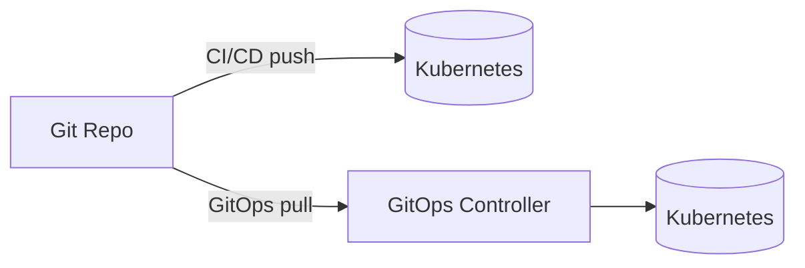
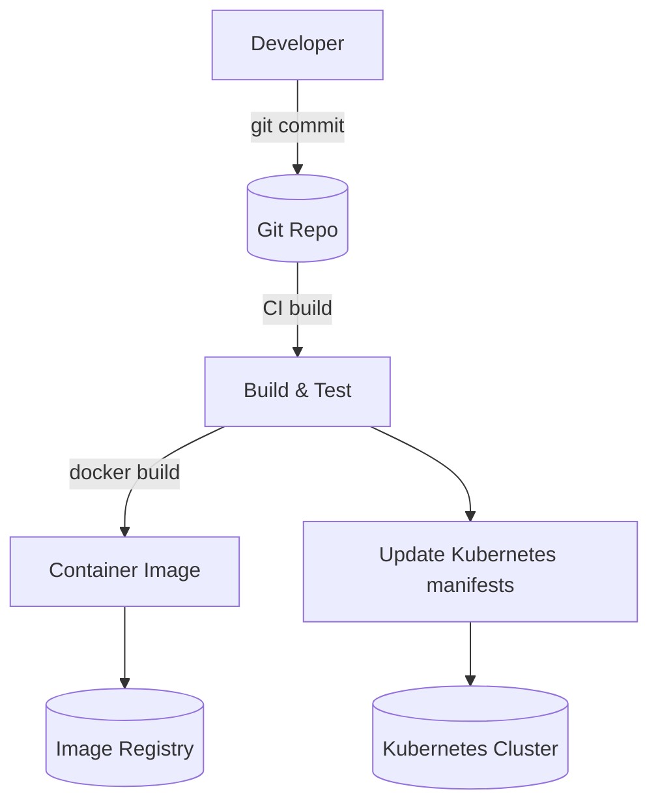
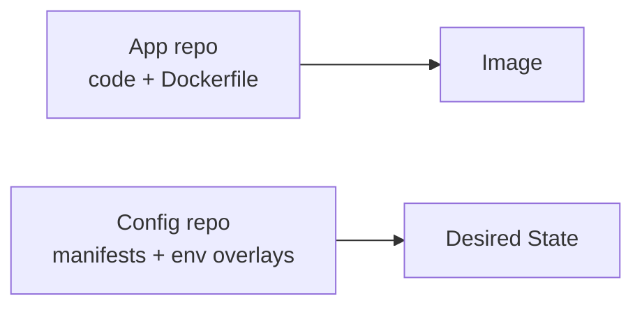
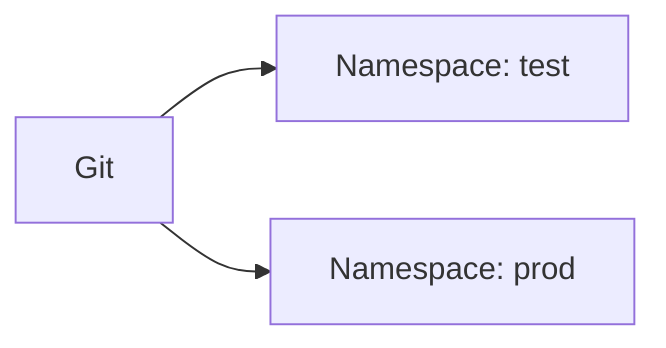
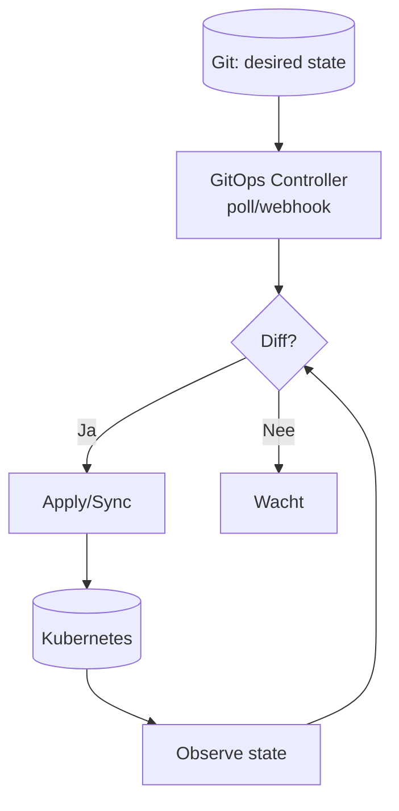
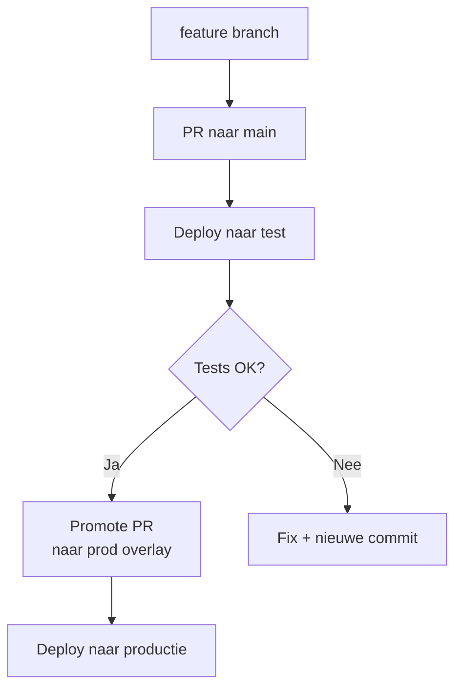
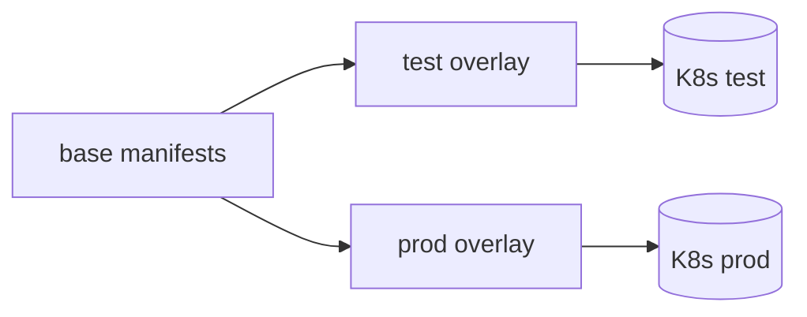
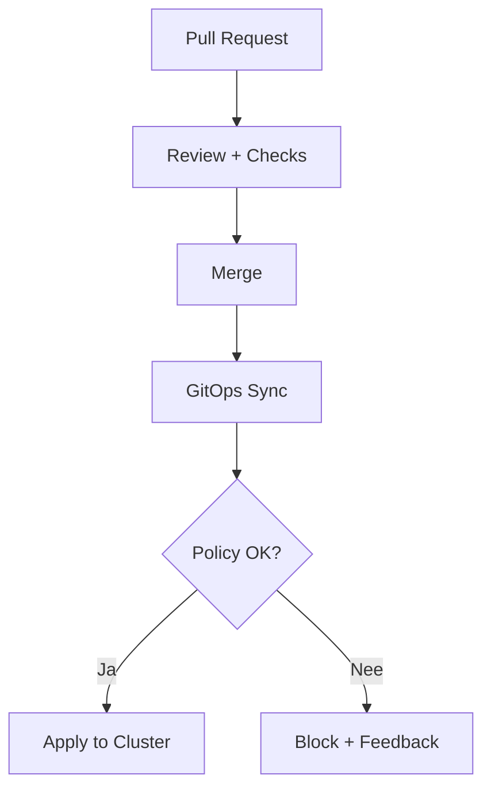

# Git & Kubernetes

## Inleiding

Dit document legt uit hoe je **Git** gebruikt om applicaties **beheerst naar productie** te brengen in een Kubernetes-omgeving.
We bouwen op van basisprincipes (beginners) naar een volwassen GitOps-aanpak (experts), inclusief Mermaid-diagrammen.

**Doel:** een herhaalbare, auditeerbare en veilige route van *code → test → productie*.

---

## 1. Wat is Git? (Beginner)

**Git** is een versiebeheersysteem: het bewaart de geschiedenis van je bestanden.

Git helpt je om:
- Wijzigingen te volgen (wie, wat, wanneer, waarom)
- Samen te werken (branches, pull requests)
- Reproducible releases te maken (tags, releases)
- Terug te rollen naar een werkende versie

### Begrippen (kort)
- **Repository**: map met code + geschiedenis
- **Commit**: opgeslagen wijziging
- **Branch**: parallelle lijn (bijv. `feature/x`, `main`)
- **Pull Request (PR)**: voorstel om wijzigingen te mergen
- **Tag**: “label” op een commit, vaak voor releases (bijv. `v1.2.0`)

---

## 2. Van Git naar Kubernetes: twee paden

Je kunt Kubernetes op twee manieren “voeden” vanuit Git:

1. **CI/CD push model** (klassiek)
   - Pipeline pusht manifests naar cluster (`kubectl apply`)
2. **GitOps pull model** (aanbevolen)
   - Cluster *pullt* desired state uit Git en reconcilieert continu



---

## 3. Basisflow: Code → Image → Deploy (Beginner)

### Stap-voor-stap
1. Developer commit code naar Git
2. Pipeline bouwt een container image
3. Image wordt opgeslagen in een registry
4. Kubernetes krijgt nieuwe desired state (manifests/Helm)



---

## 4. Repo-structuur voor Kubernetes (Beginner → Intermediate)

Veel teams gebruiken 2 repos:

### A) App repo (code)
Bevat:
- applicatiecode
- Dockerfile
- tests
- pipeline config

### B) Config repo (deployments)
Bevat:
- Kubernetes manifests / Helm / Kustomize overlays
- omgevingsconfig (test/prod)
- policies (optioneel)



**Waarom 2 repos?**
- App teams kunnen code releasen zonder productieconfig te overschrijven
- Platform/security kan config-review afdwingen

---

## 5. Test vs Productie: omgevingen beheren

### Populaire keuzes
- **Namespaces**: `test` en `prod` in hetzelfde cluster
- **Clusters**: apart testcluster en prodcluster (sterker, duurder)

Voorbeeld met namespaces:



### Belangrijk
- Test en prod hebben **andere configuratie** (URLs, feature flags, secrets)
- Je promoot changes gecontroleerd: **eerst test, dan prod**

---

## 6. GitOps (Recommended) – Hoe werkt dat?

### Wat is GitOps?
GitOps is een werkwijze waarbij:

> **Git de enige bron van waarheid is** voor wat er in Kubernetes draait.

Een GitOps controller (bijv. Argo CD / Flux) draait in het cluster en:
- leest de gewenste state uit Git
- vergelijkt dit met de echte state
- voert reconciliatie uit (apply/rollback)



### Waarom is dit sterk?
- Audit trail in Git
- Rollback = revert commit
- Drift-detectie (handmatige wijzigingen vallen op)
- Declaratief + reproduceerbaar

---

## 7. Releasebeheer: “beheerst naar productie” (Beginner → Expert)

### Simpele promotie (beginner)
- PR naar `main` triggert deploy naar test
- Handmatige “promote” PR triggert deploy naar productie



### Volwassen promotie (expert)
- **Immutable versioning**: image tags zijn versies (bijv. `v1.3.7`), nooit `latest`
- **Environment overlays**: Kustomize/Helm values per omgeving
- **Approval gates**: security/ops approvals voor prod
- **Progressive delivery**: canary/blue-green met metriek-gates
- **Automated rollback** bij SLO breach

---

## 8. Concreet voorbeeld: overlays met Kustomize (Intermediate)

Repo-structuur (voorbeeld):

```text
config-repo/
  base/
    deployment.yaml
    service.yaml
    ingress.yaml
    kustomization.yaml
  overlays/
    test/
      kustomization.yaml
      values.yaml (optioneel)
    prod/
      kustomization.yaml
      values.yaml (optioneel)
```

Conceptueel:



**Promotie** = dezelfde base + andere overlay met nieuwe image tag.

---

## 9. Security & Governance (Expert)

### Baseline best practices
- **Branch protection** op `main`
- Verplicht PR review (minimaal 1–2 reviewers)
- CI checks verplicht (tests, lint, policy)

### Kubernetes/GitOps best practices
- GitOps controller heeft least privilege
- Secrets niet in plain Git (gebruik sealed secrets / external secrets)
- Policies (OPA/Gatekeeper/Kyverno) om “foute” manifests te blokkeren
- Audit logs + change history via Git



---

## 10. Veelgemaakte Valkuilen

- Deployen met `latest` tags (niet reproduceerbaar)
- Productie wijzigen buiten Git om (drift)
- Geen duidelijke scheiding tussen test/prod
- Geen rollback-procedure
- Secrets in Git zonder encryptie/strategie

---

## 11. Samenvatting

### Beginner
- Git bewaart wijzigingen en maakt samenwerken veilig
- Pipeline bouwt image en update Kubernetes config
- Test eerst, daarna productie

### Expert
- GitOps: Git is single source of truth
- Promotie via overlays + immutable versioning
- Policies en approvals maken het beheerst en compliant
- Progressive delivery + metriek-gates verminderen risico

