# Technisch Ontwerp: Hybride Kubernetes Architectuur

## 🎯 Doelstelling
Dit ontwerp beschrijft de infrastructuur voor een **Hybride Kubernetes Omgeving**. Het doel is om de schaalbaarheid en innovatiesnelheid van de Public Cloud (Azure) te combineren met de data-soevereiniteit en controle van het Eigen Datacenter (On-Premise).

Dit ontwerp volgt de **"Data Gravitation"** strategie: Compute (rekenkracht) brengen we naar de Data toe, niet andersom.

---

## 🏗️ High-Level Architectuur

In deze opzet fungeert **Azure** als de "flexibele schil" en toegangspoort, terwijl het **Datacenter** de "veilige kluis" is voor gevoelige burgerdata en zware verwerkingen.

---

## 🛠️ Technische Inrichting

### 1. De Kubernetes Stack (RKE2 in Multi-Cluster)
We gebruiken **Rancher Kubernetes Engine 2 (RKE2)** als uniforme runtime voor beide locaties. Dit zorgt voor 100% compabiliteit.
*   **Beheer**: We zetten één centrale **Rancher Management Server** op (in Azure of DMZ) om beide clusters te beheren.
*   **Cluster Azure (`RKE2-Cloud`)**:
    *   *Doel*: Frontends, Chatbots, Public API's.
    *   *Kenmerk*: Autoscaling nodes (voordelig schalen), Stateless.
*   **Cluster On-Prem (`RKE2-Core`)**:
    *   *Doel*: Gevoelige data opslag, GPU-intensieve taken (Drone beeldverwerking), koppeling SCADA.
    *   *Kenmerk*: Static Hardware, High Security, Stateful.

### 2. Netwerk & Connectiviteit
De verbinding is cruciaal. We gebruiken een **Hub-Spoke** model.
*   **Interconnect**: Azure ExpressRoute (of Site-to-Site VPN) zorgt voor een privé verbinding.
*   **Service Mesh (Optioneel)**: Cilium of Linkerd om services over clusters heen te laten praten alsof ze lokaal zijn (`drone-api.on-prem.svc.cluster.local`).
*   **Ingress**:
    *   Publiek verkeer komt binnen via **Kong Gateway** in Azure (DDoS bescherming).
    *   Kong routeert traffic voor "zware taken" door de tunnel naar de On-Prem Ingress (intern).

### 3. Data Strategie (Data Sovereignty)
Conform de **Data Act** en **AVG**:
*   **Data Lake (MinIO)**: Draait primair On-Prem. Voor AI training in de cloud kan een specifieke bucket ("Anonymized-Training-Data") gerepliceerd worden naar Azure (MinIO Mirroring), maar de *Master* blijft thuis.
*   **Database (PostgreSQL)**: Master draait On-Prem. Read-Replicas kunnen eventueel in Azure draaien voor snelle frontend access (met geanonimiseerde views).

---

## 4. AI Model Strategie: Hybride Intelligentie

Een cruciaal onderdeel van het ontwerp is de keuze **waar** de AI verwerking plaatsvindt. We gebruiken een "Router" (onderdeel van Druppie Core) die op basis van data-classificatie het juiste model kiest.

### A. Interne AI (On-Premise)
*   **Wanneer**: Voor **Gevoelige Data** (Persoonsgegevens, Beveiligingsdetails Critical Infra) of **Offline** taken.
*   **Techniek**: Self-hosted LLM's (zoals Llama 3, Mistral) draaiend op GPU nodes in het eigen datacenter.
*   **Tools**: `Ollama` of `vLLM` containers in het RKE2-Core cluster.
*   **Voordeel**: Data verlaat nooit het pand. Volledige controle.
*   **Nadeel**: Minder krachtig dan GPT-4 ("Dumber but Safer").

### B. Externe AI (Azure OpenAI)
*   **Wanneer**: Voor **Openbare Data**, generieke kennisvragen, coderen, of creatieve taken.
*   **Techniek**: Azure OpenAI Service (GPT-4o).
*   **Compliance**: We gebruiken de "Enterprise" variant waarbij Microsoft garandeert dat *input data NIET wordt gebruikt voor training*.
*   **Voordeel**: State-of-the-Art intelligentie, schaalbaar.
*   **Nadeel**: Data verlaat (versleuteld) het netwerk.

### Beslisboom (Router Logic)

```mermaid
graph TD
    Start("❓ User Prompt / Data")
    Classify{"🔍 Classificatie (Policy Engine)"}
    Internal["🏢 Internal Cluster (Ollama/LMStudio)"]
    Scrub{"🧹 Kan anonimiseren?"}
    External["☁️ Azure Foundry (GPT-5.2)"]
    Result("📝 Antwoord")

    Start --> Classify
    
    Classify -->|🔴 Zeer Geheim / BSN| Internal
    Classify -->|🟠 Vertrouwelijk Intern| Scrub
    Classify -->|🟢 Openbaar / Publiek| External
    
    Scrub -- Ja --> External
    Scrub -- Nee --> Internal
    
    Internal --> Result
    External --> Result
```

---

## 5. OTAP Strategie (Environment Separation)

We hanteren een strikte scheiding tussen omgevingen om stabiliteit te garanderen. Dit wordt geregeld via **GitOps (Flux)** en **Kubernetes Namespaces**.

```mermaid
graph LR
    Dev[("💻 DEV (Namespace)")] --> |"Promote (PR)"| Test[("🧪 TEST (Namespace)")]
    Test --> |"Promote (PR)"| Acc[("✅ ACC (Namespace)")]
    Acc --> |"Approval (Human)"| Prod[("🚀 PROD (Cluster)")]
    
    subgraph "Single RKE2 Cluster (Logical Split)"
        Dev
        Test
        Acc
    end
    
    subgraph "Dedicated RKE2 Cluster"
        Prod
    end
```

### 1. DEV / TEST / ACC
*   **Locatie**: Draaien samen op één `Non-Prod` cluster (om kosten te besparen).
*   **Isolatie**: Gescheiden door **Namespaces** en **NetworkPolicies** (Kyverno zorgt ervoor dat DEV niet bij ACC data kan).
*   **Data**: Gebruiken synthetische data of geanonimiseerde dumps.

### 2. PRODUCTIE (PROD)
*   **Locatie**: Eigen dedicated hardware/VMs.
*   **Security**: Alleen toegankelijk via de CI/CD pipeline (Tekton/Flux). Geen `kubectl` toegang voor developers.
*   **Policies**: **Kyverno** staat in 'Enforce' mode (blokkeert alles wat niet compliant is).

---

## 🔒 Security Architectuur

### Identity & Access (IAM)
*   **Keycloak** (On-Prem) is de centrale autoriteit.
*   Het Azure cluster vertrouwt deze Keycloak (via OIDC).
*   **Workload Identity**: Een pod in Azure die data uit het datacenter wil halen, krijgt een token. De On-Prem firewall/gateway valideert dit token voordat toegang wordt verleend.

### Policy Enforcement (Kyverno)
We dwingen uniformiteit af over beide omgevingen:
1.  **Geo-Fencing**: "Pods met label `data-level=high` mogen NIET op het Azure cluster gescheduled worden." (via NodeAffinity regels in Kyverno).
2.  **Image Signing**: Alleen images die door onze eigen **Foundry** (On-Prem) zijn gebouwd en gesigned (Cosign), mogen starten.

### Traceability
*   **Logs**: Alle logs (Azure & On-Prem) worden verzameld in één centraal **Loki** cluster (On-Prem) voor een totaaloverzicht.
*   **Traces**: OpenTelemetry (Tempo) volgt een verzoek van de Burger (Azure) tot diep in de database (On-Prem).

---

## ✅ Samenvatting
Dit ontwerp biedt het beste van twee werelden:
1.  **Flexibiliteit**: Chatbots en websites schalen in de Azure Cloud.
2.  **Veiligheid**: Gevoelige dronebeelden en persoonsgegevens verlaten nooit de kluis van het Datacenter.
3.  **Controle**: Via RKE2 en Kyverno beheren we de hybride omgeving als één geheel.
