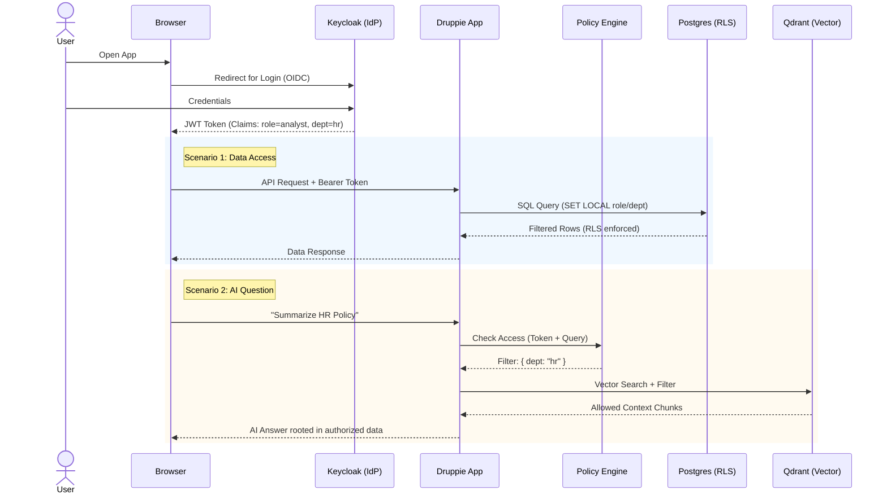

# Technisch Ontwerp: IAM & OPA Integratie met Keycloak

## 🎯 Doelstelling
Het beveiligen van applicaties, data (Postgres) en AI-kennis (RAG) door middel van een centraal Identity & Access Management (IAM) systeem. We gebruiken **Keycloak** als Identity Provider (IdP) en **Open Policy Agent (OPA)** voor fijnmazige autorisatie.

## 🏗️ Architectuur

De beveiliging is opgebouwd uit drie lagen:
1.  **Authenticatie (Wie ben je?)**: Via **Keycloak** (OIDC).
2.  **Autorisatie (Wat mag je?)**: Via **OPA** (Regels in Rego).
3.  **Handhaving (Enforcement)**: Via **Envoy / Sidecars** of in de App code.



### 1. Applicatie Toegang (SSO)
Gebruikers loggen in via de browser.
*   **Protocol**: OpenID Connect (OIDC).
*   **Flow**: Authorization Code Flow met PKCE.
*   **Token**: JWT (JSON Web Token) bevat gebruikersrollen (bijv. `analist`, `beheerder`).

### 2. Data Toegang (Row Level Security)
Toegang tot specifieke rijen in PostgreSQL (bijv. alleen dossiers van jouw afdeling).
*   **Mechanisme**: PostgreSQL Row Level Security (RLS).
*   **Implementatie**:
    1.  De API ontvangt de JWT van de gebruiker.
    2.  De API "impersoneert" de gebruiker in de DB sessie: `SET LOCAL request.jwt.claim.role = 'analist';`
    3.  Postgres Policies filteren automatisch de data.

### 3. RAG / Kennis Toegang (AI Security)
Toegang tot documenten in de Vector DB (Qdrant).
*   **Probleem**: Een gebruiker mag via de Chatbot niet zoeken in documenten waar hij geen recht op heeft.
*   **Oplossing (Attribute Based Access Control - ABAC)**:
    1.  Elk document in Qdrant heeft metadata: `{"department": "hr", "confidentiality": "high"}`.
    2.  De Chatbot stuurt de vraag + JWT naar de **Policy Engine**.
    3.  De Policy Engine (OPA) geeft een filter terug: `filter = { must: [ { key: "department", match: { value: "hr" } } ] }`.
    4.  Dit filter wordt toegevoegd aan de zoekopdracht naar Qdrant.

## 🛠️ Technische Implementatie

### A. Keycloak Configuratie (Terraform)
We definiëren de infrastructuur als code.

```hcl
resource "keycloak_realm" "druppie" {
  realm = "druppie"
  enabled = true
}

resource "keycloak_openid_client" "rag_app" {
  realm_id  = keycloak_realm.druppie.id
  client_id = "rag-chatbot"
  access_type = "CONFIDENTIAL"
  valid_redirect_uris = ["https://chat.druppie.nl/callback"]
}
```

### B. Voorbeeld: RAG Security (Python)
Hoe de backend het user token gebruikt om de zoekopdracht te filteren.

```python
from fastapi import Depends, HTTPException
from fastapi.security import OAuth2PasswordBearer
import jwt

# 1. Valideer Token
def get_current_user_claims(token: str = Depends(oauth2_scheme)):
    try:
        payload = jwt.decode(token, PUBLIC_KEY, algorithms=["RS256"])
        return payload # Bevat roles, department, etc.
    except:
        raise HTTPException(status_code=401)

# 2. Stel Zoekfilter Samen (Policy Enforcement)
def search_knowledge_base(query: str, user_claims: dict):
    user_dept = user_claims.get("department")
    
    # Authorisatie Filter (Alleen eigen afdeling)
    auth_filter = {
        "key": "department",
        "match": {"value": user_dept}
    }

    # Voer zoekopdracht uit in Qdrant met filter
    results = qdrant_client.search(
        collection_name="bedrijfskennis",
        query_vector=encode(query),
        query_filter=Filter(must=[auth_filter]) # <--- CRUCIAAL
    )
    return results
```

### C. Voorbeeld: Database RLS (Postgres SQL)
Hoe de database zelf de toegang afdwingt.

```sql
-- 1. Maak Table met ownership kolom
CREATE TABLE dossiers (
    id SERIAL PRIMARY KEY,
    inhoud TEXT,
    afdeling TEXT -- bijv. 'hr', 'finance'
);

-- 2. Enable RLS
ALTER TABLE dossiers ENABLE ROW LEVEL SECURITY;

-- 3. Maak Policy: "Je mag alleen lezen als jouw afdeling matcht met de rij"
CREATE POLICY afdeling_policy ON dossiers
    FOR SELECT
    USING (afdeling = current_setting('request.jwt.claim.department', true));
```

## ✅ Samenvatting
Door deze 3-traps raket (Web SSO, DB RLS, Vector Filtering) zorgen we dat **beveiliging overal wordt afgedwongen**, niet alleen aan de voordeur. Zelfs als een AI Agent "rogue" gaat, kan hij fysiek geen data ophalen die niet voor de gebruiker bedoeld is.
