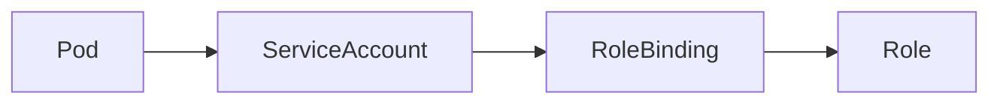

# Kubernetes Role Based Access Control (RBAC) 

## Inleiding

**RBAC (Role-Based Access Control)** is het autorisatiemechanisme van Kubernetes.  
Het bepaalt **wie** (*subject*) **wat** (*actie*) mag doen op **welke resources** binnen het cluster.

Dit document is gelaagd opgebouwd:
- 🔰 **Beginners** leren wat RBAC is en waarom het nodig is
- 🧠 **Experts** krijgen inzicht in het autorisatiemodel, evaluatielogica en ontwerpkeuzes

---

## 1. Wat is RBAC? (Beginner)

RBAC beantwoordt één simpele vraag:

> *“Mag deze gebruiker dit doen?”*

Voorbeelden:
- Mag Alice pods bekijken?
- Mag een CI/CD pipeline deployments aanpassen?
- Mag een applicatie secrets lezen?

Zonder RBAC:
- Iedereen kan alles
- Grote security-risico’s

Met RBAC:
- Rechten zijn **expliciet**
- Toegang is **beperkt en controleerbaar**

---

## 2. De Basisbegrippen van RBAC (Beginner)

RBAC bestaat uit **vier kernobjecten**:


### 1. Subject – *Wie?*
Een subject is een identiteit:
- Gebruiker
- Groep
- ServiceAccount (meest gebruikt door applicaties)

### 2. Role / ClusterRole – *Wat mag je doen?*
Een role bevat **regels**:
- Welke resources (pods, services, secrets)
- Welke acties (get, list, create, update, delete)

- **Role** → namespace-specifiek
- **ClusterRole** → cluster-breed

### 3. RoleBinding / ClusterRoleBinding – *Waar geldt dit?*
Een binding koppelt:
- Een subject
- Aan een role
- In een scope (namespace of cluster)

---

## 3. Eenvoudig Voorbeeld (Beginner)

> Een applicatie mag alleen pods lezen in namespace `app`.

```yaml
apiVersion: rbac.authorization.k8s.io/v1
kind: Role
metadata:
  name: pod-reader
  namespace: app
rules:
- apiGroups: [""]
  resources: ["pods"]
  verbs: ["get", "list"]
```

```yaml
apiVersion: rbac.authorization.k8s.io/v1
kind: RoleBinding
metadata:
  name: bind-pod-reader
  namespace: app
subjects:
- kind: ServiceAccount
  name: app-sa
roleRef:
  kind: Role
  name: pod-reader
  apiGroup: rbac.authorization.k8s.io
```

---

## 4. Hoe Kubernetes RBAC Beslissingen Neemt (Expert)

RBAC werkt als een **autorisation pipeline**:


Stap-voor-stap:
1. **Authenticatie**: Wie ben je?
2. **Autorisatie (RBAC)**:
   - Zoek alle bindings voor het subject
   - Verzamel alle bijbehorende roles
   - Combineer alle regels
   - Eén *allow* is voldoende → toegestaan
3. **Geen expliciete deny** bestaat in RBAC

---

## 5. Evaluatielogica (Expert)

RBAC is:
- **Additief**
- **Stateless**
- **Order-onafhankelijk**

Belangrijke gevolgen:
- Meer bindings = meer rechten
- Rechten worden nooit “ontzegd”, alleen niet toegekend
- Least privilege vereist discipline


---

## 6. ClusterRole vs Role (Expert)

| Aspect | Role | ClusterRole |
|------|------|-------------|
| Scope | Namespace | Cluster |
| Use-case | App-specifiek | Infra / platform |
| Resources | Namespaced | Namespaced + cluster-wide |

**Let op:**  
Een ClusterRole kan via een RoleBinding alsnog **namespace-beperkt** worden toegepast.

---

## 7. ServiceAccounts en Workloads (Expert)

Best practices:
- Elke workload krijgt **eigen ServiceAccount**
- Nooit `default` gebruiken
- Tokens alleen waar nodig
- Combineer met NetworkPolicy



---

## 8. Security Best Practices

### Voor beginners
- Gebruik zo min mogelijk rechten
- Begin met `get` / `list`
- Gebruik namespaces

### Voor experts
- Audit RBAC regelmatig
- Gebruik tooling voor RBAC-visualisatie
- Combineer RBAC met:
  - NetworkPolicies
  - PodSecurity
  - Admission controllers

---

## 9. Veelgemaakte Valkuilen

- ClusterRoleBinding voor applicaties
- Wildcards (`*`) in verbs/resources
- Rechten stapelen zonder overzicht
- Geen documentatie van intentie

---

## 10. Samenvatting

### Beginner
- RBAC bepaalt **wie wat mag**
- Rollen + bindings = toegang

### Expert
- RBAC is een additief autorisatiemodel
- Ontwerp voor least privilege
- RBAC is één laag in defense-in-depth

