# Functioneel Ontwerp: Vergunning zoeker

## 🎯 Doelstelling
Veel oude vergunningen (PDFs, Word-documenten) staan nog op file-shares (S-schijf, SharePoint) in plaats van in het officiële Zaaksysteem. Dit maakt ze onvindbaar, juridisch kwetsbaar en niet compliant met de Archiefwet.

De **Vergunning zoeker** is een AI-gedreven flow die deze "verloren" vergunningen opspoort, analyseert, registreert in het Zaaksysteem en vervolgens opruimt.

---

## 👥 Gebruikersverhaal
> *"Als medewerker Vergunningverlening wil ik dat oude vergunningen automatisch op de juiste plek in het Zaaksysteem komen, zodat ik niet handmatig duizenden mappen hoef door te spitten."*

---

## 🏗️ Proces Flow (High Level)

```mermaid
graph TD
    Start("🟢 Start Proces") --> Search("🕵️ AI Zoekt Bestanden")
    Search --> Classify{{"Is dit een Vergunning?"}}
    
    Classify -- Nee --> Skip("⏭️ Negeer bestand")
    Classify -- Ja --> Extract("🧠 AI Extractie (LLM)")
    
    Extract --> Validate{{"Validatie (Human-in-Loop?)"}}
    
    Validate -- Afgekeurd --> Manual("👷 Handmatige Actie")
    Validate -- Goedgekeurd --> Register("📝 Registreer in Zaaksysteem")
    
    Register -- Succes --> Archive("🗑️ Verwijder van Schijf")
    Archive --> Log("✅ Audit Log")
```

---

## 🧩 Componenten & Werking

We gebruiken de [Secure Agentic RAG Network](../design/agentic_rag_network.md) architectuur.

### 1. De Speurder (Ingest Agent + MCP Filesystem)
*   **Taak**: Scant mappen op de netwerkschijf (SMB).
*   **Filter**: Zoekt naar bestandsnamen zoals `*vergunning*`, `*beschikking*`, `*.pdf`.
*   **Security**: De agent gebruikt de rechten van een "Service Account" dat specifiek toegang heeft tot deze mappen.

### 2. De Analist (Internal AI Agent)
*   **Taak**: Leest de inhoud van het document (OCR indien nodig).
*   **Classificatie**:
    *   Bepaal Document Type: `Watervergunning`, `Leggerwijziging`, `Ontheffing`.
    *   Bepaal Metadata: `Huisnummer`, `Perceel`, `Datum`, `Aanvrager`.
    *   **Privacy**: Detecteer BSN nummers (via [AI Anonymizer](../bouwblokken/ai_anonymizer_yolo.md) logica).

### 3. De Beslisser (Policy Engine)
*   **Check**: Is de "Vertrouwen Score" van de AI hoog genoeg (> 90%)?
    *   **Ja**: Volledig automatisch verwerken.
    *   **Nee**: Stuur taak naar "Mens in de Loop" werklijst in Druppie UI.

### 4. De Uitvoerder (Action Agent + MCP Zaaksysteem)
*   **Actie 1**: Roep API van Zaaksysteem (bijv. PowerBrowser/Mozard) aan om een `Nieuwe Zaak` aan te maken.
*   **Actie 2**: Upload het document als bijlage.
*   **Actie 3**: Vul metadatavelden in.
*   **Actie 4** (Na bevestiging API): Verwijder het originele bestand van de file-share (Data Clean-up).

---

## 🛡️ Waarborgen (Compliance)

1.  **De "Prullenbak" Veiligheid**:
    *   We verwijderen het bestand niet direct hard (`rm`), maar verplaatsen het eerst naar een `PROCESSED_QUARANTINE` map voor 30 dagen. Mocht er iets misgaan, hebben we een backup.
2.  **Audit Trail**:
    *   *"Bestand 'Vergunning_Jansen.pdf' is op 21-12-2025 verplaatst naar Zaak Z-2025-001 door Agent Druppie."*
3.  **Toegangsrechten**:
    *   Documenten met BSN nummers worden als "Vertrouwelijk" gemarkeerd in het Zaaksysteem.

---

## ✅ Resultaat
*   **Opgeruimde schijven**: Minder storage kosten, minder datalek risico.
*   **Compleet Dossier**: Het Zaaksysteem bevat nu het volledige beeld.
*   **Tijdwinst**: Geen handmatig overtikken van pdf's.

## 🔗 Relatie met Bouwblokken
*   Gebruikt **[Secure Agentic RAG](../design/agentic_rag_network.md)** voor het vinden.
*   Gebruikt **[Interne AI (Ollama)](../design/hybrid_cluster_architecture.md)** voor het lezen van gevoelige data.
*   Gebruikt **[MCP Servers](../mcp/overview.md)** voor connectie met Filesystem en Zaaksysteem.
