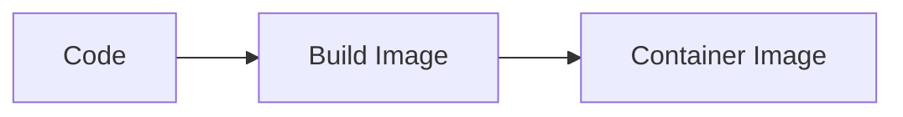
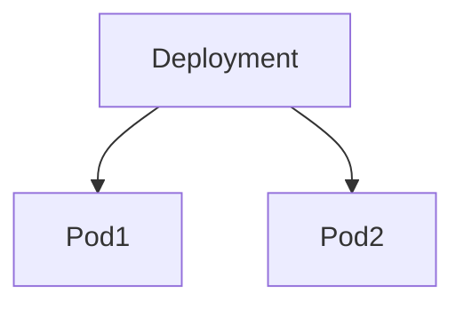
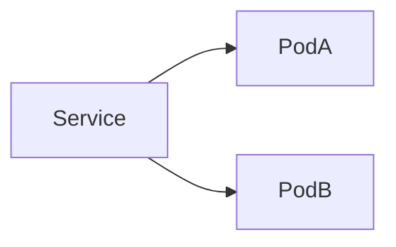
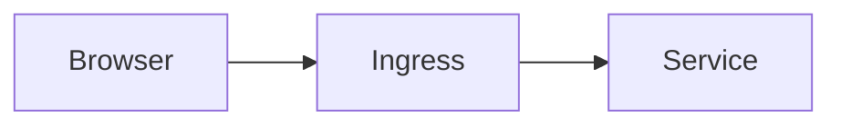
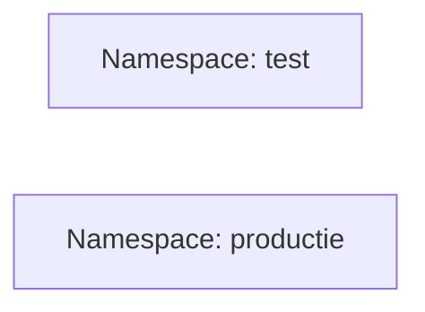
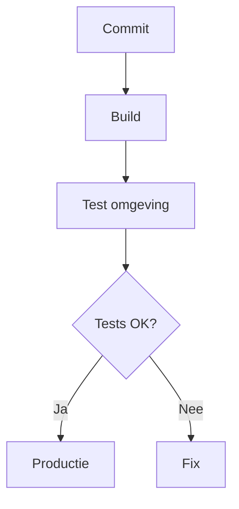
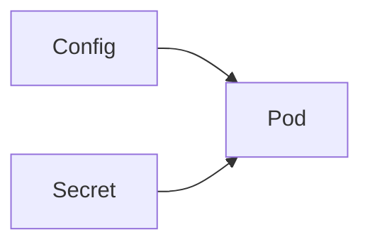
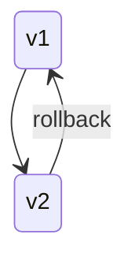

# Dynamic Slot - Het deployen van applicaties

## Inleiding

Dit document beschrijft **hoe een applicatie wordt gedeployed**, **via het web bereikbaar wordt gemaakt** en **hoe omgegaan wordt met test- en productieomgevingen**.

Het document is gelaagd opgebouwd:
- 🔰 **Beginners** leren het end-to-end pad van code → webpagina
- 🧠 **Experts** krijgen inzicht in omgevingsscheiding, deploymentstrategieën en releasebeheer

Mermaid-diagrammen worden gebruikt om de werking visueel te maken.

---

## 1. Wat betekent “een applicatie deployen”? (Beginner)

Een applicatie deployen betekent:

> Je code beschikbaar maken zodat gebruikers deze via het **web** kunnen gebruiken.

In Kubernetes houdt dit in:
1. Je applicatie draait in een container
2. Kubernetes start en bewaakt deze container
3. Verkeer van buiten wordt veilig naar de applicatie geleid

---

## 2. Van Code tot Container

### Stap 1 – Applicatiecode
- Backend (bijv. API)
- Frontend (bijv. webapp)
- Of een combinatie

### Stap 2 – Container Image
De code wordt verpakt in een **container image**.

Het image bevat:
- De applicatie
- Runtime (bijv. Node, Python, Java)
- Configuratie defaults

---

## 3. Applicatie in Kubernetes (Beginner)

### Deployment

Een **Deployment** beschrijft:
- Welke image moet draaien
- Hoeveel replicas
- Hoe updates verlopen

Kubernetes zorgt voor:
- Starten van pods
- Herstarten bij fouten
- Rolling updates

---

## 4. Applicatie Bereikbaar via het Web

### Service (intern)

Een **Service**:
- Geeft een vast adres (DNS/IP)
- Verdeelt verkeer over pods

Gebruikt binnen het cluster.

---

### Ingress (extern – webtoegang)

Een **Ingress**:
- Maakt de applicatie bereikbaar via HTTP/HTTPS
- Regelt routing op domeinnaam en pad

Voorbeeld:
- https://app.example.nl
- https://api.example.nl

---

## 5. Test en Productie Omgevingen (Beginner)

### Waarom scheiden?
- Fouten in test mogen geen impact hebben op productie
- Nieuwe versies eerst veilig uitproberen

### Meest gebruikte aanpak: namespaces

Elke omgeving heeft:
- Eigen pods
- Eigen services
- Eigen configuratie

---

## 6. Deployment Flow met Test → Productie

---

## 7. Configuratie per Omgeving (Expert)

### ConfigMaps & Secrets

- **ConfigMap**: niet-gevoelige configuratie
- **Secret**: wachtwoorden, tokens, certificaten

Per omgeving verschillend:
- Database URL
- API keys
- Feature flags

---

## 8. Updates en Releases (Expert)

### Rolling Updates
- Pods worden één voor één vervangen
- Geen downtime

### Blue/Green of Canary
- Nieuwe versie eerst beperkt beschikbaar
- Terugrollen is eenvoudig

---

## 9. Beveiliging en Toegang (Expert)

- HTTPS via Ingress
- RBAC voor deployment-rechten
- NetworkPolicies tussen applicaties
- Secrets nooit in images

---

## 10. Veelgemaakte Valkuilen

- Geen omgevingsscheiding
- Handmatig deployen in productie
- Configuratie in code
- Geen health checks
- Geen rollback-strategie

---

## 11. Samenvatting

### Beginner
- Code → container → Kubernetes → web
- Kubernetes regelt starten en herstellen
- Ingress maakt de app bereikbaar

### Expert
- Omgevingen zijn strikt gescheiden
- Releases zijn gecontroleerd en terug te draaien
- Configuratie en security zijn first-class citizens
