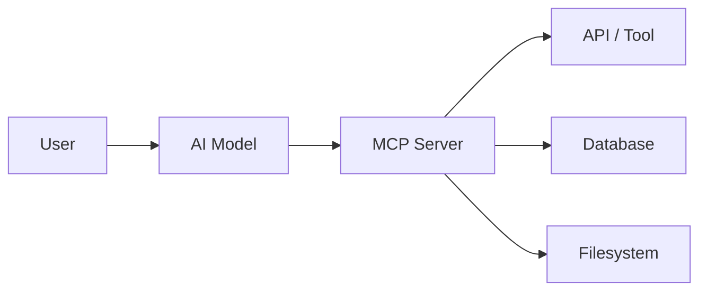
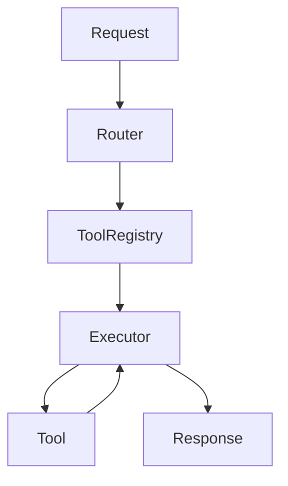
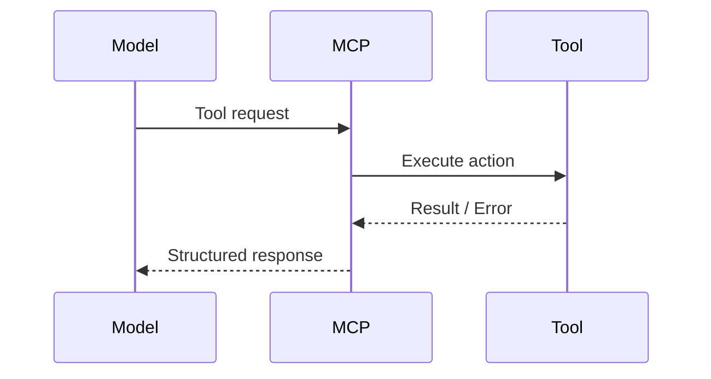
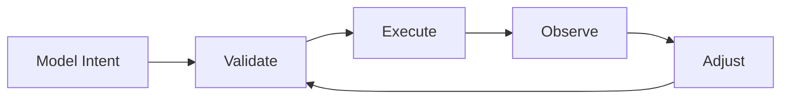
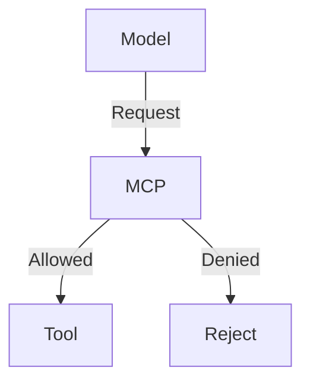

# MCP Server

## Inleiding

Een **MCP Server (Model Context Protocol Server)** is een runtime-component die fungeert als **brug tussen een AI‑model en externe systemen, data en tools**.  
De MCP Server stelt een AI-model in staat om **gestructureerde context op te vragen, acties uit te voeren en resultaten terug te geven**, op een gecontroleerde en reproduceerbare manier.

Dit document is gelaagd opgebouwd:
- 🔰 **Beginners** begrijpen *wat een MCP Server is en waarom je hem gebruikt*
- 🧠 **Experts** krijgen inzicht in architectuur, control‑loops, security en extensiepatronen

Binnen dit document worden **Mermaid-diagrammen** gebruikt om de werking visueel te maken.

---

## 1. Wat is een MCP Server? (Beginner)

Een MCP Server is:

> Een **tussenlaag** die een AI‑model laat samenwerken met de echte wereld  
> (zoals API’s, bestanden, databases of systemen)

Zonder MCP:
- Een AI kan alleen tekst genereren
- Geen directe toegang tot data of acties

Met MCP:
- Een AI kan **tools gebruiken**
- Context ophalen
- Acties uitvoeren
- Resultaten interpreteren

---

## 2. Hoog Overzicht (Beginner)

De MCP Server:
- Ontvangt verzoeken van het model
- Roept tools aan
- Geeft gestructureerde antwoorden terug

---

## 3. Kernverantwoordelijkheden van een MCP Server

### Voor beginners
- Context ophalen
- Acties uitvoeren
- Antwoorden structureren

### Voor experts
- Capability exposure
- Input/output validatie
- Security enforcement
- Observability
- Deterministische uitvoering

---

## 4. Conceptuele Bouwblokken

### Overzicht

### Componenten

#### 1. Request Handler
- Ontvangt MCP‑verzoeken
- Valideert structuur en intentie

#### 2. Router
- Bepaalt **welke tool** nodig is
- Matcht intentie → capability

#### 3. Tool Registry
- Catalogus van beschikbare tools
- Metadata: naam, schema, permissies

#### 4. Executor
- Voert tool-aanroepen uit
- Beheert timeouts, retries en fouten

#### 5. Response Formatter
- Zet resultaten om naar MCP‑compatibel formaat

---

## 5. Tool Interactie Model

Belangrijk:
- De MCP Server **vertaalt intentie naar actie**
- Het model voert zelf **geen side effects** uit

---

## 6. MCP als Control Loop (Expert)

Net als Kubernetes werkt MCP als een **control loop**:

Eigenschappen:
- Deterministisch
- Herhaalbaar
- Observeerbaar
- Veilig afgebakend

---

## 7. Security Model (Expert)

### Principes
- Least privilege
- Explicit allow
- Geen implicit trust

### Mechanismen
- Tool‑level permissions
- Input schema validatie
- Output filtering
- Rate limiting
- Audit logging

---

## 8. Foutafhandeling & Betrouwbaarheid

### Typische fouten
- Ongeldige input
- Timeouts
- Tool failures
- Partial responses

### MCP-verantwoordelijkheid
- Fouten isoleren
- Duidelijk terugrapporteren
- Geen ongedefinieerd gedrag

---

## 9. Best Practices

### Voor beginners
- Begin met read‑only tools
- Houd tools klein en eenduidig
- Log alles

### Voor experts
- Idempotente tools
- Scheiding tussen intent & uitvoering
- Contract‑first schemas
- Observability per tool
- Simuleer falen

---

## 10. Veelgemaakte Valkuilen

- Te brede tools
- Businesslogica in het model
- Geen validatie
- Onbegrensde tool‑toegang
- Geen auditing

---

## 11. Samenvatting

### Beginner
- MCP laat AI samenwerken met systemen
- De server voert acties uit, niet het model

### Expert
- MCP is een gecontroleerde execution‑laag
- Ontwerp voor determinisme, veiligheid en herhaalbaarheid
- Zie MCP als een **runtime, niet als een script**
