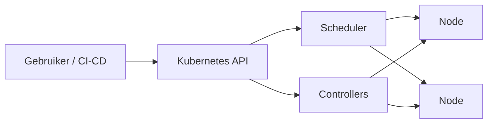
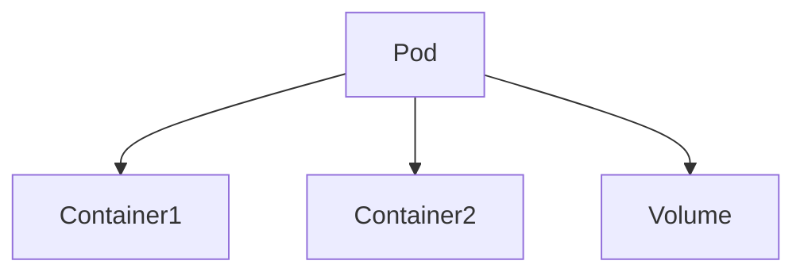
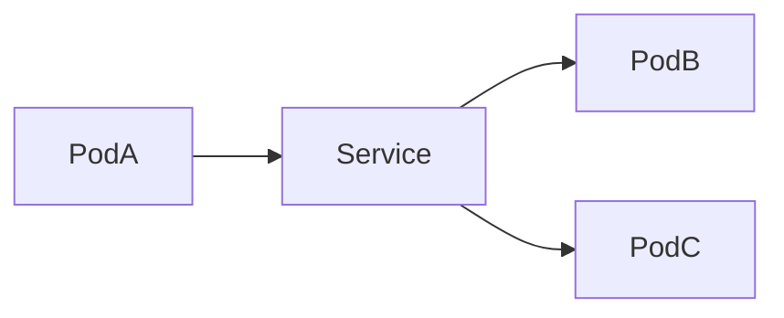
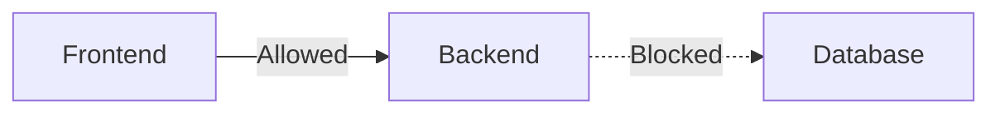
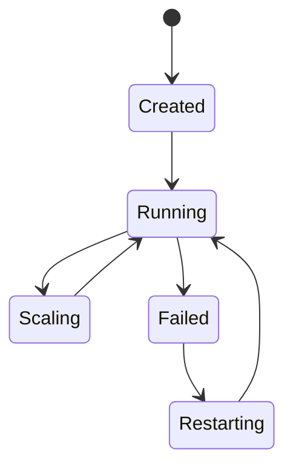
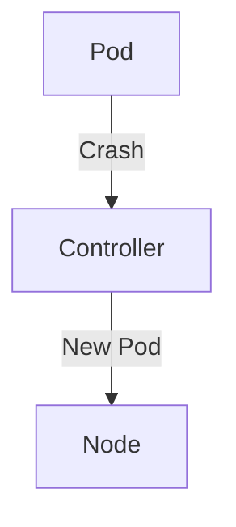
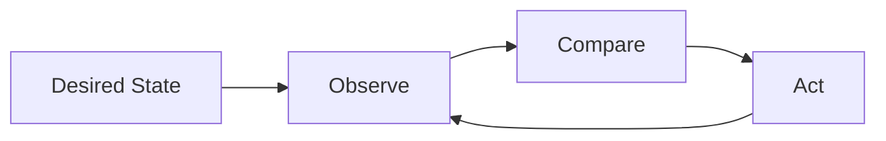

# Kubernetes Runtime

## Inleiding

Dit document beschrijft de **Kubernetes runtime**: de infrastructuurlaag waarop applicaties (bouwblokken) **geautomatiseerd, veilig en schaalbaar** worden uitgevoerd.  
Het document is bewust opgebouwd in lagen, zodat zowel **beginners** als **experts / platform engineers** waardevolle inzichten krijgen.

- Beginners krijgen **begrip van wat Kubernetes is en doet**
- Experts krijgen **architectuur, control-loops en ontwerpprincipes**

---

## 1. Wat is een Kubernetes Runtime? (Beginner)

Een Kubernetes runtime is:

> Een **geautomatiseerde omgeving** waarin containers worden gestart, bewaakt, geschaald en hersteld **zonder menselijke tussenkomst**.

Je hoeft als gebruiker **niet** te weten:
- Op welke server je applicatie draait
- Wanneer een container opnieuw start
- Hoe verkeer wordt gerouteerd

Dat regelt Kubernetes voor je.

---

## 2. Hoofdcomponenten van een Kubernetes Cluster

### Overzicht (conceptueel)

### Componenten uitgelegd

#### Kubernetes API (Control Plane)
- Het **centrale aansturingspunt**
- Alle acties lopen via de API (kubectl, CI/CD, operators)
- Bewaakt de *desired state*

#### Scheduler
- Bepaalt **waar** een Pod wordt geplaatst
- Houdt rekening met:
  - CPU / Memory
  - Affiniteit / anti-affiniteit
  - Taints & tolerations

#### Controllers
- Controleren continu:
  > “Is de werkelijkheid gelijk aan wat gewenst is?”
- Voorbeelden:
  - Deployment controller
  - ReplicaSet controller
  - Node controller

---

## 3. Nodes en Pods

### Nodes
- Machines (VM of bare-metal)
- Draaien:
  - container runtime (containerd)
  - kubelet
  - networking (CNI)

### Pods
- Kleinste deploybare eenheid
- Bevat:
  - Eén of meerdere containers
  - Shared netwerk
  - Shared storage (volumes)

---

## 4. Netwerk en Verkeer

### Service Discovery (Beginner)

- Services zorgen voor:
  - Stabiel IP/DNS
  - Load balancing

### Network Policies (Expert)

- Zero-trust binnen het cluster
- Verkeer is **expliciet toegestaan**
- Zonder policy: alles open

---

## 5. Deployments en Scaling

### Deployment Lifecycle

### Scaling
- **Horizontal Pod Autoscaler (HPA)**
- Triggers:
  - CPU
  - Memory
  - Custom metrics

---

## 6. Failover en Self-Healing

Kubernetes is **self-healing**:

- Pod crasht → nieuwe pod
- Node valt weg → pods opnieuw gepland
- Healthcheck faalt → container restart

---

## 7. Runtime als Control Loop (Expert)

De kern van Kubernetes is een **control loop**:

- Declaratief model
- Geen scripts, maar intentie
- Altijd convergent naar gewenst gedrag

---

## 8. Security & Compliance (Expert)

### Basisprincipes
- Least privilege (RBAC)
- Network isolation
- Immutable containers

### Componenten
- RBAC
- NetworkPolicy
- PodSecurity
- Secrets management

---

## 9. Samenvatting

### Voor beginners
- Kubernetes regelt *alles rondom draaien van containers*
- Jij beschrijft **wat je wilt**, niet **hoe**

### Voor experts
- Kubernetes is een **gedistribueerde control-plane**
- Alles draait om:
  - Desired state
  - Control loops
  - Idempotente acties
