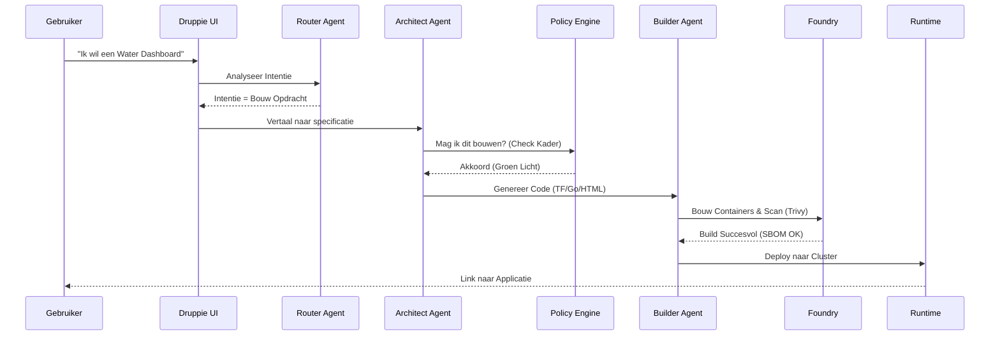
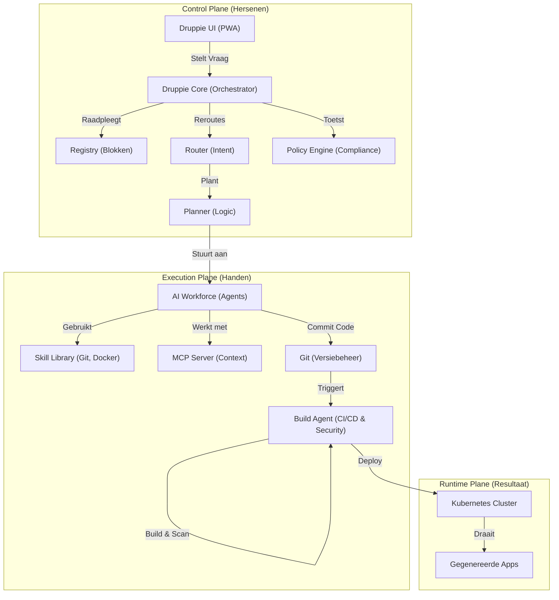

# Projectbrief: Druppie - Spec-Driven AI Platform

## 1. Bestuurlijke Context & Visie

Deze projectbrief beschrijft de realisatie van het **Druppie Platform**, gebaseerd op de bestuurlijke visie op digitalisering binnen het Waterschap.

### De IJsberg Metafoor
Nederland digitaliseert in hoog tempo. Als Waterschap staan we midden in de maatschappij en werken we aan grote opgaven zoals klimaatadaptatie, energietransitie en woningbouw.

Technologie wordt hierbij gezien als een ijsberg:
*   **Topje (Zichtbaar - Burgerperspectief)**: De apps, websites en interfaces die burgers en medewerkers zien en gebruiken.
*   **Onder water (Onzichtbaar - Fundament)**: De complexe wereld van data, infrastructuur, beslissingen en processen die alles mogelijk maakt. Vaak onzichtbaar, maar essentieel.

### Het Fundament: Onze Visie
Onze digitale transformatie rust op drie pijlers die het fundament van de ijsberg vormen:
1.  **Verslimmen**: We implementeren digitale technieken en AI om onze werkprocessen en dienstverlening effectiever en efficiënter te maken.
2.  **Verbonden met de omgeving**: We werken datagedreven samen met burgers, bedrijven en ketenpartners.
3.  **Digitaal Weerbaar**: Informatieveiligheid, privacy en ethiek zijn randvoorwaardelijk. We ontwerpen de organisatie van morgen.

### Kader & Principes
Wij geven digitalisering vorm aan de hand van duidelijke principes (het "Ontwerpproces"):
*   **Voldoen aan wetgeving**: We anticiperen op wetten zoals de WOO en de Wet Digitale Overheid.
*   **Datagedreven Samenwerken**: Data delen creëert meerwaarde.
*   **Voorspellend werken**: We sturen niet op de achteruitkijkspiegel, maar kijken vooruit.
*   **Digitaal voorop**: Verslimmen van processen met AI.
*   **Menselijke Maat**: Technologie moet inclusief en toegankelijk blijven voor iedereen.

---

## 2. Project Druppie

### 2.1 Wat is Druppie?
Druppie is niet zomaar een "Chatbot" of een "Automatiseringstool". Het is een **Autonoom AI-Platform voor Data Toegang & Software Creatie & Beheer**, specifiek ontworpen voor de Publieke Sector (Waterschappen).

In essentie is Druppie een "Collega" (AI Workforce) die functioneert als de intermediair tussen de **Business** (de vraag van de medewerker) en de **Techniek** (de code/infrastructuur).

*   **Identiteit**: Druppie manifesteert zich als een vriendelijke waterdruppel, maar erachter schuilt een netwerk van gespecialiseerde AI-agenten (Architect, Developer, Security Officer) die samenwerken.
*   **Functie**: Het Platform neemt de *volledige* lifecycle van digitale oplossingen over: van vraagarticulatie, ontwerp en toetsing aan wetgeving, tot de daadwerkelijke bouw, automatishe uitrol en beheer.
*   **Uitbreidbaar**: Druppie kan gemakkelijkworden uitgebreid met nieuwe AI-agenten en technieken omdat de business zonder tussenkomst van IT beheer agents kan beschrijven in natuurlijke taal die door Druppie wordt vertaald tot code.
*   **Resultaat**: Een volledig werkbaar digitale oplossing die voldoet aan alle bestuurlijke kaders, ambities en veilig is.

### 2.2 Waarom doen we dit? (De Noodzaak)
Gelet op de bestuurlijke visie (De IJsberg) staan we voor enorme uitdagingen:
1.  **Explosieve Vraag**: De vraag naar digitale oplossingen groeit exponentieel, sneller dan de organisatie mensen kan werven of opleiden.
2.  **Toenemende Complexiteit**: Wetgeving (AVG, BIO, WOO) en techniek (Cloud Containerization, Zero Trust) worden steeds complexer. Het is voor één mens bijna onmogelijk om alle kaders te kennen én toe te passen.
3.  **Wildgroei & Veiligheid**: Zonder centraal platform ontstaan vaak "Shadow IT" oplossingen die onveilig en onbeheersbaar zijn.

**Druppie lost dit op door:**
*   **Snelheid**: Software creatie versnellen van maanden naar minuten.
*   **Uniformiteit**: Kwaliteit en veiligheid borgen "by design". Elke oplossing voldoet *bewezen* aan de vastgestelde kaders.
*   **Democratisering**: Iedereen in de organisatie kan een veilige applicatie laten bouwen, zonder zelf te hoeven programmeren.
* **Data Toegang**: Iedereen heeft alleen toegang tot de data waar hij recht op heeft, volgens de IAM oplossing, hierdoor kan geen onveilige toegang onstaan tot tijdens het gebruike van Druppie.
* **Privacy**: Druppie zorgt voor privacy door gebruik te maken van een privacy-first oplossing, er wordt altijd een privacy impact assessment gemaakt en een privacy impact statement gemaakt. Er wordt geen privacy gevoeligde data gedeeld buiten de boundaries die gedefinieerd zijn door de privacy impact assessment.
*   **Logging en Monitoring**: Alles leggen wij vast in een logging en monitoring systeem zodat we altijd kunnen kijken naar de geschiedenis van een oplossing en transparantie kunnen bieden.

### 2.3 Wat is Druppie NIET?
Om verwachtingen te managen, is het cruciaal te definiëren wat buiten scope valt:
*   ❌ **Geen "Magic Button" zonder toezicht**: Druppie werkt volgens het strikte principe van *Human-in-the-Loop*, *security-by-design* en *privacy-by-design*. Hij doet niets zonder expliciete goedkeuring op cruciale momenten (vooral bij uitgaven, publicatie of risico's).
*   ❌ **Geen vervanging van de mens**: Druppie neemt repetitief, controlerend en complex technisch werk over. Hierdoor kunnen mensen zich richten op het *Probleem* (Domeinkennis) en de *Creativiteit*.
*   ❌ **Geen "ChatGPT Wrapper"**: Druppie "babbelt" niet zomaar. Hij *denkt* in specificaties, *voert* echte acties uit (Git commits, Data Analyse,Compilers, Deployments) en *valideert* zijn eigen werk. Hij is deterministisch in zijn output (werkende software).
*   ❌ **Geen SaaS pakket**: Het is een platform dat *eigendom* is van het Waterschap, draaiend op eigen infrastructuur/cloud, met volledige controle over data en modellen.

### 2.4 Functionele Werking (De "Flow")
Het proces loopt altijd via vaste stappen (De "Fabriek"):

1.  **De Vraag (Interactie)**:
    *   De gebruiker stelt een vraag in natuurlijke taal. *"Ik wil een dashboard voor waterkwaliteit metingen".*
    *   Druppie (UI) vraagt door om de specificaties helder te krijgen ("Clarification Loop").

2.  **De Analyse (Router)**:
    *   De **Router Agent** analyseert de intentie van de gebruiker. Is het een simpele vraag? Of wil men iets bouwen?
    *   De Router bepaalt welk spoor wordt gevolgd: "General Chat", "Registry Search" of "New Project".

3.  **Het Ontwerp (Architect)**:
    *   De **Architect Agent** analyseert de vraag, vertaalt deze naar een Technisch Ontwerp en selecteert de benodigde "Bouwblokken" (Building Blocks) uit de Registry.

4.  **De Toetsing (Policy Engine - Het Geweten)**:
    *   Vóórdat er ook maar één regel code wordt geschreven, toetst de Policy Engine het plan aan het **Bestuurlijk Kader**.
    *   *Check*: "Mag deze data wel gedeeld worden?", "Is dit AVG compliant?", "Voldoet dit aan de BIO?".
    *   Indien rood licht: Druppie stopt en legt uit waarom, of vraagt om menselijke escalatie (bijv. CISO goedkeuring voor een uitzondering).
    *   Controleert of er reeds bouwblokken bestaan die voldoen aan de specifiek eisen van de gebruiker.
    *   Elke stap in het proces wordt geregistreerd in een audit trail.

5.  **De Realisatie (Builder & Foundry)**:
    *   De **Builder Agent** genereert de code (Go, Python, Terraform, HTML).
    *   De **Foundry** (Fabriek) bouwt de containers, scant ze op kwetsbaarheden (Trivy), en genereert een SBOM (Software Bill of Materials).

6.  **De Uitrol (Runtime)**:
    *   Indien de bouwfase en security scans succesvol zijn, wordt de applicatie automatisch en veilig uitgerold naar de Runtime omgeving. De gebruiker krijgt direct een werkende link.
    *   De **Runtime Agent** zorgt voor de juiste omgeving (Terraform, Kubernetes).
    *   De **Beheer Agent** zorgt voor de dagelijkse beheeromgeving en beheert en update de runtime.
    *   Elke stap in het proces wordt geregistreerd in een audit trail.



---

## 3. Technische Implementatie & Architectuur

De architectuur volgt een strikte scheiding tussen de "Hersenen" (Core) en "Handen" (Agents).



### [Druppie Core (Backend)](../core/README.md)
De centrale orkestrator geschreven in **Go**.
*   **Locatie**: `/core`
*   **Docker Image**: `druppie`
*   **Functies**:
    *   **Registry**: Beheert capabilities (`/blocks`).
    *   **Planner**: Vertaalt prompts naar stappenplannen.
    *   **Policy Engine**: Handhaaft regels (bijv. "Geen directe SQL toegang").

### [Druppie UI (Frontend)](../ui/README.md)
De interface voor interactie en beheer.
*   **Locatie**: `/ui` (Served via Core).
*   **Type**: Progressive Web App (PWA).
*   **Features**:
    *   Chat Interface (voor opdrachten).
    *   Kanban Bord (voor procesinzicht).
    *   Simulatie Modus (Direct/Indirect scenario's).

### Componenten
Druppie maakt gebruik van verschillende componeten om zo zelfstandig mogelijk digitale te kunnen werken.
*  **Compliance** (`/compliance`): Beheert de bedrijfsregels, wetsgeving en compliance (bijv. AVG, ISO 27001, BIO, NIS2).
*   **Agents** (`/agents`): Gedefinieerde rollen (bijv. `architect-agent`, `builder-agent`, `reviewer-agent`).
*   **Skills** (`/skills`): Specifieke taken die agents kunnen uitvoeren (bijv. `git-commit`, `docker-build`, `trivy-scan`, `create-video`, `create-power-bi-report`).    
*   **Bouwblokken** (`/blocks`): Herbruikbare componenten, die door agents kunnen worden gebruikt. Dit kunnen technische componenten zijn (bijv. `git-commit`, `docker-build`, `trivy-scan`), maar ook conceptuele componenten (bijv. `dashboard`, `reporting`, `monitoring`) die reeds eerder zijn gemaakt door andere gebruikers.
*   **MCP** (`/mcp`): Een MCP server is een server die het Model Context Protocol (MCP) implementeert. Dit protocol is ontworpen om AI-modellen (zoals LLM’s) op een gestandaardiseerde, veilige en schaalbare manier toegang te geven tot externe context en functionaliteit.

---

## 4. Documentatie Overzicht

Alle technische ontwerpbeslissingen zijn vastgelegd in de `/design` map. Hieronder een overzicht van de belangrijkste documenten:

### Architectuur & Design
*   **[Architecture Overview](../design/overview.md)**: High-level overzicht.
*   **[Component Interaction](../design/component_interaction.md)**: Interactiepatronen tussen services.
*   **[Hybrid Cluster Architecture](../design/hybrid_cluster_architecture.md)**: K3s/Cloud implementatie.

### AI & Agents
*   **[Agentic Patterns](../design/agentic_patterns.md)**: Gebruikte AI patronen (ReAct, Chain-of-Thought).
*   **[Builder Agent](../design/builder_agent.md)**: Specificaties van de bouw-agent.
*   **[Policy Engine](../design/policy_engine.md)**: Compliance logica.

### Security & Governance
*   **[Compliance Lifecycle](../design/compliance_lifecycle_monitoring.md)**: Monitoring van regels.
*   **[IAM & Keycloak](../design/iam_keycloak_interaction.md)**: Identiteitsbeheer.
*   **[RBAC](../design/rbac.md)**: Rechtenstructuur.

### Runtime & Operations
*   **[Runtime Implementation](../design/runtime_implementation.md)**: Hoe workloads draaien.
*   **[Deployment Strategies](../design/deployment_strategies.md)**: Rolling updates vs Blue/Green.
*   **[Git Workflow](../design/git.md)**: Versiebeheer strategie.

*(Zie de volledige `/design` map voor alle documenten)*

---

## 5. Installatie & Gebruik

### Vereisten
*   Go 1.22+
*   Docker
*   Make (optioneel)

### Snel Starten
1.  **Lokaal (CLI)**:
    ```bash
    ./script/druppie.sh
    # Of handmatig
    go run ./cmd serve
    ```

2a.  **Docker**:
    ```bash
    docker build -t druppie .
    docker run -p 8080:80 druppie
    ```
    Open `http://localhost:8080/ui/` voor de interface.

2b.  **Kubernetes**:

    Het instaleren van Druppie op een Kubernetes cluster is gedaan door het gebruik van Helm. De installatie vereist een Gitea repository en een Gitea token. Voor de installatie van een lokaal cluster kan je gebruik maken van `script/druppie.sh`.
    ```bash
     helm install druppie ./deploy/helm \
     --set git.provider="gitea" \
     --set git.url="http://gitea-http.gitea.svc.cluster.local:3000" \
     --set git.user="druppie" \
     --set git.tokenSecretName="gitea-token"
    ```
    Open `http://<your-k8s-cluster>:8080/ui/` voor de interface.

### Projectstructuur
```
.
├── agents/         # AI Agent definities
├── core/           # Backend broncode
├── core/cmd/       # Go entrypoints
├── design/         # Architectuur documentatie (.md)
├── mcp/            # MCP implementatie
├── research/       # Research documentatie
├── scripts/        # Beheerscripts
├── skills/         # Agent tools/functies
├── ui/             # Frontend Chat (index.html)
├── Dockerfile      # Container definitie
├── index.html      # The documentation page
└── README.md       # Root git repository documentatie
```
